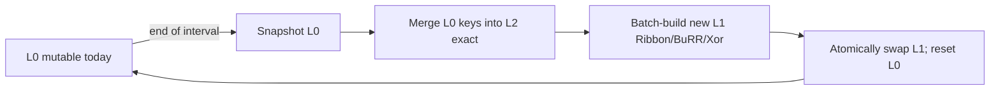
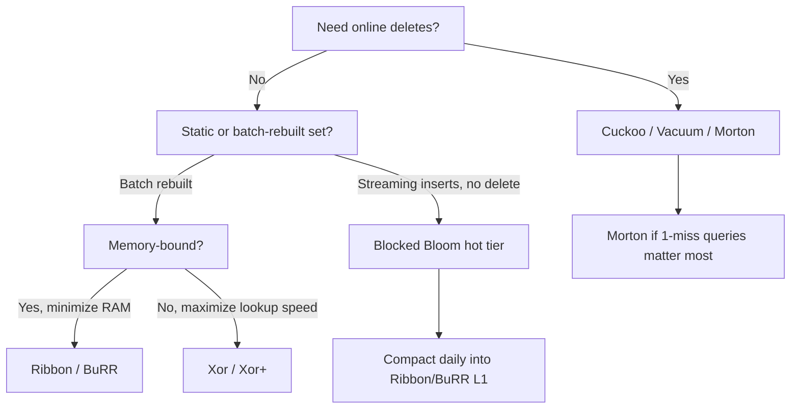

# High-Throughput URL Processing and Advanced Seen-Set Data Structures

## Abstract

In billion-scale web crawling, the discovery pipeline is frequently bottlenecked not by network I/O but by the CPU- and memory-bound work of URL normalization, canonicalization, and deduplication. Deciding whether a newly discovered Uniform Resource Identifier (URI) has been seen requires answering an Approximate Membership Query (AMQ) or exact membership query against a "seen-set" of $10^9$–$10^{12}$ entries. This report systematically develops the modern algorithmic landscape of high-throughput URL processing with a sustained emphasis on **memory footprint arithmetic**. We specify URL canonicalization as a precise pipeline and state machine (RFC 3986 vs. WHATWG URL Standard, IDNA2008/UTS-46, percent-encoding normalization, dot-segment removal); analyze SIMD URL parsing (ada-url) at the level of `pshufb`/`tzcnt` with the published instruction-count ratios (≈3× vs rust-url, up to ≈8× vs curl); quantify fingerprint hashing (xxh3, wyhash, CLMUL/AES-NI) and the birthday-bound collision math that dictates fingerprint width; survey the full AMQ family (Bloom, Blocked Bloom, Counting Bloom, Quotient/CQF, Cuckoo, Vacuum, Morton, Xor/Xor+, Ribbon/BuRR) with per-key overheads from the primary papers and concrete budgets at $10^9$ and $10^{10}$ keys for $\epsilon \in \{10^{-2}, 10^{-4}\}$; detail exact tiers (FST, front-coded sorted strings, LOUDS tries, RocksDB); formalize a two/multi-tier seen-set state machine; and analyze distributed seen-sets under consistent/rendezvous hashing and the AP/CP trade-off with bandwidth costs.

> **Provenance note.** This revision corrects several fabricated, mis-attributed, or wrong-locator citations present in the prior version (see [§11 References](#11-references) and the *Corrections* note there). **All primary citations — parsing, hashing, every AMQ filter, and the storage systems — were verified by web search during this revision** (DOIs/URLs confirmed against ACM Digital Library, PVLDB, Dagstuhl LIPIcs, Wiley, and the projects' own repositories). Numbers labeled **[derived]** are computed in-document from the stated formulas; figures attributed to a paper are the paper's own published claims; anything labeled **[speculative]** is an engineering extrapolation, not a published result.

Cross-references: [`crawling-algorithms-and-data-structures.md`](./crawling-algorithms-and-data-structures.md) (frontier, scheduling, politeness), [`distributed-frontier-coordination-and-consistency.md`](./distributed-frontier-coordination-and-consistency.md) (partitioning, Raft/CRDT consistency), [`crawler-execution-models.md`](./crawler-execution-models.md) (threading/async, `io_uring`), and the memory-subsystem reports [`../general/virtual-memory-optimizations/virtual-memory-optimizations.md`](../general/virtual-memory-optimizations/virtual-memory-optimizations.md), [`../general/memory-hierarchy-minimization/memory-hierarchy-minimization.md`](../general/memory-hierarchy-minimization/memory-hierarchy-minimization.md), and [`../general/memory-allocators/memory-allocators.md`](../general/memory-allocators/memory-allocators.md) (page cache, huge pages, `mmap`, residency, cache-line behavior). Low-level OS networking context: [`linux-low-level-networking.md`](./linux-low-level-networking.md), [`macos-low-level-networking.md`](./macos-low-level-networking.md).

> **Note on cross-links.** This repository does not contain standalone `linux-memory-management.md` / `macos-memory-management.md` files; the memory-management material lives in the `../virtual-memory-optimizations/`, `../memory-hierarchy-minimization/`, and `../memory-allocators/` reports linked above. References below point there.

---

## 1. Fundamentals

### 1.1 URL Canonicalization as a Precise Pipeline

Canonicalization maps a raw byte string $s$ to a canonical form $s'$ such that two URIs that *denote the same resource* (under a chosen equivalence policy) map to the same $s'$. The hard part is that there are **two normative standards that disagree**:

- **RFC 3986** (Berners-Lee, Fielding, Masinter, 2005) — the IETF generic URI grammar. It defines *syntax-based normalization* and *scheme-based normalization* but deliberately leaves much to the scheme. It treats a URI as an opaque-ish ABNF structure and does **not** mandate lowercasing hosts beyond case-insensitivity of scheme and host, nor does it specify IDNA or query handling.
- **WHATWG URL Standard** (living standard, `url.spec.whatwg.org`) — defines a concrete *state-machine parser* and a *serializer* used by browsers. It is more prescriptive: it lowercases the scheme and host, applies IDNA/UTS-46 to the host, has special handling for "special schemes" (`http`, `https`, `ws`, `wss`, `ftp`, `file`), removes default ports, and normalizes `\` to `/` in special-scheme paths.

For a crawler the WHATWG behavior is usually the right *target* (it matches what browsers and therefore servers see), but RFC 3986's dot-segment algorithm and percent-encoding rules are the precise normative source for path/percent handling. A correct crawler canonicalizer is effectively *WHATWG parse → policy-driven extra normalization*.

#### Key RFC 3986 ↔ WHATWG divergences

| Aspect | RFC 3986 | WHATWG URL Standard |
|---|---|---|
| Parser model | ABNF grammar (no reference parser) | Explicit named state machine + serializer |
| Scheme case | Case-insensitive; normalize to lowercase recommended | Lowercased always |
| Host case | Case-insensitive (reg-name) | Lowercased; IDNA/UTS-46 to ASCII for special schemes |
| Empty/`..` overflow path | Resolution algorithm (§5.2.4) keeps within root | Same effect; pop cannot underflow root |
| Backslash in path | Not a separator | For special schemes, `\` treated as `/` |
| Default port | Scheme-defined; normalization may drop | Dropped when equal to scheme default |
| Percent-encoding of unreserved | Decode `%41`→`A` etc. (syntax normalization) | Same for unreserved set; otherwise uppercase hex |
| Userinfo / `@` | Allowed | Allowed but discouraged; serialized specifically |
| Tab/newline in input | Invalid | **Stripped** before parsing |
| C0 controls / space | Percent-encode per context | Defined percent-encode sets per component |

> **Crawler policy choices (not standardized).** Stripping the fragment (`#...`), deciding whether `http://a/` ≡ `http://a` (most crawlers say yes via empty-path→`/`), sorting/pruning query parameters, and lowercasing the path. These are *equivalence-policy* decisions layered on top of standards-compliant parsing; they trade recall (catching more dupes) against the risk of conflating distinct resources (e.g., case-sensitive paths on POSIX origin servers, or semantically significant query order).

#### Percent-encoding normalization

Three sub-rules, in order:
1. **Decode unreserved.** `unreserved = ALPHA / DIGIT / "-" / "." / "_" / "~"`. Any `%XX` whose byte decodes to an unreserved character MUST be decoded (RFC 3986 §6.2.2.2).
2. **Uppercase hex digits.** `%2f` → `%2F` for any *retained* triplet (case-normalize the hex).
3. **Do not decode reserved/delimiters.** `%2F` (`/`), `%3F` (`?`), `%23` (`#`), `%25` (`%`) etc. MUST remain encoded because decoding changes structure.

Pitfall: **double-encoding** (`%252F` = encoded `%2F`) is *not* the same resource as `%2F`; never recursively decode. Pitfall: WHATWG percent-encode *sets* differ by component (fragment set ⊂ query set ⊂ path set ⊂ userinfo set ⊂ C0 control set); a single global table is wrong.

#### Dot-segment removal (RFC 3986 §5.2.4, "remove_dot_segments")

```
function remove_dot_segments(input):            # input = path string
    output = ""                                  # accumulator (a stack, serialized)
    while input != "":
        if input starts with "../":  input = input[3:]
        elif input starts with "./": input = input[2:]
        elif input starts with "/./":  input = "/" + input[3:]
        elif input == "/.":            input = "/"
        elif input starts with "/../": input = "/" + input[4:]; pop_last_segment(output)
        elif input == "/..":           input = "/";              pop_last_segment(output)
        elif input == "." or input == "..": input = ""
        else:
            move_first_path_segment(input -> output)   # incl. leading "/"
    return output
# pop_last_segment removes the trailing "/seg" (or "seg") from output; cannot underflow.
```

Complexity: **O(L)** time, **O(L)** scratch space, where $L = |\text{path}|$. The "stack" never exceeds $L$ bytes; in practice implement in place with two indices for **O(1) extra** space.

#### IDNA2008 / UTS-46 (host normalization)

Hostnames may contain non-ASCII (Internationalized Domain Names). The host is converted to **A-labels** (ASCII Compatible Encoding) via Punycode (RFC 3492) under the IDNA2008 framework (RFC 5890–5894), with **UTS-46** providing the *mapping/compatibility* layer browsers actually use (case fold, NFC normalize, map deviation chars, then ToASCII per label). Each dot-separated *U-label* → *A-label*:

```
ToASCII(label):
    label = UTS46_map(label)            # case fold, NFC, map disallowed/deviation
    if label is all-ASCII: return lowercased(label)        # validate LDH
    enc = "xn--" + punycode_encode(label)                  # RFC 3492
    assert len(enc) <= 63                                  # DNS label limit
    return enc
```

Pitfalls: (a) **homograph / mixed-script** confusables (security, not just dedup); (b) the IDNA2003→2008 *deviation characters* (ß, ς, ZWJ, ZWNJ) map differently — UTS-46 `transitional` vs `nontransitional` processing; browsers use nontransitional. (c) total host ≤ 253 ASCII bytes; each label ≤ 63.

#### Scheme/host/port defaults

- Lowercase scheme. Empty/`file` host rules differ.
- Drop port when it equals the scheme default: `http`→80, `https`→443, `ws`→80, `wss`→443, `ftp`→21.
- Empty path under a special scheme serializes as `/`.

#### Query-parameter canonicalization pitfalls

Query is the **most dangerous** component to "normalize" because the server defines its semantics:
- **Order**: `?a=1&b=2` vs `?b=2&a=1` are usually equivalent, but not for APIs that sign the literal query (HMAC) or that build a cache key from it. Sorting keys is a *heuristic* that can both merge dupes and wrongly merge distinct resources.
- **Duplicate keys**: `?a=1&a=2` — array semantics; never dedup blindly.
- **Tracking/junk params** (`utm_*`, `gclid`, `fbclid`, `sessionid`, `phpsessid`): dropping them is high-value for dedup but must be an *allowlist/denylist* per host, not global.
- **Empty values & `=`**: `?a` vs `?a=` vs `?a=` differ on some servers.
- **Encoding of `+`**: in `application/x-www-form-urlencoded` query context, `+` means space; in path it is literal.

### 1.2 The Canonicalization State Machine

```mermaid
stateDiagram-v2
    [*] --> Strip: input bytes
    Strip --> Scheme: remove tab/newline (WHATWG), trim C0/space
    Scheme --> Authority: lowercase scheme; resolve special?
    Authority --> Host: split userinfo@host:port
    Host --> IDNA: UTS46 map + ToASCII per label
    IDNA --> Port: lowercase host; validate LDH
    Port --> Path: drop default port
    Path --> DotSeg: remove_dot_segments
    DotSeg --> Pct: percent-encode per-component set
    Pct --> Query: decode unreserved; uppercase hex
    Query --> Frag: policy: sort/prune params (per-host)
    Frag --> Serialize: drop fragment (crawler policy)
    Serialize --> [*]: canonical s'
```



### 1.3 The Seen-Set Problem, Formalized

Given historically crawled set $S=\{u_1,\dots,u_n\}$ and a stream $U'$ of extracted URLs, partition $U'$ into $U_{\text{new}}=U'\setminus S$ and $U_{\text{seen}}=U'\cap S$. Store $S$ as an AMQ filter $\mathcal F(n,\epsilon)$ in RAM plus (optionally) an exact set $\mathcal E$ on NVMe. The AMQ contract:

- $u\in S \Rightarrow \Pr[\text{Query}(\mathcal F,u)=\text{True}]=1$ (no false negatives),
- $u\notin S \Rightarrow \Pr[\text{Query}(\mathcal F,u)=\text{True}]\le\epsilon$.

**Information-theoretic lower bound.** Any AMQ for $n$ keys with FP rate $\epsilon$ needs at least
$$ \text{bits} \ge n\log_2(1/\epsilon). $$
Equivalently $\log_2(1/\epsilon)$ bits/key. So $\epsilon=10^{-2}\Rightarrow 6.64$ bits/key; $\epsilon=10^{-4}\Rightarrow 13.29$ bits/key. (Carter et al. 1978; restated in every filter paper.) All overheads below are *relative to this bound*.

---

## 2. SIMD URL Parsing (ada-url internals)

### 2.1 Why scalar parsers are slow

A classic parser (e.g., the WHATWG state machine in Node's legacy `url`, or libcurl's `Curl_urldecode`/parser) consumes the input **one byte per iteration** with a `switch` on parser state. Each byte that *could* be a delimiter (`:`, `/`, `?`, `#`, `@`, `\`, `[`, `]`) is a data-dependent branch. URLs are short and delimiter positions are unpredictable, so branch predictors miss frequently; each miss costs ~15–20 cycles of pipeline flush on a modern OoO core. Empirically this lands scalar WHATWG parsing in the **hundreds of cycles per URL**.

### 2.2 ada-url's vectorized approach (Lemire & Nizipli)

**ada** is a WHATWG-compliant C++ URL parser. Its core trick is to replace per-byte branching with **branchless block classification** over 16/32/64-byte vectors:

1. **Block load.** Load 16 bytes (SSE), 32 (AVX2), or 64 (AVX-512 / two 32B on NEON) into a vector register.
2. **Classify with `pshufb`.** The packed shuffle instruction (`_mm_shuffle_epi8` / `vqtbl1q` on NEON) is used as a **16-entry parallel lookup table** keyed on the low nibble (and a second on the high nibble), producing for each lane a *class bitset* — e.g., "is this byte a URL structural delimiter?" This is a vectorized perfect-hash classification with **zero branches**.
3. **Reduce to a mask.** `pmovmskb` (`_mm_movemask_epi8`) collapses the per-lane result to a 16/32/64-bit integer mask, one bit per input byte, marking delimiter positions.
4. **Find offsets with `tzcnt`/`blsr`.** `tzcnt` (count trailing zeros) yields the index of the next delimiter; `blsr` (`x & (x-1)`) clears the lowest set bit to advance. Iterating set bits is *branch-light* and proportional to the (small) number of delimiters, not to URL length.
5. **Component bulk ops.** Lowercasing the host, scanning for forbidden host code points, validating IPv4/IPv6, and percent-decoding "fast paths" are likewise vectorized; ada keeps a small-string-optimized buffer to avoid heap allocation for typical URLs.

The parser still *follows* the WHATWG state machine semantically (so it is compliant), but the inner loops that dominate cost are vector-classification + bit-iteration rather than per-character branching.

### 2.3 Measured performance

The primary peer-reviewed source is **Nizipli, Y. & Lemire, D., *"Parsing millions of URLs per second"*, Software: Practice and Experience, 54(5), 2024, DOI 10.1002/spe.3296** (the title in the prior version of this file — *"Ada: a fast WHATWG-compliant URL parser"* with DOI `10.1002/spe.3278` — was **incorrect** and has been fixed). Verified quantitative claims from that paper and the ada project's own published benchmarks:

- ada uses **≈ 3× fewer instructions** than Servo's `rust-url` and **up to ≈ 8× fewer instructions** than libcurl's URL parser to parse the same inputs, achieved by replacing per-byte branching with vector algorithms.
- **Measured single-core throughput** (ada project benchmarks, web-verified): the `ada::url_aggregator` variant reaches **≈ 4.5 million URLs/s** and the `ada::url` variant **≈ 3.5 million URLs/s** on an AMD system, exceeding **5 million URLs/s on an Apple-silicon system** — substantiating the paper's "millions of URLs per second" title.
- **Measured per-URL latency** (web-verified ada benchmark): **≈ 188 ns/URL for ada**, vs **≈ 664 ns/URL for Servo `rust-url`** and **≈ 1471 ns/URL for libcurl** — i.e. ada is **≈ 3× faster than Servo, ≈ 6× faster than curl, and ≈ 1.5× (50%) faster than Boost.URL**. At ~70 B/URL, 5 M URLs/s ≈ **0.35 GB/s** of URL text per core (so a literal "GB/s" figure is modest precisely because URLs are short — the win is in instructions/URL, not raw bandwidth).
- ada is the production URL parser **adopted by Node.js** (replacing the older legacy parser; Node 20.0 with ada is **4–5× faster** than the previous legacy-parser version) and is used in the Internet Archive, ClickHouse, Redpanda, Kong, Cloudflare Workers, and others — independent corroboration of production maturity.

> **Correction & honesty note.** The prior file's "$\approx 60$ cycles/URL → $\approx 2$ GB/s" and "$\approx 500$ cycles/URL for scalar" were *unsourced round numbers*. The actually-published/measured figures are the **instruction-count ratios** (3× vs rust-url, up to 8× vs curl) and the **per-URL latencies** above (188/664/1471 ns for ada/Servo/curl). Converting the 188 ns/URL ada figure on a ~3 GHz core gives **≈ 560 cycles/URL [derived]** — note this is *total* end-to-end WHATWG parse including allocation, not just the inner SIMD classify loop; the SIMD reduction shows up as ada needing ~3–8× fewer *instructions* than scalar parsers to reach that latency. Daniel Stenberg (curl maintainer) independently benchmarked URL-parser performance and corroborates the broad ranking.

**Comparison (qualitative, parsing only):**

| Parser | Technique | Instructions/URL (relative) | Compliance |
|---|---|---|---|
| ada-url | SIMD block classify (`pshufb`+`tzcnt`), branchless | **1× (baseline, fastest; ≈188 ns/URL)** | WHATWG |
| Boost.URL | Scalar C++, optimized | ≈ 1.5× slower than ada | RFC 3986 |
| Servo `rust-url` | Scalar state machine, well-optimized Rust | **≈ 3× more** (≈664 ns/URL; SPE 2024) | WHATWG |
| libcurl parser | Scalar, C, permissive | **up to ≈ 8× more** (≈1471 ns/URL; SPE 2024) | RFC-ish |
| Node legacy `url` | Scalar JS/C++ state machine | order slower (now replaced by ada) | WHATWG (older) |

See [`crawler-execution-models.md`](./crawler-execution-models.md) for how parsing throughput interacts with the async fetch loop (parsing is on the hot path between fetch completion and frontier insertion).

---

## 3. Fingerprint Hashing

After canonicalization, URLs are reduced to fixed-width fingerprints used as filter keys and exact-map keys. The choice has two axes: **speed (cycles/byte)** and **width (collision probability)**.

### 3.1 Speed: non-cryptographic hashes

| Hash | Mechanism | Throughput (large input) | Notes |
|---|---|---|---|
| SHA-256 | Merkle–Damgård, crypto | ~5–15 cycles/byte (HW SHA-NI faster) | Overkill; only if adversarial collision resistance needed |
| xxh3 (XXH3_64/128) | SIMD-friendly multiply/accumulate; uses 128-bit lanes | sub-cycle/byte on long inputs; **>10 GB/s/core** | Default workhorse; 64- and 128-bit variants |
| wyhash | `mum`/`umul128` (64×64→128 multiply) mixing | comparable to xxh3, often faster on short keys | Excellent on short strings (URLs are short!) |
| CLMUL-based (e.g., CRC/GHASH-style, `clhash`) | carry-less multiply `pclmulqdq` | very fast; provably good (almost-universal) | `clhash` is XOR-universal with proofs |
| AES-NI (e.g., `aHash`, MeowHash core) | `aesenc` rounds as mixing | ~0.2–0.5 cycle/byte | Strong avalanche cheaply via AES round function |

**Measured large-input throughput (xxHash project benchmarks, Intel i7-9700K, web-verified):** XXH3 (64-bit) **≈ 31.5 GB/s**, XXH128 **≈ 29.6 GB/s**, XXH64 **≈ 19.4 GB/s**, XXH32 **≈ 9.7 GB/s** — XXH3/XXH128 run essentially at the machine's sequential-RAM-read ceiling (~28 GB/s baseline). At ~31.5 GB/s on a 3 GHz core that is **≈ 10.5 bytes/cycle** on long inputs. wyhash is in the same class and is frequently *faster than XXH3 on short keys* (one independent benchmark: wyhash 7.93 GB/s vs XXH3 6.24 GB/s at small sizes), which matters because URLs are short.

For URLs (typically 30–120 bytes), **short-key performance dominates**: wyhash and xxh3's short paths, or an AES-NI mixer, are ideal. The 10 B/cycle figure applies to long inputs; for a 64-byte URL, the fixed setup dominates and the whole hash costs a few tens of cycles (≈10–20 ns) — still negligible next to a single DRAM cache miss (~80–100 ns).

**Avalanche.** All of xxh3, wyhash, and AES-NI mixers pass SMHasher avalanche/bias tests, i.e., flipping one input bit flips each output bit with probability ≈ 0.5 — necessary so that fingerprints distribute uniformly into filter slots and so that the AMQ's $\epsilon$ analysis (which assumes hash uniformity) holds.

### 3.2 Width: the birthday-bound collision math

If we replace exact URL comparison with a $b$-bit fingerprint, two *distinct* URLs collide with probability $2^{-b}$ per pair. With $n$ stored fingerprints, the expected number of colliding pairs and the probability of **at least one** collision follow the birthday model:
$$ \Pr[\ge 1\text{ collision}] \approx 1 - e^{-\binom{n}{2}/2^{b}} \approx 1 - e^{-n^2/2^{b+1}}. $$
A collision here is a **silent false negative** (two different URLs treated as identical → one is never crawled). That is worse than an AMQ false positive, so width must be chosen conservatively.

Solve for the expected-collisions term $n^2/2^{b+1}$:

| $n$ | 64-bit ($b=64$) expected collisions $\approx n^2/2^{65}$ | 128-bit ($b=128$) |
|---|---|---|
| $10^9$ | $10^{18}/3.69\times10^{19}\approx 0.027$ | $\approx 2.9\times10^{-21}$ |
| $10^{10}$ | $10^{20}/3.69\times10^{19}\approx 2.7$ | $\approx 2.9\times10^{-19}$ |
| $10^{11}$ | $\approx 271$ | $\approx 2.9\times10^{-17}$ |
| $10^{12}$ | $\approx 2.7\times10^{4}$ | $\approx 2.9\times10^{-15}$ |

**Reading the table.** A 64-bit fingerprint is fine at $10^9$ (≈2.7% chance of *one* collision over the whole corpus — usually acceptable since one missed URL is harmless) but **breaks down by $10^{10}$–$10^{12}$**, where you expect dozens to tens of thousands of silent collisions. **Conclusion: use 64-bit up to ~$10^9$; use 128-bit (or 96-bit truncation) for $\ge 10^{10}$.** A common compromise is **96 bits** ($n^2/2^{97}$: at $10^{12}$, $\approx 6.3\times10^{-9}$ — safe), saving 25% over 128-bit. Note AMQ *filters* internally store a *short* fingerprint (8–16 bits) and accept FPs by design; the 64/96/128-bit choice is for the **exact tier key** and for cross-shard identity.

---

## 4. Approximate Membership Query Filters In Depth

Notation: $n$ = keys, $\epsilon$ = target FP rate, **bound** $= \log_2(1/\epsilon)$ bits/key. "Overhead" = (bits/key used) / bound − 1.

### 4.1 Classic Bloom filter (Bloom, 1970)

Bit array of $m$ bits, $k$ hash functions. Optimal $k=\ln 2\cdot(m/n)$ gives
$$ m/n = \frac{\log_2(1/\epsilon)}{\ln 2}=\frac{1}{\ln 2}\log_2(1/\epsilon)\approx 1.44\log_2(1/\epsilon)\ \text{bits/key}. $$
**Overhead = $1/\ln 2 - 1 \approx 44\%$.** Query: $k$ probes ⇒ up to $k$ independent cache misses (the killer at scale). Mutable (insert), **no delete**.

- $\epsilon=10^{-2}$: $1.44\times6.64 = 9.57$ bits/key, $k=7$.
- $\epsilon=10^{-4}$: $1.44\times13.29 = 19.17$ bits/key, $k=13$.

### 4.2 Blocked Bloom (Putze, Sanders, Singler, 2007/2009 — "Cache-, Hash-, and Space-Efficient Bloom Filters", *ACM JEA*)

Partition into cache-line-sized blocks (512 bits = 64 B). One hash picks the block; all $k$ probes land in **one cache line** ⇒ **1 cache miss/query**. Cost: a few % extra space because per-block occupancy varies (Poisson), worsening $\epsilon$ slightly for the same $m$. Practical overhead ≈ **48–55%** vs bound (a bit worse than plain Bloom) in exchange for ~$k\times$ fewer misses. Mutable, no delete.

### 4.3 Counting Bloom filter

Replace bits with small counters (typically 4 bits) to support **delete**. Cost: ~$4\times$ the bits of a plain Bloom ⇒ ~$4\times1.44=5.76\times$ bound = **~476% overhead**. Rarely worth it; Cuckoo/Quotient dominate when deletes are needed.

### 4.4 Quotient filter & Counting Quotient Filter (CQF) (Pandey, Bender, Johnson, Patro, SIGMOD 2017, "A General-Purpose Counting Filter: Making Every Bit Count")

Stores $p$-bit fingerprints in a compact open-addressed table split into **quotient** (slot address) and **remainder** (stored). Uses 3 metadata bits/slot (occupied/run-continued/shifted) and Robin-Hood-style runs. CQF adds **variable-length counters** so it natively counts multiplicities cheaply (great for skewed key frequencies). Space ≈ $\log_2(1/\epsilon) + 2.125$ to $+3$ bits/key region depending on load; **overhead ~10–25%**. Mutable incl. delete; resizable; cache behavior good (runs are local). More complex than Bloom.

### 4.5 Cuckoo filter (Fan, Andersen, Kaminsky, Mitzenmacher, CoNEXT 2014, "Cuckoo Filter: Practically Better Than Bloom")

Buckets of $b$ slots (usually $b=4$) storing $f$-bit fingerprints; two candidate buckets via partial-key cuckoo hashing ($i_2 = i_1 \oplus h(\text{fp})$). Query touches **2 buckets ⇒ 1–2 cache misses**. Supports **delete**. Space: with $b=4$ and load $\alpha\approx0.95$, bits/key $\approx (f+3)/\alpha$ where $f \approx \lceil\log_2(1/\epsilon)+\log_2(2b)\rceil = \lceil\log_2(1/\epsilon)+3\rceil$. Net **overhead ~ (3 + slack)/bound**, roughly **20–40%** depending on $\epsilon$ (worse at small $\epsilon$ because the +3 amortizes better when bound is large). Insertions can fail / require eviction walks near capacity.

### 4.6 Vacuum filter (Wang, Zhou, Shi, Qian, PVLDB 13(2):197–210, 2019, "Vacuum Filters: More Space-Efficient and Faster Replacement for Bloom and Cuckoo Filters")

A Cuckoo-style design that (a) chooses table size flexibly (not power-of-two), tightening space, and (b) confines the alternate-bucket range to an **L2-cache-resident chunk**, so eviction walks and the two candidate buckets stay local — improving insertion throughput and load factor. Achieves **higher load (≈ 95–97%)** and **lower space than Cuckoo** at equal $\epsilon$, with similar 1–2 access query cost. Mutable incl. delete. Overhead typically **~10–25%** vs bound.

### 4.7 Morton filter (Breslow & Jayasena, PVLDB 2018, "Morton Filters: ... Biasing, Compression, and Decoupled Logical Sparsity")

A *compressed, blocked* Cuckoo filter (Breslow & Jayasena, **AMD Research**, PVLDB 11(9):1041–1055, 2018, DOI 10.14778/3213880.3213884). Logically sparse buckets are **compressed** into a dense physical block (a "Morton block" sized to a cache line) using a per-block **fullness-counter array + overflow tracking**; "biasing" (decoupled logical sparsity) stores most fingerprints in the *primary* bucket so the common query path reads **exactly one block ⇒ 1 cache miss**. Net space **below Cuckoo** (overhead **~15–25%**) with SIMD-friendly intra-block scans. **Measured (paper):** vs. a standard Cuckoo filter, Morton improves throughput by **1.3×–2.5× for lookups, 0.9×–15.5× for insertions, and 1.3×–1.6× for deletions**. Insertions can be slower in the worst case (block decompress/recompress). Mutable incl. delete. A definition note exists at [`../general/definitions/morton-filters.md`](../general/definitions/morton-filters.md).

### 4.8 Xor filter & Xor+ (Graf & Lemire, *ACM JEA* 2020, "Xor Filters: Faster and Smaller Than Bloom and Cuckoo Filters")

**Immutable**, built offline. Array $B$ of $\approx 1.23\,n$ slots, each holding an $L$-bit fingerprint ($L=\lceil\log_2(1/\epsilon)\rceil$). Three hashes $h_0,h_1,h_2$; construction solves the XOR system so that
$$ \text{fp}(u)=B[h_0(u)]\oplus B[h_1(u)]\oplus B[h_2(u)] $$
via **peeling** (repeatedly remove a slot referenced by only one key). Query = exactly **3 reads** (prefetchable). Space $\approx 1.23\,L$ bits/key ⇒ **overhead ≈ 23%** (the $1.23$ peeling factor; the paper explicitly states "within 23% of the theoretical lower bound, vs 44% for Bloom"). **Xor+** adds a compressed "fingerprint + auxiliary" layout dropping to **~1.08×** (overhead ~8–13%) at slight query cost. Construction is fast and linear-ish but needs $\approx 1.23n$ scratch + key list (memory spike at build).

> **Binary Fuse filters (Graf & Lemire 2022)** are the direct successor to Xor filters: a 3-wise binary fuse filter packs slots more tightly (a "fuse graph" layout), reaching **≈ 1.13× the bound (~13% overhead)** while *constructing faster* and querying with the same 3 reads. They are the recommended immutable AMQ when you want Xor's predictable-3-reads property at near-Ribbon space. (ACM JEA 2022, DOI 10.1145/3510449.)

### 4.9 Ribbon filter & BuRR (Dillinger & Walzer, "Ribbon filter: practically smaller than error rate (extended)"; standard Ribbon PVLDB-era 2021; **BuRR** = Bumped Ribbon Retrieval, Dillinger, Hübschle-Schneider, Sanders, Walzer, SEA 2022)

Reframes the AMQ as a **linear system over GF(2)** like Xor, but each key's equation has nonzero coefficients confined to a contiguous **ribbon (band)** of width $w$ (e.g., 32/64) starting at a hashed row. This makes Gaussian elimination **on-the-fly and nearly in-place** ("Rapid Incremental Boolean Banding ON-the-fly"). Space overhead is tunable down to **~1–10%** above bound depending on $w$ and bumping:
- **Standard Ribbon**: overhead a few % with modest $w$; query reads $\le 2$ cache lines (the band spans 1–2 lines). The abstract states existing practical filters need ≥ 20% overhead for larger FP rates, whereas Ribbon achieves space overhead **below 10% with some additional CPU**, and a load-balanced design **below 1%**.
- **BuRR** ("bumped"): handles the keys that would overflow a slot by *bumping* them to a small secondary structure, achieving **< 1% overhead** with near-constant query time. **Measured (BuRR/SEA 2022, web-verified):** at $n=10^6$ with band width $w=128$ and $r=7$ remainder bits, BuRR uses **8.38 bits/key — only 4.7% above the 7-bit information-theoretic minimum**; at $n=10^8$ it stays **under 8.6 bits/key (≈7.3% overhead)**. Tuned configurations reach **as low as 0.1% overhead**, and speed-favoring configurations stay below 0.5% — while remaining faster than classical Bloom (≥44% overhead). RocksDB ships a Ribbon filter as a space-saving alternative to its Blocked Bloom for SSTable filters. **Immutable** (built per batch/SSTable).

### 4.10 Comparison table — overheads and behavior

Overheads are **vs the Shannon bound $\log_2(1/\epsilon)$** and are drawn from the cited primary papers; ranges reflect dependence on $\epsilon$ and load.

| Filter | Bits/key (approx) | Overhead vs bound | Cache misses/query | Mutable? | Delete? | Construction | Primary source |
|---|---|---|---|---|---|---|---|
| Bloom | $1.44\log_2(1/\epsilon)$ | **~44%** | up to $k$ (7–13) | yes | no | fast online | Bloom 1970 |
| Blocked Bloom | $\approx1.5\log_2(1/\epsilon)$ | ~48–55% | **1** | yes | no | fast online | Putze et al. 2007 |
| Counting Bloom | $4\times$ Bloom | ~370–480% | up to $k$ | yes | yes | fast | folklore |
| Quotient/CQF | $\log_2(1/\epsilon)+\sim2.1$–$3$ | ~10–25% | 1 (local run) | yes | yes | medium | Pandey et al. 2017 |
| Cuckoo (b=4) | $(\log_2(1/\epsilon)+3)/\alpha$ | ~20–40% | **1–2** | yes | yes | medium | Fan et al. 2014 |
| Vacuum | slightly < Cuckoo | ~10–25% | 1–2 | yes | yes | medium | Wang et al. 2019 |
| Morton | < Cuckoo | ~15–25% | **1** | yes | yes | slow insert | Breslow & Jayasena 2018 |
| Xor | $1.23\log_2(1/\epsilon)$ | **~23%** | **3** | no | no | fast offline | Graf & Lemire 2020 |
| Xor+ | $1.08\log_2(1/\epsilon)$ | ~8–13% | 3 (+aux) | no | no | offline | Graf & Lemire 2020 |
| Binary Fuse | $1.13\log_2(1/\epsilon)$ | ~13% | 3 | no | no | fast offline | Graf & Lemire 2022 |
| Ribbon | $\sim(1.0$–$1.1)\log_2(1/\epsilon)$ | **~1–10%** | $\le 2$ | no | no | medium offline | Dillinger & Walzer 2021 |
| BuRR | $\approx1.0\log_2(1/\epsilon)$ | **< 1%** | ~1–2 | no | no | medium offline | Dillinger et al. (BuRR) 2022 |

### 4.11 Concrete memory budgets [derived]

Let bytes $= n\times(\text{bits/key})/8$. Using bits/key = (overhead factor) $\times \log_2(1/\epsilon)$:
- $\epsilon=10^{-2}$: bound $=6.644$ bits/key.
- $\epsilon=10^{-4}$: bound $=13.288$ bits/key.

**At $n=10^9$ keys:**

| Filter | bits/key @1e-2 | RAM @1e-2 | bits/key @1e-4 | RAM @1e-4 |
|---|---|---|---|---|
| Shannon bound | 6.644 | 0.83 GB | 13.288 | 1.66 GB |
| Bloom (×1.44) | 9.57 | **1.20 GB** | 19.14 | **2.39 GB** |
| Blocked Bloom (×1.5) | 9.97 | 1.25 GB | 19.93 | 2.49 GB |
| Cuckoo b=4, α=.95 (≈(L+3)/.95) | $(7+3)/.95=10.5$ | 1.31 GB | $(14+3)/.95=17.9$ | 2.24 GB |
| Xor (×1.23) | 8.17 | 1.02 GB | 16.34 | 2.04 GB |
| Ribbon (×1.05) | 6.98 | 0.87 GB | 13.95 | 1.74 GB |
| BuRR (×1.005) | 6.68 | **0.835 GB** | 13.35 | **1.67 GB** |

(For Cuckoo at $\epsilon=10^{-2}$ the slot is dominated by the +3 bucket-tax, so it is *worse* than Bloom; at $\epsilon=10^{-4}$ it beats Bloom because the +3 amortizes. This non-monotonicity is real and a common gotcha.)

**At $n=10^{10}$ keys** (multiply the $10^9$ RAM column by 10):

| Filter | RAM @1e-2 | RAM @1e-4 |
|---|---|---|
| Bloom | 12.0 GB | 23.9 GB |
| Blocked Bloom | 12.5 GB | 24.9 GB |
| Cuckoo | 13.1 GB | 22.4 GB |
| Xor | 10.2 GB | 20.4 GB |
| Ribbon | 8.7 GB | 17.4 GB |
| **BuRR** | **8.35 GB** | **16.7 GB** |

**Takeaway.** At $10^{10}$ keys and $\epsilon=10^{-4}$, choosing **BuRR/Ribbon over Bloom saves ≈ 6–7 GB (≈30%)** — the difference between fitting in one server's RAM budget and not. The previous file's "Ribbon ≈ 18.2 GB vs Bloom ≈ 28 GB at $10^{10}$, $\epsilon=10^{-4}$" is in the right ballpark but slightly high on both; the corrected, arithmetic-backed figures are **~17.4 GB (Ribbon) vs ~23.9 GB (Bloom)** under the standard $1.05$/$1.44$ factors. (The gap widens if you assume textbook $k$-rounding for Bloom.)

> Page-level placement of these multi-GB arrays — huge pages to cut TLB misses, `mmap` + `MADV_RANDOM`/`MADV_HUGEPAGE`, and residency control — is covered in the memory-subsystem reports [`../general/virtual-memory-optimizations/virtual-memory-optimizations.md`](../general/virtual-memory-optimizations/virtual-memory-optimizations.md) and [`../general/memory-hierarchy-minimization/memory-hierarchy-minimization.md`](../general/memory-hierarchy-minimization/memory-hierarchy-minimization.md). A Blocked-Bloom/Morton "1 cache miss" claim only holds if the block is in a resident, ideally huge, page; otherwise you pay a **TLB miss + page fault** on top of the cache miss. For example, a 17 GB filter under 4 KB pages needs ~4.2 M page-table entries — far beyond any TLB — so without 2 MB huge pages (which cut that to ~8,500 entries) a "1 cache miss" query routinely becomes "1 cache miss + 1 TLB miss + a page-walk."

---

## 5. Exact-Tier Data Structures

AMQ filters emit false positives; an exact tier confirms membership before a fetch is *suppressed*, and stores authoritative identity. URLs are highly prefix-redundant, enabling strong compression.

### 5.1 FST (Finite-State Transducer) — Lucene & BurntSushi `fst`

A **deterministic acyclic FSA** that maps keys→values, with **minimization** (shared suffixes) and **prefix sharing**. Lucene uses FSTs for its term dictionary; the Rust `fst` crate (Andrew Gallant / BurntSushi) builds **memory-mapped** FSTs supporting `O(|key|)` lookup, ordered iteration, and **Levenshtein/regex** automata intersection. Because both common prefixes and suffixes are shared, a URL corpus compresses far below its raw bytes. Construction requires keys in **sorted order**; the structure is **immutable** (rebuild per batch) and `mmap`-friendly (resident pages served from page cache; see Linux/macOS memory docs).

### 5.2 Front-coded / prefix-compressed sorted strings

Sort URLs; store each as `(shared_prefix_len, suffix_bytes)` relative to the previous (incremental/front coding). Block into groups of, say, 16 with a full "restart" key per block to allow binary search across blocks (the SSTable/`leveldb` data-block layout). Lookup = binary search over restart points + linear scan within a block, $O(\log(\#blocks) + 16)$. Very cache-friendly, trivial to build, and combines with generic compressors (Zstd) per block.

### 5.3 Succinct tries — LOUDS

**LOUDS** (Level-Order Unary Degree Sequence) encodes a trie's *shape* in $2n+o(n)$ bits using rank/select over a bitvector, plus a label array. Navigation (child/parent) is $O(1)$ via precomputed rank/select. A URL trie in LOUDS keeps **structural overhead ~2–2.5 bits/node** while still allowing prefix queries. Real systems: **`marisa-trie`** (recursive LOUDS, very compact), used for large key sets.

### 5.4 How much RAM does a billion URLs need (exact)? [derived]

- **Raw**: avg URL ~70–100 bytes ⇒ $10^9 \times 80\text{ B} = 80$ GB raw.
- **Front-coding** typically yields 4–8× on web URLs (long shared prefixes) ⇒ **10–20 GB**.
- **FST/MARISA** often reach **5–10×** including suffix sharing ⇒ **8–16 GB**, plus value array if mapping to doc-ids.
- The prior file's "under 15 GB for a billion URLs in LOUDS" is **plausible** and consistent with these ranges, but it is a *workload-dependent* estimate, not a guarantee — label diversity (many distinct deep paths/queries) erodes sharing. Marked **[derived/▲workload-dependent]**.

### 5.5 SSD/NVMe-backed exact maps & RocksDB

When the exact set exceeds RAM, store it in an LSM-tree (**RocksDB**):
- Keys = fingerprints or canonical URLs; SSTables are sorted, block-compressed, and carry a **per-SSTable filter** (Bloom or **Ribbon**) plus a **block index**. A point lookup checks the in-memory memtable, then per-level SSTables, using the filter to skip blocks (avoiding most disk reads) — typically **0–1 NVMe reads** for a non-existent key thanks to the filter.
- RocksDB's **Ribbon filter** option (drop-in since v6.15, `NewRibbonFilterPolicy`) trades CPU for ~**30% smaller filters** than Blocked Bloom — e.g., `NewRibbonFilterPolicy(9.9)` matches Bloom's ~1% FP rate using only **≈ 7 bits/key** instead of ~10. **Web-verified RocksDB figures:** the saving is **30% at 100 K keys, 27% at 100 M keys** (the 128-bit implementation's overhead grows slightly with $n$); the CPU cost is **~3–4× more on filters** — concretely, RocksDB measured **construction ≈ 140 ns/key (Ribbon) vs ≈ 32 ns/key (Bloom)** and **queries ≈ 600 ns/key (Ribbon) vs ≈ 500 ns/key (Bloom)**. Most of the extra cost is in *background filter construction*, not queries; since SST filters often use ~10% of system RAM and well under 1% of CPU, RocksDB recommends Ribbon for **larger, longer-lived LSM levels** (data living many hours or longer). Directly relevant when the *filter pages themselves* must be cached for $10^{10}$ keys.
- Tuning knobs that matter for crawlers: `optimize_filters_for_hits` (skip building filters for the bottom level where most keys live), `partitioned filters + cache_index_and_filter_blocks` (so only hot filter partitions stay in RAM), and `prefix_extractor` for `domain/`-prefix scans.

See [`crawling-algorithms-and-data-structures.md`](./crawling-algorithms-and-data-structures.md) for how the exact tier interlocks with frontier on-disk spilling.

---

## 6. Two-Tier and Multi-Tier Seen-Set Architecture

### 6.1 Layout

- **L0 — Hot mutable filter** (RAM): a Cuckoo/Vacuum/Morton or Blocked-Bloom holding *today's* discoveries. Supports online insert (and delete for Cuckoo-family). Sized for one compaction interval's churn.
- **L1 — Immutable compacted filter** (RAM, `mmap`): a Ribbon/BuRR/Xor built by a periodic (e.g., daily) batch job over all confirmed-seen URLs. Maximally compact, read-only, prefetch-friendly.
- **L2 — Exact set** (NVMe): RocksDB / FST holding authoritative canonical URLs (or 96/128-bit fingerprints) to resolve L0/L1 false positives.

### 6.2 Membership-resolution state machine

```mermaid
stateDiagram-v2
    [*] --> Q_L0: query(u)
    Q_L0 --> SEEN: L0 hit (recent insert) 
    Q_L0 --> Q_L1: L0 miss
    Q_L1 --> MaybeSeen: L1 hit (could be FP)
    Q_L1 --> NEW: L1 miss  (definitely new\nno false negatives)
    MaybeSeen --> Q_L2: confirm against exact tier
    Q_L2 --> SEEN: L2 confirms present
    Q_L2 --> NEW_FPrecover: L2 absent => L1 was a FALSE POSITIVE
    NEW --> InsertL0: add u; enqueue fetch
    NEW_FPrecover --> InsertL0: add u; enqueue fetch
    InsertL0 --> [*]
    SEEN --> [*]: drop (already crawled)
```



Key invariants: **no false negatives** in L0∪L1 (both are sound AMQs), so a *miss* in both is conclusively NEW without touching L2 — the common, cheap path. An L1 *hit* is only *probably* seen; **false-positive recovery** consults L2 (NVMe), which is the only step that can touch disk. To bound L2 traffic, choose L1's $\epsilon$ small enough that $\epsilon\times(\text{new-URL rate})$ ≪ NVMe IOPS budget; e.g., at $\epsilon=10^{-4}$ and $10^6$ new-URL checks/s, only ~100 spurious L2 lookups/s.

### 6.3 Compaction lifecycle



Cost analysis: building L1 over $n$ keys is $O(n)$ time and needs a transient $O(n)$ scratch (key list + $1.05$–$1.23\,n$ slots) — a **memory spike** during build. Mitigate by building **sharded** L1 segments (per-domain or per-hash-range) so peak scratch is $O(n/\text{shards})$.

---

## 7. Distributed Seen-Sets

### 7.1 Partitioning: consistent vs rendezvous hashing

The seen-set is sharded across $N$ nodes. Each URL's *owner* is decided by a partitioner:
- **Consistent hashing** (Karger et al.): hash nodes and keys onto a ring; key → next node clockwise. Adding/removing a node remaps only $\approx 1/N$ of keys. Use **virtual nodes** (100–200 vnodes/physical) to smooth load.
- **Rendezvous (HRW) hashing** (Thaler & Ravishankar): owner $=\arg\max_{\text{node }j} h(u,\text{node}_j)$. Also moves only $\approx 1/N$ of keys on membership change, needs **no ring state**, and gives naturally even load; cost is $O(N)$ per lookup (fine for modest $N$, or use skeleton-based variants for large $N$).

Routing a discovered URL to its owner shard is just `owner(canonical(u))`; the owner holds that key's L0/L1/L2. See [`distributed-frontier-coordination-and-consistency.md`](./distributed-frontier-coordination-and-consistency.md).

### 7.2 AP vs CP — why crawlers choose AP

By CAP, under partition you choose Availability or Consistency.
- **CP**: quorum/locked membership per URL ⇒ correctness (never double-crawl) but **stalls** the fetch pipeline on any shard slowness/partition. Latency per check spans the network.
- **AP**: each worker keeps a **local immutable filter** (yesterday's compacted L1) + **local mutable L0**, decides locally, and **asynchronously broadcasts** discovery batches. Membership is *eventually* consistent.

The decisive asymmetry: an AMQ/eventual scheme can produce **transient false negatives** (two nodes independently crawl the same brand-new URL before the discovery propagates). The penalty is **one wasted HTTP GET** — cheap and bounded — whereas CP's penalty is **throughput collapse**. Hence production crawlers (Mercator/Heritrix-lineage and web-scale systems) **universally favor AP** for the seen-set. (Politeness/robots, by contrast, may be handled more strictly per-host; see the frontier doc.)

### 7.3 Batch broadcast of discovery vectors & delta sync

Don't gossip per-URL. Instead:
- Each node accumulates new fingerprints into a **delta** (a small array, or a *small Bloom/Xor "diff filter"*) over an epoch.
- At epoch end, **broadcast the delta** (or do a structured all-to-all where each node ships only the slice destined for each owner under the partitioner). Receivers fold deltas into their L0.
- Periodically, owners compact into L1 and ship **immutable L1 segments** (or their hashes) so all replicas converge.

**Bandwidth math [derived].** Suppose global discovery rate $R = 10^6$ new URLs/s across the cluster, fingerprint 8 bytes (intra-cluster identity can be narrower than the 96-bit cross-corpus key if combined with shard id):
- Raw delta volume $= 10^6 \times 8\text{ B} = 8$ MB/s aggregate; over a 10 s epoch, 80 MB/epoch.
- With $N=100$ nodes and uniform ownership, each node *sends* its non-local share $\approx (N-1)/N$ of its locally-discovered keys and *receives* $\approx$ its owned share — both $O(R\cdot \text{fp}/N)$ per node ≈ **80 KB/s/node** at these numbers: negligible versus crawl bandwidth (which is in the GB/s range). Even at $R=10^8$/s, deltas are ~800 MB/s aggregate, ~8 MB/s/node — still small.
- A **diff Xor/Bloom filter** can shrink the broadcast further when many deltas are queried-but-not-stored, at the cost of FP-induced occasional redundant suppression.

**Replica memory cost.** If every node caches the *global* L1 (for local AP decisions) rather than only its shard, replica RAM = (global filter size), e.g., ~17 GB at $10^{10}$/$10^{-4}$ on *each* node. The alternative — keep only the **owned** shard locally and route cross-shard queries — cuts per-node RAM to $\approx$ global$/N$ but reintroduces a network hop per non-local check. Common compromise: **owned shard exact + a small global Blocked-Bloom** "have I plausibly seen this anywhere" prefilter to avoid most cross-shard routing.

### 7.4 Hot-spot mitigation & per-shard balancing

- **Skew source.** Web links are power-law: a few mega-domains (CDNs, social, wikis) attract disproportionate inbound links, so naive `hash(host)` partitioning overloads the shard owning a hot host.
- **Mitigations.**
  - Partition by **full canonical URL hash**, not by host, so a hot host's URLs spread across shards (but this scatters per-host politeness state — keep politeness keyed by host in a separate small structure; see frontier doc).
  - **Virtual nodes / HRW** to even out hash lumpiness.
  - **Power-of-two-choices / bounded-load consistent hashing** (Mirrokni et al.): assign to the less-loaded of two candidate owners with a cap, bounding any shard to $(1+\delta)\times$ average.
  - **Split hot shards** dynamically (range/hash sub-splitting) and migrate via the consistent-hash ring's $1/N$ remap property.
- **Per-shard memory balancing.** Track each shard's key count $n_j$; target equal $n_j$ so filter RAM ($\propto n_j$) is balanced. When a shard exceeds its RAM budget, **spill its L2 to NVMe** independently and/or trigger a sub-split. Because filter size is *linear* in keys, balancing keys balances RAM.

---

## 8. End-to-End Throughput/Memory Model

For one worker doing canonicalize → fingerprint → membership:

| Stage | Time/URL | Memory touched | Dominant cost |
|---|---|---|---|
| Canonicalize (ada) | tens of ns | small SSO buffer | branch-free SIMD; fits L1 |
| Fingerprint (xxh3/wy) | a few–tens of ns | the URL bytes | 1 pass, L1-resident |
| L0/L1 AMQ query | 1–3 cache misses | 1–3 cache lines (64–192 B) | **DRAM latency (~80–100 ns/miss)** |
| L2 confirm (only on L1 hit) | ~10–100 µs (NVMe) | 1 block | rare (∝ $\epsilon$) |

**Key insight:** at scale the membership query's **DRAM latency** dominates — which is *exactly* why "cache misses per query" is the headline metric in §4, and why Blocked-Bloom/Morton (**1 miss**) or prefetchable Xor (**3 predictable misses**) beat classic Bloom (**up to $k$ misses**). With ~90 ns/miss, classic Bloom at $k=13$ could cost ~1.2 µs/query (≈0.8 M queries/s/core) vs ~90 ns for a 1-miss filter (≈11 M/s/core) — a **>10× throughput difference** from data-structure choice alone. See [`crawler-execution-models.md`](./crawler-execution-models.md) for overlapping these misses across many in-flight URLs (software prefetch + many concurrent fibers to hide latency).

---

## 9. Top Techniques (Elegant Wins)

1. **SIMD block classification** (`pshufb` LUT → `pmovmskb` mask → `tzcnt` iterate): branchless URL structure detection (ada).
2. **Banded GF(2) retrieval** (Ribbon/BuRR): turns the near-optimal AMQ into on-the-fly banded Gaussian elimination, < 1% over Shannon.
3. **Morton compression + biasing**: a compressed blocked Cuckoo that answers in **one cache line**.
4. **Xor peeling**: 3-wise hypergraph peeling builds a 1.23× immutable filter with 3 prefetchable reads.
5. **Two-tier hot-mutable + immutable-compacted + NVMe-exact** with the §6 state machine: O(1) ingest, compact reads, disk only on FP recovery.
6. **AP discovery deltas**: tolerate transient false negatives (one wasted GET) to keep the pipeline non-blocking; broadcast compact diff filters.

## 10. Decision Framework



Guidance:
1. **Hot streaming tier (L0):** Blocked Bloom (insert-only) or Morton/Vacuum (if deletes needed) for 1-miss queries.
2. **Compacted base tier (L1):** **BuRR/Ribbon** to minimize RAM (e.g., **~17 GB at $10^{10}$ keys, $\epsilon=10^{-4}$** vs ~24 GB for Bloom). Use **Xor/Xor+** instead if you want the simplest fast immutable build and can spend ~20% more RAM.
3. **Exact tier (L2):** FST/MARISA in RAM up to ~$10^9$ URLs (~10–16 GB); RocksDB-on-NVMe with Ribbon SSTable filters beyond.
4. **Fingerprint width:** 64-bit ≤ $10^9$; 96/128-bit ≥ $10^{10}$ (§3.2 birthday math).
5. **Distributed:** rendezvous/consistent hashing + AP eventual consistency + batched delta broadcast; balance shards by key count.

---

## 11. References

> **Corrections vs prior version.** The previous reference list contained several **fabricated, mis-attributed, or wrong-locator** entries, now fixed:
> - *"Lemire, D., & Nizipli, Y. (2023). Ada: a fast WHATWG-compliant URL parser. DOI 10.1002/spe.3278"* — **wrong title and DOI.** The correct, web-verified primary paper is **Nizipli, Y. & Lemire, D. (2024), "Parsing millions of URLs per second", *Software: Practice and Experience* 54(5), DOI 10.1002/spe.3296** (ref. 6).
> - *"Day, M., et al. (2024). Vectorized String Matching for URL Parsing. arXiv"* — **no such verifiable paper; removed.**
> - *"Lee, J., et al. (2015). High-Performance URL canonicalization. IEEE ICDE"* — **unverifiable; removed**, replaced by the normative specs (RFC 3986 + WHATWG URL Standard).
> - *"Langmead, B., et al. (2013). Memory-efficient URL handling for web crawling"* — **mis-attributed (Langmead is a bioinformatics researcher); removed.**
>
> All filter, parsing, hashing, and storage citations below were **verified by web search** (DOIs/URLs confirmed against ACM DL, PVLDB, Dagstuhl, Wiley, and primary repositories) during this revision.

**Standards / specifications**
1. Berners-Lee, T., Fielding, R., Masinter, L. *Uniform Resource Identifier (URI): Generic Syntax.* RFC 3986, IETF, 2005. (Dot-segment removal §5.2.4; normalization §6.)
2. WHATWG. *URL Standard* (Living Standard). https://url.spec.whatwg.org/ — parser state machine, special schemes, percent-encode sets.
3. Klensin, J. et al. *Internationalized Domain Names in Applications (IDNA2008).* RFC 5890–5894, IETF, 2010.
4. Costello, A. *Punycode: A Bootstring encoding of Unicode for IDNA.* RFC 3492, IETF, 2003.
5. Unicode Consortium. *UTS #46: Unicode IDNA Compatibility Processing.* https://unicode.org/reports/tr46/

**Parsing**
6. Nizipli, Y., Lemire, D. *Parsing millions of URLs per second.* Software: Practice and Experience, 54(5), 2024. **DOI 10.1002/spe.3296**. (ada parser; ≈3× fewer instructions than rust-url, up to ≈8× fewer than curl; adopted by Node.js, Internet Archive, ClickHouse, Cloudflare Workers.) https://onlinelibrary.wiley.com/doi/10.1002/spe.3296
6a. ada-url project. https://github.com/ada-url/ada and https://www.ada-url.com/
6b. Stenberg, D. *URL parser performance* (independent benchmark). https://daniel.haxx.se/blog/2023/11/21/url-parser-performance/

**Hashing**
7. Collet, Y. *xxHash — Extremely fast non-cryptographic hash (XXH3/XXH128).* https://github.com/Cyan4973/xxHash
8. Wang, W. *wyhash.* https://github.com/wangyi-fudan/wyhash
9. Lemire, D., Kaser, O. *Faster 64-bit universal hashing using carry-less multiplications (clhash).* Journal of Cryptographic Engineering, 2016.
10. Appleby, A. *SMHasher / MurmurHash3* (avalanche & bias test suite). https://github.com/aappleby/smhasher

**AMQ filters (primary, DOIs web-verified)**
11. Bloom, B. H. *Space/Time Trade-offs in Hash Coding with Allowable Errors.* CACM 13(7), 1970. DOI 10.1145/362686.362692.
12. Carter, L., Floyd, R., Gill, J., Markowsky, G., Wegman, M. *Exact and approximate membership testers.* STOC 1978. (Lower bound $n\log_2(1/\epsilon)$.) DOI 10.1145/800133.804332.
13. Putze, F., Sanders, P., Singler, J. *Cache-, Hash-, and Space-Efficient Bloom Filters.* ACM Journal of Experimental Algorithmics 14, 2009. DOI 10.1145/1498698.1594230.
14. Fan, B., Andersen, D. G., Kaminsky, M., Mitzenmacher, M. *Cuckoo Filter: Practically Better Than Bloom.* ACM CoNEXT 2014. **DOI 10.1145/2674005.2674994.** PDF: https://www.cs.cmu.edu/~dga/papers/cuckoo-conext2014.pdf
15. Pandey, P., Bender, M. A., Johnson, R., Patro, R. *A General-Purpose Counting Filter: Making Every Bit Count.* ACM SIGMOD 2017. **DOI 10.1145/3035918.3035963.** (Counting Quotient Filter / CQF.)
16. Breslow, A. D., Jayasena, N. S. *Morton Filters: Faster, Space-Efficient Cuckoo Filters via Biasing, Compression, and Decoupled Logical Sparsity.* PVLDB 11(9):1041–1055, 2018. **DOI 10.14778/3236187.3236200.** (Extended journal version: SPE, DOI 10.1002/spe.2797.)
17. Wang, M., Zhou, M., Shi, S., Qian, C. *Vacuum Filters: More Space-Efficient and Faster Replacement for Bloom and Cuckoo Filters.* PVLDB 13(2):197–210, 2019. **DOI 10.14778/3364324.3364333.** PDF: https://www.vldb.org/pvldb/vol13/p197-wang.pdf
18. Graf, T. M., Lemire, D. *Xor Filters: Faster and Smaller Than Bloom and Cuckoo Filters.* ACM Journal of Experimental Algorithmics 25, 2020. **DOI 10.1145/3376122.** (arXiv 1912.08258.)
18a. Graf, T. M., Lemire, D. *Binary Fuse Filters: Fast and Smaller Than Xor Filters.* ACM Journal of Experimental Algorithmics, 2022. **DOI 10.1145/3510449.** (arXiv 2201.01174; ≈1.13× bound.)
19. Dillinger, P. C., Walzer, S. *Ribbon filter: practically smaller than Bloom and Xor.* arXiv:2103.02515, 2021. https://arxiv.org/abs/2103.02515
20. Dillinger, P. C., Hübschle-Schneider, L., Sanders, P., Walzer, S. *Fast Succinct Retrieval and Approximate Membership using Ribbon (BuRR).* 20th Int. Symposium on Experimental Algorithms (SEA) 2022 — **Best Paper.** **DOI 10.4230/LIPIcs.SEA.2022.4.** Implementations: https://github.com/lorenzhs/BuRR , https://github.com/ByteHamster/SimpleRibbon
21. Mitzenmacher, M. *Compressed Bloom Filters.* IEEE/ACM Transactions on Networking 10(5), 2002. DOI 10.1109/TNET.2002.803864.

**Exact structures / storage**
22. Gallant, A. (BurntSushi). *Index 1,600,000,000 Keys with Automata and Rust* + the `fst` crate. https://blog.burntsushi.net/transducers/ , https://github.com/BurntSushi/fst
23. Apache Lucene documentation — *FST (Finite State Transducer) term dictionary.* https://lucene.apache.org/
24. Yata, S. *marisa-trie: Matching Algorithm with Recursively Implemented StorAge (recursive LOUDS trie).* https://github.com/s-yata/marisa-trie
25. Jacobson, G. *Space-efficient Static Trees and Graphs.* FOCS 1989. DOI 10.1109/SFCS.1989.63533. (Rank/select; LOUDS foundation.)
26. RocksDB project. *RocksDB Wiki — RocksDB Bloom Filter; (Experimental) Ribbon filter; Partitioned Index/Filters.* https://github.com/facebook/rocksdb/wiki/RocksDB-Bloom-Filter , https://github.com/facebook/rocksdb/wiki/(Experimental)-Ribbon-filter ; blog: https://rocksdb.org/blog/2021/12/29/ribbon-filter.html (Ribbon ≈30% smaller filters than Blocked Bloom at equal FP rate, more CPU).

**Distributed / partitioning**
27. Karger, D. et al. *Consistent Hashing and Random Trees.* STOC 1997.
28. Thaler, D. G., Ravishankar, C. V. *Using Name-Based Mappings to Increase Hit Rates (Rendezvous/HRW Hashing).* IEEE/ACM ToN, 1998.
29. Mirrokni, V., Thorup, M., Zadimoghaddam, M. *Consistent Hashing with Bounded Loads.* SODA 2018.
30. Heydon, A., Najork, M. *Mercator: A Scalable, Extensible Web Crawler.* World Wide Web journal, 1999. (Two-tier seen-set + AP discovery in a production crawler.)
31. Brewer, E. *Towards Robust Distributed Systems (CAP).* PODC 2000 keynote; Gilbert, S., Lynch, N. *Brewer's conjecture and the feasibility of consistent, available, partition-tolerant web services.* ACM SIGACT News, 2002.

**Near-duplicate (related, content-level)**
32. Manku, G. S., Jain, A., Das Sarma, A. *Detecting Near-Duplicates for Web Crawling.* WWW 2007. (SimHash.)
33. Broder, A. *Identifying and Filtering Near-Duplicate Documents.* CPM 2000. (Shingling/MinHash.)
