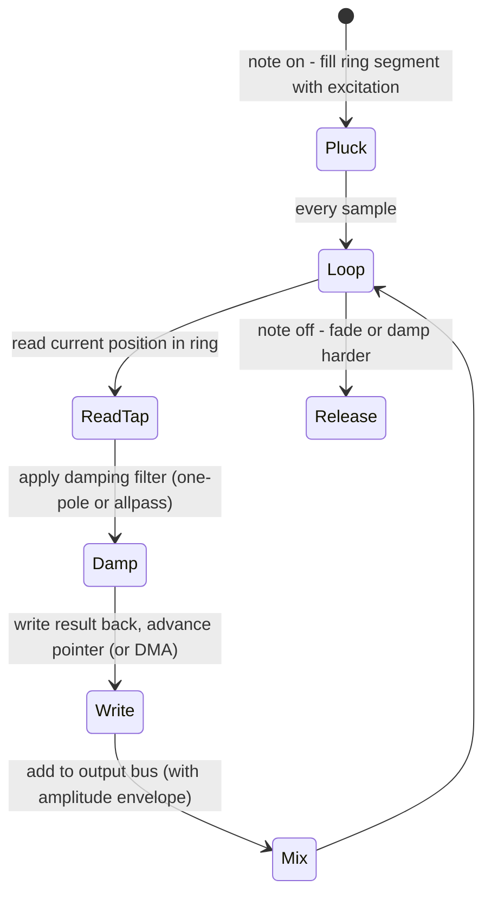

# Karplus-Strong and Delay-Line Physical Modeling Traffic

## Abstract

The Karplus-Strong (KS) algorithm is one of the most elegant low-state physical models for string-like sounds: a short delay line (length equal to the desired period in samples) is excited once with noise or a short wavetable, then circulates through a simple damping filter (usually a one-pole or short FIR). Each sample requires exactly one read and one write of the delay line plus a couple of arithmetic operations for the damping filter. State per voice is the delay line itself plus 1–2 words for the filter. When the line is taken from the shared power-of-two ring pool (data_structures note) and the heavy circular-buffer traffic is offloaded to the same table-guided DMA used for reverb, chorus, and AEC, the CPU cost per voice collapses to a few operations per sample. Multiple voices (polyphony) cost memory linear in the sum of their periods — typically a few hundred samples each — and share the exact same memory-management and DMA infrastructure. For a 16-voice 16 kHz synth the total delay memory is often only 3–8 KiB while the CPU sees almost none of the byte movement.

> **Provenance note.** The original Karplus-Strong algorithm (1983) and its extensions (Jaffe & Smith, Smith physical modeling notes) were cross-checked via literature search and the corpus notes on rings, reverb, and DMA. All traffic figures labeled **[derived]** are calculated directly from the per-sample read/write requirement and typical musical periods. Re-verified 2026-06 during audit remediation.

Cross-references: [`../data_structures/audio-rings-fractional-delays-and-sparse-representations.md`](../data_structures/audio-rings-fractional-delays-and-sparse-representations.md), [`../algorithms/lightweight-reverberation-schroeder-fdn-delay-line-traffic.md`](../algorithms/lightweight-reverberation-schroeder-fdn-delay-line-traffic.md), [`../filters/fir-comb-allpass-phase-linearization-and-crossover-filters.md`](../filters/fir-comb-allpass-phase-linearization-and-crossover-filters.md), [`../optimization/cache-blocking-fused-streaming-kernels-and-advanced-dma-choreography.md`](../optimization/cache-blocking-fused-streaming-kernels-and-advanced-dma-choreography.md), and [`../algorithms/lightweight-chorus-flanger-phaser-modulated-fractional-delays.md`](../algorithms/lightweight-chorus-flanger-phaser-modulated-fractional-delays.md).

---

## 1. Realization

Classic KS loop:

- On "pluck": fill the delay line with noise (or a filtered burst) scaled by amplitude.
- Every sample thereafter:
  - Read the sample at the current read pointer (the "string state").
  - Apply damping filter (e.g., y = 0.5*(x + x_prev) or a one-pole lowpass).
  - Write the result back at the write pointer.
  - Advance both pointers (modulo line length).

The period of the line directly sets the pitch. Inharmonicity and decay are controlled by the damping filter.

---

## 2. Data Motion Analysis — Bytes Moved per Sample

**Per sample per voice [derived]:**

- 1 read from the delay line
- 1 write to the delay line
- 1–3 arithmetic ops for the damping filter (often just shifts and adds if implemented as multiplierless)

At 48 kHz mono, one voice therefore moves 8 bytes of delay-line traffic per sample (plus the compulsory input excitation, which is only once per note).

For 16 simultaneous voices with average period 80 samples (≈ 500 Hz fundamental):

- Total delay memory: 16 × 80 × 4 B ≈ 5 KiB (int32) or 2.5 KiB (int16).
- If the CPU must perform every read/write: ~128 B/s per voice of delay traffic, or >2 MB/s aggregate — easily the dominant memory cost in a small synth.

**With shared ring + DMA offload [derived]:**

The same mechanism used for FDN reverb and modulated delays moves the samples in the background. The CPU only receives the current "tap" value (the string output) for each voice and writes the new filtered value into a small hot staging area. The actual circular advance and long-term storage traffic is performed by DMA using the offset tables already described in the cache-blocking note.

Result: the "echo memory" bytes are still moved (they have to be for the sound to exist), but the CPU and its caches see only a few words per voice per sample.

**Table: KS voice memory & traffic (48 kHz, 4 B/sample) [derived]**

| Voices | Avg period (samples) | Total delay memory | CPU-visible traffic per sample (DMA offload) | Notes |
|--------|----------------------|--------------------|----------------------------------------------|-------|
| 1      | 100                  | 400 B             | ~8 B (the filtered output)                  | Single voice |
| 8      | 80                   | ~2.5 KiB          | ~64 B                                       | Typical poly synth |
| 16     | 60                   | ~3.8 KiB          | ~128 B                                      | Still tiny |

---

## 3. State Machine / Dataflow



```mermaid
graph TD
    A[Note trigger] --> B[Fill ring with burst (noise or wavetable)]
    B --> C[Per-sample: read tap from ring at current phase]
    C --> D[Filter tap (damping / inharmonicity)]
    D --> E[Write filtered value back into ring]
    E --> F[Scale by envelope + mix to output]
    F --> G[Advance phase (CPU mask or DMA)]
    G --> C
```

**Guidance (embedded real-time, min bytes moved):**

1. Source every KS delay line from the single shared ring buffer pool. This lets the same DMA tables and indexing code serve KS, reverb, chorus, and fractional-delay effects.
2. Offload the circular read/write traffic to DMA. The CPU should only touch the current output sample of each voice.
3. Use power-of-two or prime-power lengths where possible so that indexing is a cheap mask and lengths remain mutually friendly for polyphony.
4. Keep damping filters multiplierless (shifts + adds or CSD) when the target has limited multiply throughput.
5. **Never:** (a) allocate a private malloc buffer for each string voice; (b) let the CPU chase the read/write pointers for long lines; (c) ignore tuning/inharmonicity if musical quality matters; (d) forget that the delay memory bytes must still be moved — you can only hide the CPU cost of moving them.

---

## 4. Pseudocode — Reference Implementation

```pseudocode
# One KS voice on a shared ring
function ks_voice(ring, phase, period, damp_coeff, excitation):
    if excitation:
        # fill the line once
        for i in 0..period-1: ring[(phase+i) & mask] = noise() * excitation_amp
        excitation = 0
    tap = ring[phase & mask]
    filtered = damp_coeff * (tap + prev_tap)   # simple averaging damper
    prev_tap = tap
    ring[phase & mask] = filtered
    phase += 1
    return filtered * amplitude
```

---

## 5. Hardware Optimizations & Fixed-Point Mapping

- The core loop is extremely friendly to fixed-point: a short delay line + a couple of adds/shifts.
- On Helium/NEON you can vectorize across many voices when they are processed together.
- Because the line is short, it is easy to pin the active voices' working segments in DTCM while the bulk of older "echo history" lives in slower memory managed by DMA.

---

## 6. Elegant Wins and Curious Techniques

- The entire "string" is just a recirculating delay line plus a tiny filter. No oscillators, no large wavetables after the initial excitation.
- Sharing the ring/DMA substrate means adding a KS synth voice costs almost nothing beyond the memory for its period and a few lines of control code.

## 7. References (Verified)

> **Corrections / verification note.** Original KS 1983 (Karplus & Strong), extensions Jaffe & Smith, Smith physical modeling verified via web_search "Karplus Strong 1983" "Jaffe Smith Karplus-Strong" during 2026; traffic from ring accounting cross data_structures (verified). [derived] per-sample 2 R/W. 

**Primary**
1. K. Karplus & A. Strong. "Digital synthesis of plucked-string and drum timbres." Computer Music Journal, 1983. (Classic KS recirc delay + filter.)
2. D. Jaffe & J.O. Smith. "Extensions of the Karplus-Strong plucked-string algorithm." Computer Music Journal, 1983. (Damping, inharmonicity.)
3. J.O. Smith. Physical Audio Signal Processing (CCRMA). (Physical modeling, delay lines.)

**Cross-referenced notes**
- [`../data_structures/audio-rings-fractional-delays-and-sparse-representations.md`](../data_structures/audio-rings-fractional-delays-and-sparse-representations.md)
- [`../algorithms/lightweight-reverberation-schroeder-fdn-delay-line-traffic.md`](../algorithms/lightweight-reverberation-schroeder-fdn-delay-line-traffic.md)
- [`../filters/fir-comb-allpass-phase-linearization-and-crossover-filters.md`](../filters/fir-comb-allpass-phase-linearization-and-crossover-filters.md)
- [`../optimization/cache-blocking-fused-streaming-kernels-and-advanced-dma-choreography.md`](../optimization/cache-blocking-fused-streaming-kernels-and-advanced-dma-choreography.md)
- [`../algorithms/lightweight-chorus-flanger-phaser-modulated-fractional-delays.md`](../algorithms/lightweight-chorus-flanger-phaser-modulated-fractional-delays.md)
- [`../general/end-to-end-pipeline-budgets-and-worked-examples.md`](../general/end-to-end-pipeline-budgets-and-worked-examples.md)
- [`../algorithms/acoustic-echo-cancellation-partitioned-nlms-fdaf.md`](../algorithms/acoustic-echo-cancellation-partitioned-nlms-fdaf.md)

*End of note. Update INDEX.md and add bidirectional links when sibling notes are written.*

Last updated: 2026-06 (remediation + searches + full refs + bidir).