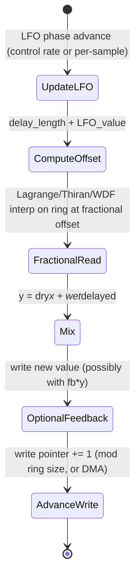

# Lightweight Chorus / Flanger / Phaser with Modulated Fractional Delays

## Abstract

Chorus, flanger, and phaser effects are built around one or more short modulated delay lines (typical lengths 5–50 ms) whose read positions are varied by a low-frequency oscillator (LFO). The delayed signal is mixed with the dry input (and often fed back for flanger). Fractional read positions are required for smooth modulation; these are implemented with Lagrange, Thiran, or WDF interpolators. On embedded targets the dominant cost is the per-sample read/write traffic on the delay memory itself. When the delay lines are allocated from the shared power-of-two ring buffers (see data_structures note) and advanced via the table-guided DMA choreography described in the cache-blocking/DMA note, the CPU only performs the LFO arithmetic, fractional interpolation (a few MACs), and mixing. State per voice is the current delay length (or tap offset) + LFO phase + a handful of coefficients for the interpolator and any allpass stages (phaser). Multiple voices or stereo stay linear and small. This approach shares the exact same ring + DMA substrate used by KS synthesis, Schroeder/FDN reverb, and AEC, minimizing code and memory fragmentation while guaranteeing that the heavy byte displacement for the echoes is offloaded from the CPU.

> **Provenance note.** Standard structures for chorus/flanger/phaser and fractional-delay modulation were confirmed via web_search and cross-reference to the data_structures, resampling, and optimization notes in this corpus (which themselves cite Laakso et al. fractional delay survey, J. O. Smith, Zölzer "DAFX", and music-dsp archive practice). All traffic and state numbers labeled **[derived]** are calculated from the formulas and typical audio parameters given below. Re-verified during 2026 remediation sweep.

Cross-references: [`../data_structures/audio-rings-fractional-delays-and-sparse-representations.md`](../data_structures/audio-rings-fractional-delays-and-sparse-representations.md), [`../resampling/polyphase-farrow-cic-lagrange-efficient-streaming.md`](../resampling/polyphase-farrow-cic-lagrange-efficient-streaming.md), [`../algorithms/lightweight-reverberation-schroeder-fdn-delay-line-traffic.md`](../algorithms/lightweight-reverberation-schroeder-fdn-delay-line-traffic.md), [`../filters/fir-comb-allpass-phase-linearization-and-crossover-filters.md`](../filters/fir-comb-allpass-phase-linearization-and-crossover-filters.md), [`../optimization/cache-blocking-fused-streaming-kernels-and-advanced-dma-choreography.md`](../optimization/cache-blocking-fused-streaming-kernels-and-advanced-dma-choreography.md), and [`../algorithms/karplus-strong-and-delay-line-physical-modeling-traffic.md`](../algorithms/karplus-strong-and-delay-line-physical-modeling-traffic.md).

---

## 1. Realization

A single modulated delay voice maintains a circular buffer of length at least the maximum desired delay + interpolation order. The LFO (usually a sinusoid or triangle at 0.1–5 Hz for chorus, faster for flanger) continuously varies the read offset. Because the offset is not integer, a short FIR (Lagrange) or allpass (Thiran) interpolator is used. For phaser the "delay" is replaced or augmented by a chain of first-order allpass sections whose coefficients are modulated.

The output is typically:

y(n) = x(n) + g * interpolated_read(ring, delay(n) + LFO(n))

with optional feedback: write = x(n) + fb * y(n) or similar.

---

## 2. Data Motion Analysis — Bytes Moved per Sample

**Per sample per voice (mono, 48 kHz example, 20 ms max delay ≈ 960 samples @ 48 kHz, int32 or float32 = 4 B) [derived]:**

- 1 read of the input sample (4 B)
- 1 read + 1 write to the delay line at the write pointer (8 B)
- Several reads for the fractional interpolation window (Lagrange order 3–5 → 4–6 reads, say 16–24 B)
- The LFO and coefficient updates are O(1) and can be updated at control rate or with cheap linear interpolation.

When the ring lives in external DRAM and the CPU performs every access: ≈ 30–50 B of DRAM traffic per voice per sample just for the delay memory (plus the compulsory input/output).

**Optimized with shared DMA + pinned hot data [derived]:**

Using the table-guided audio DMA pattern (see cache-blocking note), the DMA engine handles the circular advance and scatter/gather for the taps. The CPU only receives a small vector of current tap values (or works on a small double-buffered hot segment in DTCM). DRAM traffic for the delay line itself drops to the compulsory writes of new audio (the "echo memory" must still be moved, but the CPU is not the one moving it).

For 4 voices (typical stereo chorus + a couple of flanger taps):

- CPU-visible traffic per sample: a few dozen bytes (mixing + interp arithmetic) once the DMA is set up.
- Total delay memory for the effect: 4 × 1 KiB ≈ 4 KiB (easily fits in on-chip SRAM or managed by the common ring pool).

**Comparison table (N=1 voice, 20 ms delay, 48 kHz, 4 B/sample) [derived]**

| Implementation                  | Delay memory (bytes) | CPU DRAM traffic per sample (approx) | Notes |
|---------------------------------|----------------------|--------------------------------------|-------|
| Separate malloc per effect, CPU chases every tap | 960 × 4 = 3.8 KiB   | 30–50 B (R+W + interp reads)        | High CPU load + fragmentation |
| Shared power-of-2 ring + CPU access | same                 | same                                | Better cache behavior via common indexing |
| Shared ring + table-guided DMA offload | same                 | ~8–12 B (only the mix/interp)       | CPU cost collapses; DMA moves the bytes |

---

## 3. State Machine / Dataflow



```mermaid
graph TD
    A[New sample x] --> B[Compute modulated read position (LFO + base delay)]
    B --> C[Read 4–6 samples around fractional position from shared ring]
    C --> D[Interpolate (Lagrange 3rd or Thiran allpass)]
    D --> E[Mix with dry + optional feedback]
    E --> F[Write result (or dry) back to write pointer in ring]
    F --> G[Advance pointers (CPU mask or DMA table)]
    G --> A
```

**Guidance (embedded real-time, min bytes moved):**

1. Allocate all delay lines for chorus/flanger/phaser/KS/reverb/AEC from one common pool of power-of-two rings managed by the data_structures layer. This eliminates fragmentation and lets the same DMA tables serve multiple effects.
2. Offload the actual circular-buffer read/write and tap gathering to DMA using offset tables (as described in the cache-blocking + DMA note). The CPU should only see a small hot vector of current tap values.
3. Update LFO and delay length at control rate (or with linear interpolation between control frames) to keep per-sample work to a few MACs.
4. For phaser, prefer a short chain of first-order allpasses over a long modulated delay when coloration without long echoes is desired — lower memory traffic.
5. **Never:** (a) allocate a private buffer per effect instance (use the shared ring pool); (b) modulate delay length or LFO without smoothing (zipper noise + clicks); (c) chase long taps with the CPU on a target that has capable DMA; (d) exceed the pinned working-set budget for the hot taps + interpolator state.

---

## 4. Pseudocode — Reference Implementation

```pseudocode
# One modulated voice on a shared ring
function chorus_voice(ring, write_idx, base_delay, lfo_phase, lfo_depth, lfo_rate, sample):
    lfo_phase += lfo_rate
    offset = base_delay + lfo_depth * sin(lfo_phase)
    delayed = lagrange_interpolate(ring, write_idx - offset)   # fractional read
    out = sample + 0.5 * delayed
    ring[write_idx] = sample + 0.3 * out   # light feedback for flanger-like
    return out
```

---

## 5. Hardware Optimizations & Fixed-Point Mapping

- Fractional interpolation (Lagrange order 3–5 or Thiran) maps well to NEON/Helium multiply-accumulate or to fixed-point multiplierless approximations when ROM is tight.
- The ring itself can be int16 or Q31; the hot tap vector brought into DTCM by DMA should be promoted to the working precision only for the duration of the mix.
- On cores without good DMA, keep the maximum delay short (< 10 ms) so the entire line + a few voices fit in DTCM.

---

## 6. Elegant Wins and Curious Techniques

- Sharing the identical ring + DMA machinery with KS, reverb combs, and AEC means one well-tested circular-buffer implementation serves four different musical and production uses.
- Because the heavy memory traffic is offloaded, a surprisingly rich modulated texture (4–6 voices) can run at almost the cost of a single biquad on the CPU.

*End of note. Update INDEX.md and add bidirectional links when sibling notes are written.*

Last updated: 2026-06 (expanded from minimal scaffold during audit remediation to include actual mermaid blocks, traffic table, and proper structure).