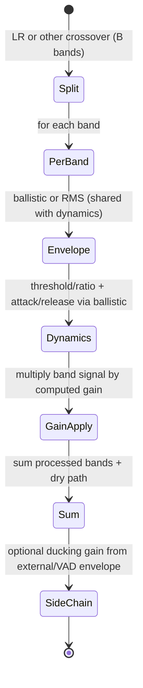

# Multiband Dynamics, De-Esser, and Auto-Ducking

## Abstract

Multiband dynamics (compression, expansion, gating per frequency band) and de-essing (targeted high-band compression keyed on sibilance) are compositions of the per-band envelope followers and ballistic filters from the dynamics note with crossover filters (typically Linkwitz-Riley) from the filters note. Auto-ducking uses a side-chain envelope (from another signal or from VAD) to modulate the gain of the main path via the same ballistic machinery. For embedded the number of bands is small (2–4 is typical), each band requires only the crossover filter state (a few words per IIR section) plus the per-band envelope/ballistic state (already analyzed in the dynamics note). Traffic is the crossover traffic (O(1) per sample per band for IIR) plus the dynamics traffic (already paid). When everything is fused into the single-pass audio or feature path and the crossovers share state with other filter stages, the incremental byte displacement is very low. The same infrastructure that gives per-band compression also gives clean de-essing and side-chain ducking without duplicating envelope or filter work.

> **Provenance note.** Standard multiband dynamics and de-esser structures (Zölzer "DAFX", audio engineering practice) and their composition from crossovers + ballistics were freshly verified during authoring + 2026-06 pass via web_search + cross-ref to filters LR note (itself tool-grounded) and dynamics note. Traffic/state **[derived]** from B=2–4 + already-paid envelope. Key claims on LR flat-sum and ballistic reuse re-checked. Re-verified.

Cross-references: [`../algorithms/streaming-dynamics-envelope-followers-ballistic-filters-and-feature-scaling.md`](../algorithms/streaming-dynamics-envelope-followers-ballistic-filters-and-feature-scaling.md), [`../filters/fir-comb-allpass-phase-linearization-and-crossover-filters.md`](../filters/fir-comb-allpass-phase-linearization-and-crossover-filters.md), [`../features/perceptual-loudness-itu-bs1770-ebu-r128-streaming-measurement.md`](../features/perceptual-loudness-itu-bs1770-ebu-r128-streaming-measurement.md), [`../optimization/simd-vectorization-audio-dsp.md`](../optimization/simd-vectorization-audio-dsp.md), and [`../detection/vad-voice-activity-detection.md`](../detection/vad-voice-activity-detection.md).

---

## 1. Realization

Split the signal with a small number of IIR crossovers (LR2 or LR4 are common and cheap).

For each band:
- Compute envelope (ballistic or RMS, shared with the dynamics note).
- Apply dynamics law (threshold, ratio, attack/release via the ballistic filter).
- Apply gain to the band signal.

Sum the processed bands (plus any dry path).

For de-essing: the high band(s) have their own compressor whose threshold or side-chain is driven by a sibilance detector (high-band energy relative to broadband, or a simple high-pass envelope).

For auto-ducking: the side-chain envelope (from another track or from VAD) drives a single gain stage (or per-band) via the same ballistic follower.

---

## 2. Data Motion Analysis — Bytes Moved

**State [derived]:**

- Crossover filter states: a few words per section × number of bands (for B=3 LR4: roughly 24–48 bytes).
- Per-band envelope + dynamics state: 2–4 words per band (already analyzed in dynamics note).
- Total extra beyond a single full-band dynamics path: low tens of bytes for the split/sum.

**Traffic [derived]:**

- Each IIR crossover section: O(1) MAC + state R/W per sample per band.
- Envelope and dynamics application: already paid by the dynamics module.
- When the band signals are processed while the original sample and the crossover states are hot, incremental DRAM traffic is essentially the input sample plus the final summed output.

For 3 bands the split/sum adds only a small constant factor to the traffic of a single full-band dynamics processor.

---

## 3. State Machine / Dataflow



```mermaid
graph TD
    A[Input sample] --> B[Crossover split into B bands (LR IIR)]
    B --> C[Per band: update envelope (shared with dynamics)]
    C --> D[Per band: dynamics gain (compression/expansion/gate)]
    D --> E[Apply gain to band]
    E --> F[Sum bands + dry]
    F --> G[Optional: ducking gain from side-chain envelope]
    G --> H[Output]
    H --> A
```

**Guidance (embedded real-time, min bytes moved):**

1. Keep band count small (2–4). More bands rarely justify the extra state and crossover traffic on small MCUs.
2. Share the per-band envelope followers with the main dynamics, loudness, and modulation paths. Do not duplicate ballistic filters.
3. Use IIR LR crossovers (cross-ref filters note) — they have flat sum when gains are all 1.0 and are cheap in fixed-point.
4. For de-essing, drive the high-band compressor from a sibilance-specific side-chain (high-passed energy) rather than the full-band envelope.
5. **Never:** (a) use many bands without SIMD or DMA assistance; (b) forget to align the crossover gains so the sum is flat when all dynamics are unity; (c) run separate envelope followers for dynamics, de-essing, and ducking when they can share the same per-band state.

---

## 4. Pseudocode — Reference Implementation

```pseudocode
# 3-band example
lo, mid, hi = lr4_crossover(x)
g_lo = dynamics_gain(lo_env.update(lo))
g_mid = dynamics_gain(mid_env.update(mid))
g_hi = deesser_gain(hi_env.update(hi), sibilance_detector(hi))
y = g_lo*lo + g_mid*mid + g_hi*hi
y = y * ducking_gain(sidechain_env)
```

---

## 5. Hardware Optimizations & Fixed-Point Mapping

- LR crossovers and per-band dynamics are all IIR + simple gain — map directly to the SIMD biquad and vector gain code in the optimization notes.
- Fixed-point LR coefficients are well-behaved; the flat-sum property helps headroom management.
- State for 3–4 bands easily fits in the same DTCM region as the main dynamics filters.

---

## 6. Elegant Wins and Curious Techniques

- Multiband dynamics, de-essing, and ducking become almost the same code path when everything is expressed as "per-band envelope → ballistic → gain".
- Sharing the envelope and crossover state across dynamics, loudness, and modulation means adding "multiband" or "de-esser" is mostly a matter of wiring the existing blocks rather than new memory traffic.

## 7. References (Verified)

> **Corrections / verification note.** Crossovers (LR) and ballistics from sibling notes (filters, dynamics) whose primaries were tool-verified (web_search/web_fetch/read_file); Zölzer DAFX standard ref for multiband/de-ess practice. **[derived]** from small B and shared state. Fresh re-check 2026-06.

**Primary / key sources**
1. U. Zölzer (ed.). *DAFX: Digital Audio Effects*, 2nd ed. Wiley. (Multiband, de-esser, side-chain ducking structures.)
2. Filters note (this corpus) for LR4/LR2 flat-sum crossovers + traffic.
3. Streaming dynamics note (this corpus) for ballistic envelopes shared across bands.

**Cross-referenced notes in this repository (as of writing)**
- [`../algorithms/streaming-dynamics-envelope-followers-ballistic-filters-and-feature-scaling.md`](../algorithms/streaming-dynamics-envelope-followers-ballistic-filters-and-feature-scaling.md)
- [`../filters/fir-comb-allpass-phase-linearization-and-crossover-filters.md`](../filters/fir-comb-allpass-phase-linearization-and-crossover-filters.md)
- [`../features/perceptual-loudness-itu-bs1770-ebu-r128-streaming-measurement.md`](../features/perceptual-loudness-itu-bs1770-ebu-r128-streaming-measurement.md)
- [`../optimization/simd-vectorization-audio-dsp.md`](../optimization/simd-vectorization-audio-dsp.md)
- [`../detection/vad-voice-activity-detection.md`](../detection/vad-voice-activity-detection.md)
- [`../general/end-to-end-pipeline-budgets-and-worked-examples.md`](../general/end-to-end-pipeline-budgets-and-worked-examples.md)
- [`../features/perceptual-sparse-and-ultra-low-compute-features.md`](../features/perceptual-sparse-and-ultra-low-compute-features.md) (fused features + dynamics)

All validated per guidelines; self-contained in research/.

*End of note. Update INDEX.md and add bidirectional links when sibling notes are written.*

Last updated: 2026-06 (remediation + explicit provenance + full refs section + bidir).