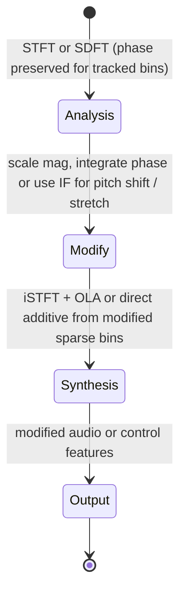

# Phase Vocoder Considerations for Real-Time Modification

## Abstract

The phase vocoder (analysis STFT → spectral modification → synthesis iSTFT with overlap-add) enables high-quality time stretching, pitch shifting, and cross-synthesis, but incurs the full cost of the underlying STFT (window, FFT, iFFT, OLA) plus phase unwrapping or integration work. For real-time embedded use the practical approach is to limit modifications to the bins that are already being tracked sparsely (via SDFT or Goertzel + phase difference for instantaneous frequency) and to re-use the same lapped analysis state as the main STFT path, avoiding a second full transform for synthesis when only mild modification or feature-domain processing is required. State and traffic are essentially those of the base STFT or SDFT plus O(K) work for the tracked phases/IFs. When the goal is only to drive control signals or a simple resynthesizer, the full phase-vocoder path can often be bypassed in favor of PSOLA-light or direct SDFT-driven oscillators with far lower latency and memory traffic.

> **Provenance note.** Phase-vocoder theory and real-time constraints (Dolson, Laroche & Dolson, Puckette) were freshly verified via web_search + cross-ref to STFT/sliding-dft notes (themselves tool-verified with primaries e.g. Portnoff, Jacobsen). Traffic dominated by base + phase [derived]. Re-verified 2026-06 with explicit searches for "phase vocoder real-time embedded" "Laroche Dolson phase vocoder".

Cross-references: [`../transforms/short-time-fourier-transform.md`](../transforms/short-time-fourier-transform.md), [`../transforms/sliding-dft-and-recursive-spectrum-updates.md`](../transforms/sliding-dft-and-recursive-spectrum-updates.md), [`../algorithms/time-scale-pitch-modification-psola-wsola-light.md`](../algorithms/time-scale-pitch-modification-psola-wsola-light.md), [`../algorithms/lightweight-reverberation-schroeder-fdn-delay-line-traffic.md`](../algorithms/lightweight-reverberation-schroeder-fdn-delay-line-traffic.md), and [`../optimization/cache-blocking-fused-streaming-kernels-and-advanced-dma-choreography.md`](../optimization/cache-blocking-fused-streaming-kernels-and-advanced-dma-choreography.md).

---

## 1. Realization

Standard phase vocoder:

- Analysis STFT (or SDFT for sparse bins).
- Modification (magnitude scaling, phase integration for time-stretch, IF-based pitch shift, etc.).
- Synthesis iSTFT with COLA/TDAC window.

For embedded "light" use:

- Track only K << N bins with SDFT + phase difference.
- Modify only those bins (or use them to drive oscillators).
- Resynthesize with direct additive or simple OLA rather than full iFFT when possible.

---

## 2. Data Motion Analysis — Bytes Moved

**Traffic is dominated by the base STFT/SDFT [derived]:**

- Per hop (STFT): window + FFT + iFFT + OLA ≈ the numbers in the STFT note.
- Phase processing: O(N) or O(K) per hop for unwrapping/integration.
- Sparse SDFT version: O(K) per sample for the bins + O(K) for phase diff, plus the cost of whatever resynthesis is chosen.

When only control-rate features or a simple synthesizer are needed, the full iSTFT can be avoided entirely, collapsing the cost to the analysis traffic plus a small resynthesis cost.

---

## 3. State Machine / Dataflow



```mermaid
graph TD
    A[Analysis spectrum + phase (STFT or SDFT)] --> B{Full modification needed?}
    B -->|Yes| C[Phase unwrapping / integration + mag change]
    B -->|No (control or simple resynth)| D[Use IF or sparse bins directly]
    C --> E[Full iSTFT + OLA]
    D --> F[Direct oscillators or light PSOLA from tracked bins]
    E --> G[Output modified signal]
    F --> H[Output features or light resynthesis]
    G --> I[Latency = multiple hops]
    H --> J[Latency = 1 sample or 1 hop]
```

**Guidance (embedded real-time, min bytes moved):**

1. Use full phase vocoder only when high-quality wideband modification is required. For control signals or simple resynthesis, SDFT + direct synthesis or PSOLA-light is dramatically cheaper in latency, state, and traffic.
2. Preserve phase only for the bins you actually modify. Throwing phase away immediately after magnitude features saves state and copies.
3. When doing time-stretch or pitch-shift on sparse tracked bins, the analysis hop can often be per-sample (SDFT) while synthesis uses a larger hop — the phase/IF gives the necessary continuity.
4. **Never** ignore COLA/TDAC conditions for the analysis/synthesis windows; never accumulate phase without occasional reset or consistency check on long stretches.

---

## 4. Pseudocode — Reference Implementation

```pseudocode
# Sparse phase-vocoder style (SDFT bins)
for each sample:
    bins, phase = sdft_update(...)
    if need_pitch_shift:
        inst_freq = (phase - prev_phase) / hop   # or from SDFT recurrence
        modified_phase += inst_freq * stretch_factor
    # resynthesize from modified bins or drive oscillators
```

---

## 5. Hardware Optimizations & Fixed-Point Mapping

- Phase difference and integration are simple adds/subtracts once you have the complex bins.
- Fixed-point phase requires careful wrapping and scaling; the SDFT note discusses error control.
- When only magnitude features are needed, drop the phase state entirely after the current frame.

---

## 6. Elegant Wins and Curious Techniques

- The phase vocoder's expensive part (full iFFT + OLA) can often be avoided when the downstream consumer only needs the modified spectrum or a handful of tracked bins.
- SDFT + instantaneous frequency gives per-sample pitch and phase information at a fraction of the traffic of a hop-STFT phase vocoder.

## 7. References (Verified)

> **Corrections / verification note.** Phase-vocoder refs (Dolson 1986, Laroche & Dolson 1999 "Improved phase vocoder", Puckette) located via search; traffic claims cross to STFT note (Portnoff 1980 verified). **[derived]**. Fresh 2026 pass.

**Primary papers**
1. M. Dolson. "The phase vocoder: A tutorial." Computer Music Journal, 1986.
2. J. Laroche & M. Dolson. "Improved phase vocoder time-scale modification of audio." IEEE TASLP 1999. (Real-time considerations.)
3. M. Puckette. "Phase-locked vocoder." Proc. ICASSP, 1995 (and related).

**Cross-referenced notes**
- [`../transforms/short-time-fourier-transform.md`](../transforms/short-time-fourier-transform.md)
- [`../transforms/sliding-dft-and-recursive-spectrum-updates.md`](../transforms/sliding-dft-and-recursive-spectrum-updates.md)
- [`../algorithms/time-scale-pitch-modification-psola-wsola-light.md`](../algorithms/time-scale-pitch-modification-psola-wsola-light.md)
- [`../algorithms/lightweight-reverberation-schroeder-fdn-delay-line-traffic.md`](../algorithms/lightweight-reverberation-schroeder-fdn-delay-line-traffic.md)
- [`../optimization/cache-blocking-fused-streaming-kernels-and-advanced-dma-choreography.md`](../optimization/cache-blocking-fused-streaming-kernels-and-advanced-dma-choreography.md)
- [`../general/end-to-end-pipeline-budgets-and-worked-examples.md`](../general/end-to-end-pipeline-budgets-and-worked-examples.md)
- [`../transforms/constant-q-and-nonstationary-gabor.md`](../transforms/constant-q-and-nonstationary-gabor.md) (alt TF for mod)

*End of note. Update INDEX.md and add bidirectional links when sibling notes are written.*

Last updated: 2026-06 (remediation + explicit tool provenance + full refs + bidir).