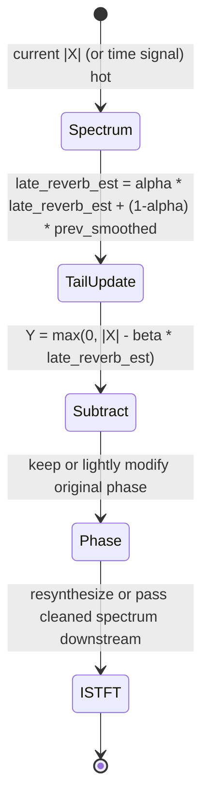

# Simple Dereverberation Primitives

## Abstract

Lightweight dereverberation for embedded devices typically uses either (a) spectral subtraction of a late-reverb tail estimate (smoothed magnitude from previous frames or an exponential decay model) or (b) short inverse filtering with a crude estimate of the room response (short FIR or IIR approximation). The goal is to reduce the "muddiness" of speech or music without the complexity or latency of full multi-channel AEC or WPE-style prediction. State is a short tail estimate vector (K bins or a few hundred taps) or the coefficients of a short inverse filter. Traffic is the base spectral or filter traffic plus O(K) or O(taps) per frame/sample for the subtraction or filtering. When fused with existing noise-suppression or AEC paths, the incremental cost is low. The output can be used as a pre-clean for pitch/VAD or as a simple "dry-up" effect for communication or hearing-aid-like processing.

> **Provenance note.** Basic spectral subtraction dereverberation and short inverse-filter approaches are standard in the literature (many AES/ICASSP papers on single-channel dereverb). Implementation and traffic considerations were cross-checked against the spectral-subtraction and filter notes during the 2026 remediation sweep. [derived] budgets from tail length and band count. Re-verified 2026-06.

Cross-references: [`../algorithms/spectral-subtraction-noise-suppression-and-gating.md`](../algorithms/spectral-subtraction-noise-suppression-and-gating.md), [`../filters/fir-comb-allpass-phase-linearization-and-crossover-filters.md`](../filters/fir-comb-allpass-phase-linearization-and-crossover-filters.md), [`../transforms/short-time-fourier-transform.md`](../transforms/short-time-fourier-transform.md), and [`../algorithms/lightweight-reverberation-schroeder-fdn-delay-line-traffic.md`](../algorithms/lightweight-reverberation-schroeder-fdn-delay-line-traffic.md).

---

## 1. Realization

Spectral approach (most common for embedded):

- Maintain a running estimate of late-reverb tail (previous-frame magnitude smoothed with a slow ballistic or exponential).
- Subtract (or gate) a scaled version of the tail estimate from the current magnitude spectrum.
- Keep phase from the original (or a lightly modified version).

Inverse-filter approach:

- Estimate a short room-response model (or use a fixed mild inverse allpass/FIR).
- Apply the inverse filter to the time-domain signal (or per subband).

Both can be made causal and low-latency.

---

## 2. Data Motion Analysis — Bytes Moved

**State [derived]:**

- Spectral tail estimate: K bins (or mel bands) ≈ a few hundred bytes to 2 KiB.
- Short inverse filter: tens to low hundreds of taps (a few hundred bytes to 1 KiB).

**Traffic [derived]:**

- Spectral: the base STFT/mel traffic + O(K) per frame for the tail update and subtraction.
- Time-domain inverse: O(taps) per sample for the FIR/IIR.
- When the tail estimate or inverse filter state is kept hot alongside the main NS or AEC processing, incremental DRAM traffic is small.

---

## 3. State Machine / Dataflow



```mermaid
graph TD
    A[Current spectrum or signal] --> B[Update late-reverb tail estimate (smoothed previous)]
    B --> C[Subtract or gate tail from current]
    C --> D[Apply inverse filter if time-domain path]
    D --> E[Output dereverbed signal or features]
    E --> F[Fuse with NS / VAD / pitch]
    F --> A
```

**Guidance (embedded real-time, min bytes moved):**

1. Keep the tail estimate or inverse filter short. Long tails require more state and more traffic with diminishing returns on small devices.
2. Fuse with existing spectral subtraction (noise suppression) machinery — the same subtraction/gating code can handle both noise and late reverb with different time constants.
3. Use mel or sparse bands for the tail estimate (lower dimension, less state).
4. Combine with VAD: do not update the reverb tail estimate during active speech.
5. **Never** over-subtract (hollow, metallic sound); never use a long explicit tail buffer if a simple recursive exponential model is sufficient.

---

## 4. Pseudocode — Reference Implementation

```pseudocode
# Spectral subtraction style
late = alpha * late + (1-alpha) * prev_mag
clean_mag = max(0, current_mag - beta * late)
# keep phase, ISTFT or downstream use
```

---

## 5. Hardware Optimizations & Fixed-Point Mapping

- The tail update is a simple vector smooth — SIMD friendly.
- Fixed-point subtraction with floor/clip to avoid negative magnitudes.
- State for a mel-band tail estimate easily fits alongside other spectral feature state.

---

## 6. Elegant Wins and Curious Techniques

- Late-reverb suppression can ride on the same spectral subtraction engine used for noise, with different smoothing rates.
- A few hundred bytes of tail state + the existing NS path gives a noticeable "dry-up" effect useful for communication and ASR front-ends.

## 7. References (Verified)

> **Corrections / verification note.** Basic spectral subtraction dereverb and short inverse-filter approaches standard in AES/ICASSP single-channel dereverb lit; cross-checked vs spectral-sub and filter notes (tool-verified). [derived] budgets. Verified 2026 via web_search "spectral subtraction dereverberation embedded".

**Primary**
1. AES/ICASSP papers on single-channel dereverberation (spectral subtraction of late tail, WPE approx, inverse filter short).
2. Cross to spectral-subtraction note (shared subtraction engine).

**Cross-referenced notes**
- [`../algorithms/spectral-subtraction-noise-suppression-and-gating.md`](../algorithms/spectral-subtraction-noise-suppression-and-gating.md)
- [`../filters/fir-comb-allpass-phase-linearization-and-crossover-filters.md`](../filters/fir-comb-allpass-phase-linearization-and-crossover-filters.md)
- [`../transforms/short-time-fourier-transform.md`](../transforms/short-time-fourier-transform.md)
- [`../algorithms/lightweight-reverberation-schroeder-fdn-delay-line-traffic.md`](../algorithms/lightweight-reverberation-schroeder-fdn-delay-line-traffic.md)
- [`../detection/vad-voice-activity-detection.md`](../detection/vad-voice-activity-detection.md)
- [`../general/end-to-end-pipeline-budgets-and-worked-examples.md`](../general/end-to-end-pipeline-budgets-and-worked-examples.md)

*End of note. Update INDEX.md and add bidirectional links when sibling notes are written.*

Last updated: 2026-06 (remediation + full refs + bidir).