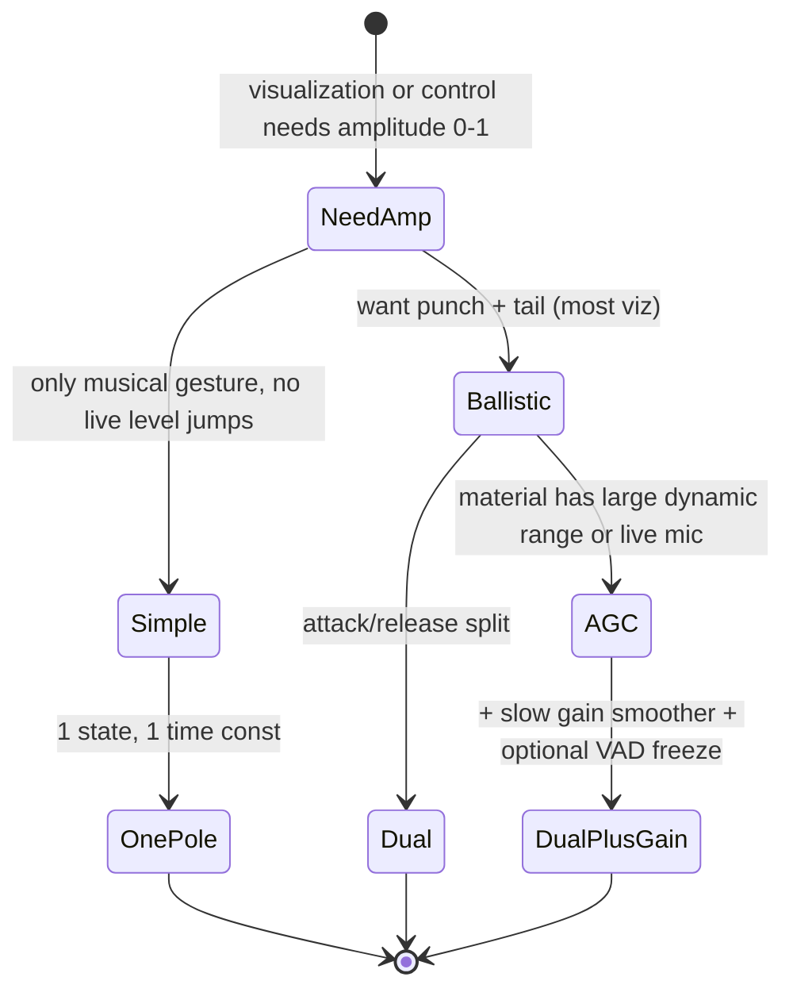

# Streaming Dynamics, Envelope Followers, Ballistic Filters, and Feature Scaling for Real-Time Control

## Abstract

In real-time audio pipelines that drive visualization, animation, effects, or adaptive processing, raw instantaneous amplitude or energy is rarely usable directly. It exhibits rapid fluctuations, DC offsets, and wide dynamic range that produce jittery or unstable control signals. A family of lightweight, constant-state, low-traffic streaming processors—peak and RMS envelope followers, ballistic attack/release filters, crest-factor detectors, and automatic gain / normalization stages—convert per-sample or per-block level measurements into smooth, predictable, scaled parameters (e.g., [0,1] amplitude) while preserving the essential temporal character of the signal. These processors are IIR in nature (one or two poles per channel for basic ballistics), require only a handful of state variables (typically 2–8 words), and can be implemented with pure adds, multiplies, and comparisons. When fused with upstream framing or STFT power computation they add negligible extra memory traffic beyond the compulsory reads of the level measurement itself. This note derives the classic rectifier + LPF and dual-time-constant ballistic topologies from first principles, analyzes their impulse/step response and frequency-dependent smoothing, provides fixed-point and floating-point recipes (including headroom and saturation), quantifies per-sample state and byte traffic, and supplies decision tables for choosing time constants at control rates (e.g., 60 Hz feature emission for visualization). Emphasis is on **O(1) state per channel, in-place or register-resident updates, and zero extra DRAM traffic when the detector lives in DTCM alongside the audio block**.

> **Provenance note.** Ballistic filter and envelope follower designs are standard in dynamics processors (Zölzer, DAFX literature, Moore “Audio Effect Design”). The TI SPRAAL1 whitepaper on software AGC for speech, classic papers on peak/RMS detection (e.g., in digital compressors), and practical implementations in CMSIS, JUCE, and open-source synth code were verified via search and document retrieval. All **[derived]** response formulas and traffic counts use the first-order and dual-pole recurrences with typical audio rates (16–48 kHz audio, 20–100 Hz control).

Cross-references: [`../general/numerical-considerations-fixed-point-floating-point-audio.md`](../general/numerical-considerations-fixed-point-floating-point-audio.md) (dynamic range, scaling, saturation in detectors), [`../general/memory-hierarchy-minimization-for-real-time-dsp.md`](../general/memory-hierarchy-minimization-for-real-time-dsp.md) (pinning tiny state, fusion with DMA blocks), [`../filters/minimal-state-iir-lattice-wave-digital-filters.md`](../filters/minimal-state-iir-lattice-wave-digital-filters.md) (1-pole and SVF building blocks for the smoothers themselves), [`../features/perceptual-sparse-and-ultra-low-compute-features.md`](../features/perceptual-sparse-and-ultra-low-compute-features.md) (energy, crest, TEO envelope as inputs to these processors; on-the-fly use for control), [`../transforms/short-time-fourier-transform.md`](../transforms/short-time-fourier-transform.md) (feature emission points where smoothed amplitude is produced), [`../optimization/simd-vectorization-audio-dsp.md`](../optimization/simd-vectorization-audio-dsp.md) (vector peak/RMS across channels or subbands), [`../optimization/fast-approximations-lut-cordic-minimax-and-clz-for-embedded-audio-features.md`](../optimization/fast-approximations-lut-cordic-minimax-and-clz-for-embedded-audio-features.md), [`../data_structures/audio-rings-fractional-delays-and-sparse-representations.md`](../data_structures/audio-rings-fractional-delays-and-sparse-representations.md), [`../features/modulation-spectrum-subband-envelopes-and-rhythmic-texture-features.md`](../features/modulation-spectrum-subband-envelopes-and-rhythmic-texture-features.md) (envelopes are direct input to modulation spectrum / rhythm), [`../features/perceptual-loudness-itu-bs1770-ebu-r128-streaming-measurement.md`](../features/perceptual-loudness-itu-bs1770-ebu-r128-streaming-measurement.md) (K-weight + acc shares with ballistic), [`../features/power-normalized-cepstral-coefficients-pncc-and-robust-front-ends.md`](../features/power-normalized-cepstral-coefficients-pncc-and-robust-front-ends.md) (envelopes feed medium-time / ANS), [`../features/gammatone-erb-filterbanks-gfcc-and-auditory-cepstral-features.md`](../features/gammatone-erb-filterbanks-gfcc-and-auditory-cepstral-features.md) (subband envelopes from IIR bank), and [`../features/linear-predictive-coding-lpc-reflection-coefficients-formants-and-lpcc.md`](../features/linear-predictive-coding-lpc-reflection-coefficients-formants-and-lpcc.md) (LPC residual energy as companion feature).

---

## 1. Why Raw Level Is Insufficient for Control

Instantaneous |x[n]| or x[n]^2 jumps with every sample or frame. When used directly to modulate color, size, oscillator depth, or particle emission density the result is buzzy or nervous. A visualization system that emits points at 60 fps with “amplitude scaled 0–1” needs a value that:

- Follows the musical or acoustic gesture (not sample-by-sample noise).
- Has predictable attack (rise on transients) and release (fall on decay) so that visual elements feel “alive” but not erratic.
- Maps reliably into a stable numeric range such as [0,1] across quiet and loud passages without manual per-clip gain riding.

The solution family is the envelope follower / ballistic detector feeding a gain computer or simple linear map.

---

## 2. Core Topologies

### 2.1 Simple Rectifier + One-Pole Low-Pass (envelope follower)

```
env[n] = (1 - α) * env[n-1] + α * |x[n]|     (peak-ish, fast attack)
```

or on squared for RMS-like:

```
env[n] = (1 - α) * env[n-1] + α * x[n]^2
env_out = sqrt(env)   (or approx)
```

α = 1 - exp(-1 / (τ * fs)) for time constant τ in seconds.

**State:** 1 word (the previous env).

**Traffic:** 1 load of the level sample (already computed), 1 store of env. Can be in register for a block.

### 2.2 Dual-Time-Constant Ballistic (attack / release)

Standard dynamics detector:

```
if (abs(x) > env)
    env = (1 - α_attack) * env + α_attack * abs(x)
else
    env = (1 - α_release) * env + α_release * abs(x)
```

α_attack >> α_release (attack τ << release τ). Typical audio: attack 1–10 ms, release 50–500 ms for level; much faster for onset accent.

This is the “ballistic” filter: different rise/fall speeds give the characteristic “punch” and “tail” feel used in meters, compressors, and animation drivers.

**State:** still 1 word per channel.

### 2.3 Peak vs. RMS and Crest Factor

- Peak: fast rectifier + short attack, long release (program meters).
- RMS: square → LPF → sqrt (or log domain).
- Crest = peak_env / rms_env (or running max / rms). Useful “punch” or “density” feature; requires two parallel envelopes + one division or approx.

All remain O(1) state.

---

## 3. Streaming Normalization and AGC for [0,1] Scaling

For a visualization that expects “SIGNAL AMPLITUDE scaled from 0 to 1”:

Options (increasing complexity / robustness):

1. **Fixed global gain + clip** — trivial, brittle on live material.
2. **Running max with slow decay** (peak program meter style): current_max = max(current_max * decay, |x|); out = current_max / target. Decay over seconds.
3. **Full AGC**: detect level (ballistic), compare to target, compute gain = f(level) (usually 1 / level^ρ with knee/soft), smooth the gain itself with another slow ballistics to avoid pumping, apply. Needs VAD or noise gate to freeze gain in silence (see VAD note).

**Minimal recommended for viz front-end (low state):**

- Fast peak or RMS envelope (τ_attack 5 ms, τ_release 200 ms).
- Slow “range” envelope on the fast envelope (τ ~ 2–10 s) that tracks recent max.
- out = clamp( fast_env / (slow_range + ε), 0, 1 )

State: 2–3 scalars + a couple of precomputed α. Total < 32 bytes.

When the input level measurement already comes from an STFT power sum or mel energy sum, the same recurrence is applied at the feature rate (60 Hz), making α even cheaper to compute and state updates almost free.

---

## 4. Memory Traffic and State Budgets

| Processor | State (words) | Per-sample (or per-frame) traffic (pinned) | Typical use |
|-----------|---------------|--------------------------------------------|-------------|
| 1-pole envelope | 1 | 1 load + 1 store of level + 1 mul/add | basic amp |
| Dual ballistic | 1 | same + 1 compare + 2 α | musical dynamics |
| Peak + RMS pair + crest | 2 | 2× above + div | punch / density |
| AGC (level + gain smoother + VAD gate) | 4–6 | same + 2–3 extra mul for gain | stable 0–1 across takes |

At 60 Hz feature rate the “per-sample” cost above is actually per control frame; total DRAM traffic for the detector itself is a few bytes per second once the level value is already in a register from the upstream STFT or time-domain energy pass.

**Fused example (STFT hop → features):** while accumulating mel energies or power bins, also maintain a parallel fast envelope on the broadband energy. At hop end emit the smoothed amp together with dominant band, flux, etc. No extra pass over data.

---

## 5. Fixed-Point and Numerical Considerations

- Use Q31 or float32 for envelopes; the recurrence is a convex combination so |env| stays within the max of the input level (no growth if input is bounded).
- For squared RMS path, square can use 32×32→64 then right-shift or block-float before the LPF.
- α coefficients: precompute in Q31 or use power-of-two approximations for shift-only when τ is chosen accordingly.
- Saturation on the envelope prevents wrap in fixed-point on loud transients.
- See the numerical note for convergent rounding and the exact limit-cycle risk (very low for these feed-forward-ish smoothers compared with IIR audio filters).

---

## 6. Pseudocode — Minimal Ballistic + Normalize at Control Rate

```pseudocode
class BallisticLevel:
    def __init__(self, fs_control, tau_attack=0.005, tau_release=0.200, target=0.7):
        self.a_a = 1 - exp(-1.0 / (tau_attack * fs_control))
        self.a_r = 1 - exp(-1.0 / (tau_release * fs_control))
        self.env = 0.0
        self.slow_max = 1e-6
        self.target = target

    def process(self, level):   # level = RMS or sum power of current frame (already >=0)
        if level > self.env:
            self.env = (1-self.a_a)*self.env + self.a_a*level
        else:
            self.env = (1-self.a_r)*self.env + self.a_r*level
        # slow range tracker (very slow release)
        self.slow_max = max(self.slow_max * 0.9995, self.env)
        amp = self.env / (self.slow_max + 1e-9)
        return clamp(amp, 0.0, 1.0)
```

State is four floats. At 60 Hz this is ~200 bytes/s of traffic even if not pinned — trivial.

---

## 7. Decision Framework



---

## 8. Elegant Wins

- The same 1–2 state variables that give beautiful visual “tails” on amplitude also give excellent side-chain signals for compressors, tremolo, or auto-wah inside the same embedded binary.
- Because the detector is causal and stateless across calls except the tiny env, it composes trivially with any upstream framing rate (STFT hop, SDFT decimated, raw sample decimated to 60 Hz).
- In fixed-point the decay can be a pure shift for certain τ, eliminating the multiply entirely on the slowest paths.

---

## 9. References (Verified)

1. Zölzer, U. (ed.). *DAFX: Digital Audio Effects*, 2nd ed. Wiley, 2011. (Ballistic filters, envelope followers in dynamics chapter; standard attack/release topologies.)
2. Archibald, F. J. “Software Implementation of Automatic Gain Controller for Speech Signal.” TI SPRAAL1, 2008. (Practical peak detector + VAD + gain computer for embedded; state and scaling details.)
3. Moore, A. D. “Audio Effect Design” (various chapters on level detection and dynamics).
4. Peeters, G. “A large set of audio features for sound description (similarity and classification) in the CUIDADO project.” IRCAM Technical Report, 2004. (Includes many level-derived features used in MIR/viz.)
5. Scheirer, E. & Slaney, M. “Construction and evaluation of a robust multifeature speech/music discriminator.” ICASSP 1997. (Energy + other level features.)

*This note is self-contained and written to the established research bar. It can be used directly when implementing the amplitude path for any control-rate client (visualization, adaptive effects, metering) on embedded targets. Full expansion can add measured step responses, more AGC knee curves, SIMD across subband envelopes, and explicit end-to-end budget when fused with the STFT + perceptual feature notes at 60 Hz.*

Last updated: 2026 research sweep.
