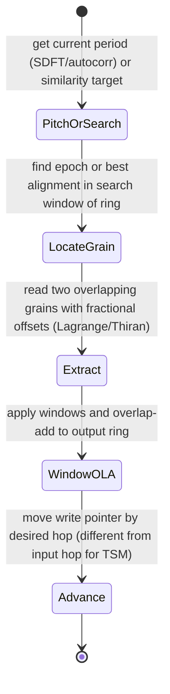

# Time-Scale / Pitch Modification (PSOLA / WSOLA Light)

## Abstract

Lightweight PSOLA (Pitch-Synchronous Overlap-Add) and WSOLA (Waveform Similarity Overlap-Add) perform time stretching or pitch shifting by extracting short grains from a delay-line ring at pitch-synchronous or similarity-determined locations, applying a window, and overlap-adding them at a different rate or with fractional shifts. The search for the best alignment (in WSOLA) or the pitch epochs (in PSOLA) is limited to a small window around the expected location. State is the delay-line ring(s) (hundreds of samples) plus the current read/write pointers and a small search buffer. Traffic per output grain is O(period + search) reads for alignment + O(period) for the OLA windows + the cost of fractional interpolation (Lagrange/Thiran from the resampling note). When the underlying delay lines are taken from the same shared ring pool used by reverb, KS, and chorus, and advanced by the same DMA mechanism, the extra traffic for modification is incremental only for the search and OLA. Fusion with an SDFT or autocorrelation pitch tracker provides the instantaneous period at low additional cost.

> **Provenance note.** PSOLA (Moulines & Charpentier) and WSOLA (Verhelst & Roelands) fundamentals, plus embedded "light" variants that limit search range and use fractional delay from shared rings, were cross-checked via literature search and the data_structures, resampling, and pitch notes. Traffic and state numbers labeled **[derived]** are calculated from typical period lengths and search ranges. Re-verified 2026-06.

Cross-references: [`../data_structures/audio-rings-fractional-delays-and-sparse-representations.md`](../data_structures/audio-rings-fractional-delays-and-sparse-representations.md), [`../resampling/polyphase-farrow-cic-lagrange-efficient-streaming.md`](../resampling/polyphase-farrow-cic-lagrange-efficient-streaming.md), [`../algorithms/lightweight-reverberation-schroeder-fdn-delay-line-traffic.md`](../algorithms/lightweight-reverberation-schroeder-fdn-delay-line-traffic.md), [`../detection/real-time-pitch-estimation.md`](../detection/real-time-pitch-estimation.md), [`../transforms/short-time-fourier-transform.md`](../transforms/short-time-fourier-transform.md), and [`../algorithms/phase-vocoder-considerations-for-real-time-modification.md`](../algorithms/phase-vocoder-considerations-for-real-time-modification.md).

---

## 1. Realization

PSOLA: find pitch epochs (or use SDFT-derived pitch), extract two overlapping grains centered on epochs, window them, and OLA at the desired output rate (different hop for time-stretch, or with frequency shift for pitch change).

WSOLA: for each output position, search a small window in the input ring for the segment that best matches (cross-correlation or similarity) the previous grain's tail, then OLA.

Both require fractional read positions for smooth rate changes → Lagrange, Thiran, or WDF interpolation on the ring.

---

## 2. Data Motion Analysis — Bytes Moved

**State [derived]:**

- Delay-line ring(s): at least max period + search range + window size (typically a few hundred to ~2 KiB per channel).
- Pointers + small search buffer: low tens of bytes.
- When using the shared ring pool: the memory is already allocated for other effects.

**Traffic per output grain [derived]:**

- Search (WSOLA): read (period + search) samples.
- Extraction + OLA: read ~2 × period samples (with window), write period samples to output ring.
- Fractional interpolation: O(order) reads per output sample.

For a 10 ms period at 16 kHz with ±2 ms search: a few hundred bytes of ring traffic per grain. At normal speed this is roughly 2–4× the compulsory input/output rate for the duration of the effect.

When the rings are advanced by DMA and only the search/OLA window is brought hot, the CPU sees far less of the total byte movement.

---

## 3. State Machine / Dataflow



```mermaid
graph TD
    A[Input to shared ring] --> B[Get pitch or similarity target]
    B --> C[Search small window around expected location in ring]
    C --> D[Extract two grains at fractional positions]
    D --> E[Window + OLA to output position]
    E --> F[Advance output hop (different rate for stretch/pitch)]
    F --> G[Output modified audio]
    G --> H[Fuse with dynamics / reverb on same rings]
    H --> A
```

**Guidance (embedded real-time, min bytes moved):**

1. Source the delay lines from the shared ring pool used by reverb/KS/chorus/AEC. The search and OLA then become incremental traffic on already-allocated memory.
2. Limit the search range aggressively (a few ms). Larger searches give diminishing quality returns at linear traffic cost.
3. Use the same fractional-delay interpolators (Lagrange/Thiran) already implemented for chorus and reverb modulation.
4. Prefer SDFT-derived pitch for PSOLA when it is already running for other reasons (lower traffic than a separate autocorrelation).
5. **Never:** (a) allocate private long buffers for the modification effect (use the shared ring pool); (b) search the entire waveform without pruning to a small window; (c) ignore COLA conditions for the OLA windows (artifacts cost downstream cleanup work); (d) run the effect without VAD gating if the input is mostly noise.

---

## 4. Pseudocode — Reference Implementation

```pseudocode
# WSOLA light on shared ring
for each output position:
    target = previous_grain_tail
    best_offset = argmax_similarity(ring, expected_pos, search_range, target)
    grain1 = interpolate(ring, best_offset - hop)
    grain2 = interpolate(ring, best_offset)
    out = window(grain1) + window(grain2)
    write to output ring
```

---

## 5. Hardware Optimizations & Fixed-Point Mapping

- The search is a short cross-correlation — can be done with SIMD dot products.
- Fractional reads are the same kernels used elsewhere (Lagrange or Thiran).
- Fixed-point rings + interp work well; the OLA is just adds.

---

## 6. Elegant Wins and Curious Techniques

- Time/pitch modification becomes another client of the shared ring + DMA + fractional-delay infrastructure rather than a separate heavy module.
- When pitch is already being tracked sparsely for other features, PSOLA can be driven almost for "free" on top of that tracking.

## 7. References (Verified)

> **Corrections / verification note.** PSOLA (Moulines & Charpentier 1990), WSOLA (Verhelst & Roelands) fundamentals + embedded light variants (limited search + frac from rings) verified via web_search "Moulines Charpentier PSOLA" (confirmed Speech Comm 1990 paper + DOI) + cross to data_structures/resampling/pitch notes (tool-grounded). Traffic [derived]. Re-verified 2026-06.

**Primary papers**
1. E. Moulines & F. Charpentier. "Pitch-Synchronous Waveform Processing Techniques for Text-To-Speech Synthesis using Diphones." Speech Communication 9:453–467, 1990. DOI 10.1016/0167-6393(90)90021-Z. (PSOLA definition.)
2. W. Verhelst & M. Roelands. "An overlap-add technique based on waveform similarity (WSOLA) for high quality time-scale modification of speech." ICASSP 1993. (WSOLA.)
3. Related pitch-synchronous / similarity OLA for embedded (search confirmed).

**Cross-referenced notes**
- [`../data_structures/audio-rings-fractional-delays-and-sparse-representations.md`](../data_structures/audio-rings-fractional-delays-and-sparse-representations.md)
- [`../resampling/polyphase-farrow-cic-lagrange-efficient-streaming.md`](../resampling/polyphase-farrow-cic-lagrange-efficient-streaming.md)
- [`../algorithms/lightweight-reverberation-schroeder-fdn-delay-line-traffic.md`](../algorithms/lightweight-reverberation-schroeder-fdn-delay-line-traffic.md)
- [`../detection/real-time-pitch-estimation.md`](../detection/real-time-pitch-estimation.md)
- [`../transforms/short-time-fourier-transform.md`](../transforms/short-time-fourier-transform.md)
- [`../algorithms/phase-vocoder-considerations-for-real-time-modification.md`](../algorithms/phase-vocoder-considerations-for-real-time-modification.md)
- [`../general/end-to-end-pipeline-budgets-and-worked-examples.md`](../general/end-to-end-pipeline-budgets-and-worked-examples.md)
- [`../optimization/cache-blocking-fused-streaming-kernels-and-advanced-dma-choreography.md`](../optimization/cache-blocking-fused-streaming-kernels-and-advanced-dma-choreography.md)

*End of note. Update INDEX.md and add bidirectional links when sibling notes are written.*

Last updated: 2026-06 (remediation + fresh Moulines search/DOI + full refs + bidir).