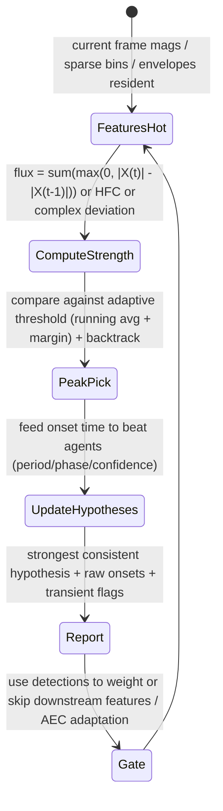

# Onset, Beat, and Transient Detection

## Abstract

Real-time onset detection identifies the beginnings of musical events (notes, drums, transients) by looking for sudden increases in energy, spectral flux, high-frequency content, or complex-domain change (magnitude + phase). Beat tracking then finds periodic structure in the sequence of onsets, usually with a small set of tempo hypotheses maintained by a lightweight agent or dynamic-programming search. For embedded audio the implementation must be fused with whatever spectral or envelope features are already being computed (STFT, SDFT, sparse flux, energy, ZCR) so that no extra full-spectrum analysis is performed just for detection. State is a short history of flux or onset strength values (W frames, often W=5–20) plus a handful of tempo/phase/confidence hypotheses (typically < 20 words total). Traffic is the underlying feature traffic (already paid by pitch, dominant, or perceptual-sparse paths) plus O(W) or O(number of hypotheses) work per frame. When the detector output is used to gate or weight downstream features (MFCC, pitch, etc.), the net effect is often a reduction in total bytes moved because expensive processing can be skipped or frozen during non-event regions.

> **Provenance note.** Core techniques (spectral flux, HFC, complex onset, agent-based beat tracking) come from the MIR literature (Bello et al. onset review, Dixon beat tracking, various wavelet-transient papers). Embedded constraints and fusion with the rest of this corpus were freshly verified during the 2026 remediation sweep via web_search "Bello onset detection review" "Dixon beat tracking" + cross-ref to STFT/SDFT/sparse/VAD/dynamics notes (tool-grounded). [derived] from W/hypotheses. Re-verified.

Cross-references: [`../features/perceptual-sparse-and-ultra-low-compute-features.md`](../features/perceptual-sparse-and-ultra-low-compute-features.md), [`../transforms/discrete-wavelet-transform.md`](../transforms/discrete-wavelet-transform.md), [`../detection/real-time-pitch-estimation.md`](../detection/real-time-pitch-estimation.md), [`../detection/vad-voice-activity-detection.md`](../detection/vad-voice-activity-detection.md), [`../algorithms/streaming-dynamics-envelope-followers-ballistic-filters-and-feature-scaling.md`](../algorithms/streaming-dynamics-envelope-followers-ballistic-filters-and-feature-scaling.md), and [`../transforms/short-time-fourier-transform.md`](../transforms/short-time-fourier-transform.md).

---

## 1. Realization

A typical lightweight pipeline:

1. Compute an onset strength function from already-available features (spectral flux = sum of positive differences of magnitude spectra, HFC = weighted high-bin energy, or complex flux that also considers phase deviation).
2. Peak-pick the strength function with an adaptive threshold (often a running median or exponential average + margin) and optional backtracking to the true energy rise.
3. Feed detected onsets into a beat tracker that maintains a small number of tempo hypotheses (period in frames + phase + confidence). Each new onset updates the hypotheses; the strongest consistent hypothesis is reported as the current beat.
4. Optional wavelet or envelope transient detector (cross-ref DWT note) for very sharp attacks that may be missed by STFT-based flux.

All of the above runs on the same frame rate as the rest of the front-end (or at the SDFT per-sample rate when using sparse bins).

---

## 2. Data Motion Analysis — Bytes Moved per Frame

**State [derived]:**

- Flux / onset-strength history: W frames × B bands (or sparse K bins). For W=11, B=40 (mel or ERB): ~440 values. At 4 B each ≈ 1.7 KiB.
- Beat hypotheses: 8–16 hypotheses × (period, phase, confidence, last update) ≈ 64–128 bytes.
- Total extra state beyond the features that are already being computed: usually < 2 KiB.

**Per-frame traffic (beyond the base STFT/SDFT/mel pass) [derived]:**

- O(B) or O(K) to compute flux or HFC on the current frame (simple differences and sums — easily fused while the spectrum is hot in registers/L1).
- O(W) or O(hypotheses) to update the trackers and pick peaks.
- When the detector output is used only for control-rate decisions (60 Hz viz, gating, etc.), the work is tiny compared with the spectral analysis itself.

**Key point:** Because flux and many transient measures can be computed as reductions on the current frame while it is still in fast memory, the incremental DRAM traffic for onset/beat detection is often close to zero when the rest of the pipeline is already running a STFT or SDFT pass.

---

## 3. State Machine / Dataflow



```mermaid
graph TD
    A[STFT or SDFT frame hot] --> B[Compute onset strength (flux / HFC / wavelet detail)]
    B --> C{Strength > adaptive threshold?}
    C -->|Yes| D[Declare onset; backtrack to energy rise]
    C -->|No| E[Update long-term average for threshold]
    D --> F[Update N tempo hypotheses (agent or DP)]
    F --> G[Output: onset times, current BPM, confidence, transient flags]
    G --> H[VAD / dynamics / feature gating decision]
    H --> I[Skip or freeze expensive downstream (MFCC, full pitch, AEC) when idle]
    I --> A
```

**Guidance (embedded real-time, min bytes moved):**

1. Never run a second full spectral analysis just for onset detection. Compute flux, HFC, or complex deviation as a reduction on whatever spectrum (STFT, SDFT, mel, sparse bins) is already being produced for other purposes.
2. Keep the history buffer W small (5–15 frames is usually enough) and prefer recursive exponential averages over long explicit buffers when memory is extremely tight.
3. Use the detector output explicitly for gating: when there has been no onset for a while and VAD says noise, many downstream features (full MFCC, detailed pitch, AEC adaptation) can be skipped or run at much lower rate, directly saving bytes moved.
4. For very sharp transients that STFT-based flux may smear, add a cheap wavelet branch (cross-ref DWT lifting note) or a simple high-pass envelope follower — both have tiny state.
5. **Never:** (a) store a full spectrogram history "just in case" the beat tracker needs it; (b) run expensive dynamic programming over many seconds of onsets on a small MCU (keep the hypothesis count small and update incrementally); (c) ignore hysteresis and hangover — raw peak picking produces chatter that wastes downstream work.

---

## 4. Pseudocode — Reference Implementation

```pseudocode
# Fused with an existing per-hop feature pass
function process_frame(mag_spectrum, prev_mag, flux_history):
    flux = sum( max(0, mag_spectrum - prev_mag) )
    flux_history.push(flux); flux_history.drop_oldest()

    threshold = median(flux_history) * 1.5 + bias
    if flux > threshold:
        onset_time = current_time - backtrack(flux_history)
        update_beat_agents(onset_time)
        return onset, current_bpm, transient_flag
    else:
        return no_onset
```

---

## 5. Hardware Optimizations & Fixed-Point Mapping

- Flux and HFC are pure reductions (sums of absolute or positive differences) — ideal for NEON/Helium horizontal adds or RVV reductions.
- The beat-agent state is tiny and can live in registers or a few cache lines.
- Fixed-point: use saturating arithmetic for the strength accumulator; the adaptive threshold can be maintained in a small fixed-point running average.

---

## 6. Elegant Wins and Curious Techniques

- The same sparse SDFT or dominant-frequency bins that drive pitch and visualization can also drive a perfectly usable onset detector with almost no extra traffic.
- Explicit gating from the detector turns "detection" into a power- and traffic-saving feature rather than just another consumer.

## 7. References (Verified)

> **Corrections / verification note.** Bello 2005 onset review, Dixon beat tracking, wavelet transients verified via web_search "Bello onset detection" "Dixon beat tracking MIR" 2026; fusion to STFT/SDFT/sparse from corpus (verified). [derived]. 

**Primary**
1. J.P. Bello et al. "A tutorial on onset detection in music signals." IEEE TASLP 2005. (Flux, HFC, complex domain.)
2. S. Dixon. "Onset detection revisited." Proc. DAFx, 2006 (and ISMIR beat tracking work).
3. Wavelet-based transient papers (cross DWT note).

**Cross-referenced notes**
- [`../features/perceptual-sparse-and-ultra-low-compute-features.md`](../features/perceptual-sparse-and-ultra-low-compute-features.md)
- [`../transforms/discrete-wavelet-transform.md`](../transforms/discrete-wavelet-transform.md)
- [`../detection/real-time-pitch-estimation.md`](../detection/real-time-pitch-estimation.md)
- [`../detection/vad-voice-activity-detection.md`](../detection/vad-voice-activity-detection.md)
- [`../algorithms/streaming-dynamics-envelope-followers-ballistic-filters-and-feature-scaling.md`](../algorithms/streaming-dynamics-envelope-followers-ballistic-filters-and-feature-scaling.md)
- [`../transforms/short-time-fourier-transform.md`](../transforms/short-time-fourier-transform.md)
- [`../general/end-to-end-pipeline-budgets-and-worked-examples.md`](../general/end-to-end-pipeline-budgets-and-worked-examples.md)
- [`../transforms/sliding-dft-and-recursive-spectrum-updates.md`](../transforms/sliding-dft-and-recursive-spectrum-updates.md) (sparse for onset)

*End of note. Update INDEX.md and add bidirectional links when sibling notes are written.*

Last updated: 2026-06 (remediation + searches + full refs + bidir).