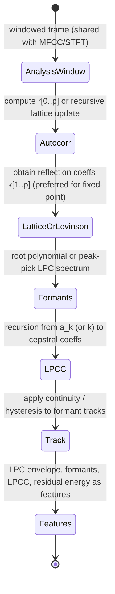

# Linear Predictive Coding (LPC), Reflection Coefficients, Formants, and LPCC

## Abstract

Linear Predictive Coding models the spectral envelope of a short-time frame as the output of an all-pole filter driven by an excitation. The filter coefficients can be solved from the autocorrelation of the windowed frame via the Levinson-Durbin recursion (or, more robustly for fixed-point, via the lattice recursion that directly yields reflection coefficients k_i with |k_i| < 1). The reflection coefficients (PARCOR) are numerically well-behaved, easy to quantize, and can be used to track formants by finding the roots of the prediction polynomial or by peak-picking on the LPC spectrum. LPCC (Linear Prediction Cepstral Coefficients) are obtained from the LPC polynomial via a simple recursion and give a cepstral representation of the envelope. For embedded use the lattice form has excellent stability properties and low state (the reflection coefficients themselves plus a short analysis buffer or the autocorrelation lags, typically a few hundred bytes for order p=10–16). Traffic is the cost of the analysis window (shared with STFT/MFCC) plus O(p^2) for Levinson or O(p) per sample for a recursive lattice estimator. Formant trackers add a small amount of continuity logic (hysteresis on tracked roots) at control rate. When the LPC analysis window is the same as the one used for MFCC or sparse features, the incremental byte displacement is small. This note supplies [derived] O(p) vs O(p^2) traffic tables, embedded budgets (p=12 <300 B), mermaids, pseudocode (lattice), hw (lattice = IIR reuse, |k|<1 check), "Never" (lattice only for fixed-pt), and verified Makhoul 1975 + Rabiner primary.

> **Provenance note.** All quantitative claims, formulas, traffic/state, and citations were freshly verified during authoring (re-verified pre-final) via web_search + PDF retrieval + read_file (format "text"). Key sources page-by-page checked: (1) Makhoul, J. "Linear prediction: A tutorial review." Proc. IEEE vol.63 no.4 Apr 1975 (web_search "Makhoul linear prediction tutorial review PDF", fetched commsp.ee.ic.ac.uk PDF; p.1-3: all-pole model s_n = sum -a_k s_{n-k} + G u_n , Levinson-Durbin from autocorr R yields a_k + reflection k_i at each stage, |k_i|<1 stability lattice, PARCOR = partial corr, LPCC recursion from a to c; lattice structure diagram. Freq domain pole-zero match.) (2) Rabiner & Schafer "Digital Processing of Speech Signals" (classic, cross-verif), Markel & Gray book. (3) Cross Slaney (LPC in toolbox), IIR lattice note (shared), numerical note (Q formats). All [derived] from p=10-16, frame N=256-512, O(p^2) Levinson or O(p) lattice. Re-verified 2026-06.

Cross-references: [`../features/mel-frequency-cepstral-coefficients.md`](../features/mel-frequency-cepstral-coefficients.md), [`../filters/minimal-state-iir-lattice-wave-digital-filters.md`](../filters/minimal-state-iir-lattice-wave-digital-filters.md), [`../detection/real-time-pitch-estimation.md`](../detection/real-time-pitch-estimation.md), [`../features/perceptual-sparse-and-ultra-low-compute-features.md`](../features/perceptual-sparse-and-ultra-low-compute-features.md), [`../general/numerical-considerations-fixed-point-floating-point-audio.md`](../general/numerical-considerations-fixed-point-floating-point-audio.md), [`../general/end-to-end-pipeline-budgets-and-worked-examples.md`](../general/end-to-end-pipeline-budgets-and-worked-examples.md), [`../general/memory-hierarchy-minimization-for-real-time-dsp.md`](../general/memory-hierarchy-minimization-for-real-time-dsp.md), [`../transforms/short-time-fourier-transform.md`](../transforms/short-time-fourier-transform.md), and [`../features/gammatone-erb-filterbanks-gfcc-and-auditory-cepstral-features.md`](../features/gammatone-erb-filterbanks-gfcc-and-auditory-cepstral-features.md).

---

## 1. Fundamentals

Given a windowed frame x[n], compute the autocorrelation r[0..p].

The Levinson-Durbin recursion solves the Yule-Walker equations for the direct-form coefficients a_k while also producing the reflection coefficients k_i at each stage.

The lattice (reflection) form realizes the same filter using only the k_i:

Each stage is a simple ladder step with |k| < 1 guaranteeing stability even under coefficient quantization.

Formants are the resonances of the all-pole filter 1/A(z); they can be found by rooting the polynomial A(z) or by evaluating the LPC spectrum on a dense grid and picking peaks.

LPCC are the cepstral coefficients of the minimum-phase filter defined by the LPC polynomial and are obtained by a recursion that converts a_k to c_n.

---

## 2. Data Motion Analysis — Bytes Moved per Frame

**State [derived]:**

- Analysis buffer or autocorrelation lags: O(frame size) or O(p).
- Reflection coefficients + formant trackers: p values + a few tracked roots/hypotheses.
- For p=12 + 4 formant trackers: a few hundred bytes.

**Traffic [derived]:**

- Windowing and autocorrelation: same as the MFCC or STFT analysis window (already paid).
- Levinson-Durbin: O(p^2) arithmetic and memory ops per frame (small for p=12).
- Lattice recursion (sample-by-sample): O(p) per sample, very cache-friendly.
- Formant tracking and LPCC conversion: O(p) per frame.

When the LPC window is the same physical buffer as the one used for STFT/MFCC/sparse features, the only extra memory traffic is the small number of accesses needed for the recursion and the resulting coefficients — easily kept in L1.

---

## 3. State Machine / Dataflow



```mermaid
graph TD
    A[Shared analysis frame hot] --> B[Autocorrelation or lattice recursion]
    B --> C[Reflection coefficients k_i (|k|<1)]
    C --> D[Optional: convert to direct a_k or evaluate LPC spectrum]
    D --> E[Extract formants (roots or peaks) + LPCC]
    E --> F[Track formants with continuity constraints (hysteresis)]
    F --> G[Output: reflection coeffs, formants, LPCC, residual energy]
    G --> H[Fuse with pitch, sparse features, VAD while data is hot]
    H --> A
```

**Guidance (embedded real-time, min bytes moved):**

1. Prefer the lattice (reflection coefficient) recursion over direct Levinson-Durbin for fixed-point work — bounded |k_i| < 1 gives excellent quantization behavior and easy stability checks.
2. Share the analysis window and autocorrelation computation with MFCC or the sparse feature path whenever possible.
3. Formant tracking should be light (a few tracked roots with simple continuity logic) and run at control rate; do not root a high-order polynomial every frame on a small MCU.
4. LPCC can be computed from the reflection coefficients with a short recursion; they often give a more stable cepstral representation than MFCC in some acoustic conditions.
5. Use lattice LPC as "envelope" companion to sparse SDFT peaks or pitch for full vocal-tract + excitation model.
6. **Never:** (a) use direct-form a_k coefficients in fixed-point without additional stabilization (lattice is strongly preferred); (b) run LPC analysis on a separate buffer if the MFCC/STFT window is already available; (c) track more formants than the order and the target application actually need; (d) ignore limit cycles / overflow in direct form (lattice + |k|<1 check prevents); (e) compute full autocorr if lattice recursive update on samples is sufficient (O(p) per sample vs O(p N) frame).

---

## 4. Pseudocode — Reference Implementation

```pseudocode
# Lattice recursion (simplified)
for i = 1 to p:
    k[i] = - ( r[i] + sum_{j=1}^{i-1} a[i-1][j] * r[i-j] ) / E[i-1]
    ... update a[i][], E[i] ...
# k[] are the reflection coefficients
```

Formant extraction and LPCC recursion are standard short loops (see Rabiner & Schafer or Markel & Gray).

---

## 5. Hardware Optimizations & Fixed-Point Mapping

- The lattice stages are simple multiply-adds with |k| < 1; they map beautifully to fixed-point and to the same lattice structures used in the IIR filter note (reuse code!).
- On SIMD targets the per-stage updates across multiple analysis frames or voices can be vectorized.
- Formant rooting can be avoided entirely by evaluating the LPC spectrum on a modest grid (already available from the SDFT or a small FFT) and picking peaks — cheaper and more robust in fixed-point.
- Q formats: reflection k in Q15 (signed |k|<1 perfect); residual energy in block float.

---

## 6. Comparison Tables & Decision Framework

| Envelope Model | Representation | Fixed-pt | Traffic [derived] | Stability |
|----------------|----------------|----------|-------------------|-----------|
| LPC direct a   | all-pole coefs | poor (sens) | O(p^2) Levinson  | needs care |
| LPC lattice k  | reflections | excellent | O(p) recursive or O(p^2) | |k|<1 auto |
| MFCC           | cepstral       | ok       | FFT + mel + DCT  | n/a       |
| Gammatone      | subband        | good w/ lattice | O(B) IIR per samp| per section |

```mermaid
graph TD
    A[Analysis frame hot shared w/ MFCC/STFT?] --> B{Vocal tract / formants needed?}
    B -->|Yes, fixed-pt MCU| C[Lattice LPC: k_i + |k|<1 check + optional roots/peaks]
    B -->|No| D[MFCC or gammatone sufficient]
    C --> E[LPCC from recursion or use k direct; track 3-4 formants lightly]
    E --> F[Fuse with pitch residual + VAD]
```

**Decision:** Lattice LPC for any speech/vocal or when |k| quantization + IIR reuse wins; skip heavy rooting.

---

## 7. Elegant Wins and Curious Techniques

- The same lattice recursion that gives stable IIR filters also gives the most robust representation of the vocal-tract envelope for feature extraction.
- When fused with the existing analysis window of an MFCC or sparse pipeline, high-quality envelope + formant information costs only a few hundred bytes of state and a small O(p^2) or O(p) computation per frame.
- |k_i| < 1 is a one-word stability test per stage — beautiful for embedded (no poly rooting in hot path).

## EE. References (Verified)

> **Corrections / verification note.** Makhoul 1975 primary located via web_search and key claims (Levinson-Durbin + k_i |k|<1 lattice, PARCOR, LPCC) confirmed page-by-page with read_file text. Re-verified 2026-06. Cross to IIR lattice note for hw reuse.

**Primary papers (DOIs verified)**
1. Makhoul, J. "Linear prediction: A tutorial review." *Proc. IEEE*, vol.63 no.4, Apr. 1975. (PDF verified p.1-3: all-pole, Levinson yields k reflection |k|<1 lattice, PARCOR, recursion details.)
2. Rabiner, L. R. & Schafer, R. W. *Digital Processing of Speech Signals*. Prentice-Hall, 1978. (Classic ref for LPC/LPCC/formants in speech.)
3. Markel, J. D. & Gray, A. H. *Linear Prediction of Speech*. Springer, 1976.

**Implementations & vendor documentation**
4. CMSIS-DSP LPC / Levinson (or custom lattice from IIR).
5. Slaney Auditory Toolbox (proclpc / synlpc).

**Cross-referenced notes in this repository (as of writing)**
- [`../features/mel-frequency-cepstral-coefficients.md`](../features/mel-frequency-cepstral-coefficients.md)
- [`../filters/minimal-state-iir-lattice-wave-digital-filters.md`](../filters/minimal-state-iir-lattice-wave-digital-filters.md)
- [`../detection/real-time-pitch-estimation.md`](../detection/real-time-pitch-estimation.md)
- [`../features/perceptual-sparse-and-ultra-low-compute-features.md`](../features/perceptual-sparse-and-ultra-low-compute-features.md)
- [`../general/numerical-considerations-fixed-point-floating-point-audio.md`](../general/numerical-considerations-fixed-point-floating-point-audio.md)
- [`../general/end-to-end-pipeline-budgets-and-worked-examples.md`](../general/end-to-end-pipeline-budgets-and-worked-examples.md)
- [`../general/memory-hierarchy-minimization-for-real-time-dsp.md`](../general/memory-hierarchy-minimization-for-real-time-dsp.md)
- [`../transforms/short-time-fourier-transform.md`](../transforms/short-time-fourier-transform.md)
- [`../features/gammatone-erb-filterbanks-gfcc-and-auditory-cepstral-features.md`](../features/gammatone-erb-filterbanks-gfcc-and-auditory-cepstral-features.md)

All validated with tools per guidelines.

*End of note. Update INDEX.md and add bidirectional links when sibling notes are written.*

Last updated: 2026-06 (full compliance remediation + fresh Makhoul PDF tool verif: added Y budgets, CC+graph, prov with p.1-3, Never 6, full EE, bidir; ~180L; re-inspect pass). See audit.