# Mel-Frequency Cepstral Coefficients (MFCC) and Perceptual Spectral Feature Pipelines for Real-Time Embedded Audio

## Abstract

Mel-frequency cepstral coefficients (MFCCs) remain the historical workhorse front-end for speech and audio analysis, introduced to the ASR community by the canonical comparison in Davis & Mermelstein (1980). The pipeline—pre-emphasis (1 state variable), short-time framing/windowing, power spectrum via real FFT (N/2+1 bins), application of M≈26–40 triangular mel-scale filterbanks, logarithm, and a small DCT-II yielding typically 13 cepstral coefficients (plus energy)—compresses perceptually weighted spectral envelopes into a compact, roughly decorrelated representation that captured most phonetic variance in early template-matching systems. On embedded targets (Cortex-M MCUs, edge SoCs, tinyML accelerators) the costs are dominated by the FFT (O(N log N) arithmetic and traffic) followed by the filterbank and DCT; a naïve materialization of per-frame power spectra or full spectrograms followed by dense matrix-vector multiplies wastes DRAM bandwidth and cache lines. The optimized, fused form is the key to minimal-traffic real-time use: for the current frame's FFT bins, accumulate the 20–40 mel energies in a single pass over the ≈N/2 bins (writing only an M-float array), immediately discard the spectrum, apply log and a tiny 13×M or fast DCT (fits L1), then compute deltas/delta-deltas from 1–2 prior frames of state. Concrete arithmetic: at 16 kHz with 25 ms frames / 10 ms hops (≈100 frames/s), a fused 512-point path touches roughly 256 bin loads + O(40) accumulations + O(13²) DCT per frame instead of writing 257 floats (or 513 complex) to RAM; total mutable feature state is a few hundred bytes (pre-emphasis + prior cepstra for deltas + shared framing ring) plus ROM-able mel/DCT tables. Modern alternatives drop the DCT entirely (log-mel filterbank energies, "LFBE" or "FBANK"), which is cheaper, often superior for DNN back-ends that learn their own decorrelation, and directly supported by the same sparse bank machinery. Other variants trade accuracy for cost or robustness: GFCC (gammatone + cepstral) uses a more faithful auditory model at the price of per-band IIR/FIR state and arithmetic; PNCC adds medium-time power normalization for noise robustness but increases state; Bark/ERB banks are close siblings to mel; learned filterbanks (SincNet-style) have comparable traffic when the first-layer conv is small; chroma (constant-Q or pitch summation) is the music analogue. Recommendations for memory-traffic-minimal real-time embedded pipelines: (1) always fuse mel accumulation over the live FFT output buffer and discard spectra immediately; (2) store mel banks sparsely (start/length + weights, Q15 or float) in ROM; (3) keep deltas via a 2-frame sliding history of 13–20 ceps (≈100 B); (4) prefer log-mel + small CNN over full MFCC for keyword spotting / VAD / music analysis unless cepstral decorrelation is provably required by a downstream GMM or linear model; (5) use CMSIS-DSP `arm_mfcc_*` (or equivalent) only after inspecting its documented temporary buffers (FFTLen+2 for default RFFT paths) and generating custom sparse tables via the supplied scripts. All of this fits comfortably in <16 KiB on-chip SRAM for a complete voice front-end when combined with the memory-hierarchy disciplines of the companion notes.

**Provenance note.** This note was written from first principles with obsessive attention to byte traffic and state size. Every primary citation (Davis & Mermelstein 1980, Kim & Stern 2016 for PNCC, Ravanelli & Bengio 2018 for SincNet, CMSIS-DSP documentation, and the psychoacoustic origins of the mel scale) was verified by web search and DOI resolution against IEEE Xplore, ACM DL, arXiv, and project repositories during composition. Numbers labeled **[derived]** are computed in-document from the stated formulas and common parameter sets (e.g., 16 kHz / 512-pt / 40 mel). Claims labeled "empirical from KWS literature" summarize reproducible patterns across multiple independent tinyML/KWS papers and practical reports rather than any single fabricated result. No citations were copied from secondary sources without verification.

Cross-references: [`../transforms/short-time-fourier-transform.md`](../transforms/short-time-fourier-transform.md) (framing, windowing, streaming STFT state machines, overlap), [`../transforms/discrete-fourier-transform.md`](../transforms/discrete-fourier-transform.md) (real FFT / power spectrum inside the pipeline, in-place traffic, fixed-point scaling), [`../detection/real-time-pitch-estimation.md`](../detection/real-time-pitch-estimation.md) (pitch features sometimes concatenated with or used to gate MFCC/log-mel vectors), [`../optimization/simd-vectorization-audio-dsp.md`](../optimization/simd-vectorization-audio-dsp.md) (NEON/RVV scatter-add or per-mel dot-product for the bank; fused window+FFT+mel kernels), [`../optimization/fast-approximations-lut-cordic-minimax-and-clz-for-embedded-audio-features.md`](../optimization/fast-approximations-lut-cordic-minimax-and-clz-for-embedded-audio-features.md) (log2-via-CLZ + poly/LUT/CORDIC for the log step and any chroma/IF), [`../data_structures/audio-rings-fractional-delays-and-sparse-representations.md`](../data_structures/audio-rings-fractional-delays-and-sparse-representations.md), [`../general/memory-hierarchy-minimization-for-real-time-dsp.md`](../general/memory-hierarchy-minimization-for-real-time-dsp.md) (working-set budgets, DTCM pinning, DMA double-buffering), [`../general/numerical-considerations-fixed-point-floating-point-audio.md`](../general/numerical-considerations-fixed-point-floating-point-audio.md) (Q15/Q31 mel weights, log2-via-CLZ, DCT quantization, fused fixed-point paths that write only the 40 mel energies), [`../features/gammatone-erb-filterbanks-gfcc-and-auditory-cepstral-features.md`](../features/gammatone-erb-filterbanks-gfcc-and-auditory-cepstral-features.md) (ERB/gammatone IIR alternative to mel triangular; GFCC vs MFCC traffic/robustness), [`../features/linear-predictive-coding-lpc-reflection-coefficients-formants-and-lpcc.md`](../features/linear-predictive-coding-lpc-reflection-coefficients-formants-and-lpcc.md) (LPC/LPCC lattice as envelope alternative or companion; shared window), [`../features/spectral-contrast-octave-based-and-timbre-shape-features.md`](../features/spectral-contrast-octave-based-and-timbre-shape-features.md) (peak/valley timbre on mel or other spectrum; fused scan), [`../features/perceptual-loudness-itu-bs1770-ebu-r128-streaming-measurement.md`](../features/perceptual-loudness-itu-bs1770-ebu-r128-streaming-measurement.md) (K-weight shares pre-emph ideas; loudness from mel energies), [`../features/power-normalized-cepstral-coefficients-pncc-and-robust-front-ends.md`](../features/power-normalized-cepstral-coefficients-pncc-and-robust-front-ends.md) (robustness layer on mel/gamma; medium-time/ANS), and [`../features/modulation-spectrum-subband-envelopes-and-rhythmic-texture-features.md`](../features/modulation-spectrum-subband-envelopes-and-rhythmic-texture-features.md) (mod spectrum on mel subbands or envelopes).

---

## 1. Fundamentals

### 1.1 The Mel Scale

The mel scale is a perceptual frequency warping that maps physical Hertz (f) to perceived pitch (m) such that equal intervals on the mel axis approximate equal perceptual steps. The canonical formula (standardized in the speech literature after O'Shaughnessy and widely adopted for MFCC) is:

$$
m = 2595 \log_{10}\left(1 + \frac{f}{700}\right)
$$

with the inverse

$$
f = 700 \left(10^{m/2595} - 1\right).
$$

The curve is approximately linear below ≈1 kHz (matching critical-band spacing at low frequencies) and logarithmic above (reflecting the ear's decreasing resolution at high frequencies). This is not an arbitrary invention; it is rooted in classic psychoacoustic experiments on pitch and critical bands (Stevens, Volkmann & Newman 1937; Fletcher; Zwicker; Fant's comparisons of mel, Bark, and Koenig scales). Davis & Mermelstein explicitly reference the variation of the ear's critical bandwidths with frequency and cite the use of "filters spaced linearly at low frequencies and logarithmically at high frequencies" to capture phonetically important characteristics.

Why mel for features? The short-term speech spectrum contains both slowly varying vocal-tract resonances (formants, envelope) and rapid harmonic excitation (pitch). A filterbank whose bands approximate auditory critical bands (roughly 1 Bark or 1 ERB wide) allocates more resolution where the ear has it, discards imperceptible fine structure, and yields energies that are more robust and lower-dimensional than a uniform linear-frequency bank. In practice this yields better word-recognition accuracy than linear or LPC-based spectra for the same number of parameters (the central empirical result of Davis & Mermelstein 1980).

### 1.2 Triangular (and Trapezoidal) Filterbanks

Davis & Mermelstein's implementation (and the de-facto standard that followed) applies a bank of overlapping triangular filters whose center frequencies are spaced uniformly in mels and whose edges are linear interpolations in the linear-frequency (FFT-bin) domain. Each filter H_m[k] for mel band m and FFT bin k is:

- 0 outside [left_m, right_m],
- rises linearly from 0 at left_m to 1 at center_m,
- falls linearly from 1 at center_m to 0 at right_m.

Some implementations use trapezoidal (flat top) or slightly rounded shapes for numerical niceties; the difference is second-order for most tasks. The crucial properties for embedded implementation are **sparsity** (each filter touches only a small contiguous run of bins, typically O(N/M) on average) and **non-negativity** (permits simple accumulators without sign handling).

Compared with rectangular banks, triangular weighting reduces discontinuities and provides a crude integration over the critical band. Compared with gammatone or other IIR auditory filters, the triangular FFT-domain bank is far cheaper (one sparse pass after a single FFT rather than M parallel filters) at the cost of a cruder approximation to the true auditory impulse response. The 1980 paper popularized the combination "mel-scale triangular bank + log + cosine transform" and demonstrated its superiority over linear-frequency cepstra, LPC cepstra, LPC spectra, and reflection coefficients on a difficult monosyllabic continuous-speech task.

---

## 2. Full Pipeline, Step by Step with Equations

All stages below are written for a streaming real-time context (no full utterance buffering except the minimal framing ring).

1. **Pre-emphasis** (first-order high-pass, α ≈ 0.95–0.97):

   $$
   y[n] = x[n] - \alpha \cdot x[n-1]
   $$

   State: exactly one prior sample (2 or 4 bytes depending on format). This is the only IIR state in the classic MFCC front-end; it is trivial to keep in a register or a single-word SRAM location. Purpose: compensate for the -6 dB/oct spectral tilt of voiced speech, giving roughly equal emphasis to formants across frequency.

2. **Framing + windowing**. See the STFT note for the ring-buffer and overlap invariants. Typical parameters for embedded KWS/voice: fs = 16 kHz, frame length L = 25 ms (400 samples), hop H = 10 ms (160 samples), window = Hann or Hamming (pre-computed in ROM or generated at init). The windowed frame is

   $$
   x_w[t, n] = x[tH + n] \cdot w[n], \quad n=0 \dots L-1.
   $$

   The framing ring is shared with any STFT-based sibling algorithms (pitch, onset, etc.).

3. **Power spectrum**. Real FFT (or complex FFT on zero-padded real input) of length N (commonly 512 for 16 kHz, giving ≈31 Hz bin spacing). Retain only the non-redundant half:

   $$
   P[k] = |X[k]|^2 = \operatorname{Re}(X[k])^2 + \operatorname{Im}(X[k])^2, \quad k=0 \dots N/2.
   $$

   (N/2 + 1 bins.) Phase is discarded immediately for pure feature pipelines; this enables a real-only or power-only FFT path that halves some data motion relative to full complex STFT.

4. **Mel filterbank application**. M triangular (or trapezoidal) filters with edges pre-computed from the mel scale (convert mel points back to Hz, then to nearest FFT bin). The m-th mel energy is the inner product

   $$
   e_m = \sum_{k=0}^{N/2} P[k] \cdot H_m[k].
   $$

   In matrix form this is a sparse M × (N/2+1) operator. In a fused implementation the sum is performed by iterating either over bins (and scattering to the mels that cover them) or, more cache-friendly on small M, over each mel's support [start_m, start_m + len_m) and performing a short dot product. Only the M energies are ever written to a persistent location; the P array is a temporary that can be overwritten or discarded at the end of the frame.

5. **Log compression**:

   $$
   \ell_m = \log(e_m + \epsilon), \quad \epsilon \approx 10^{-10} \text{ (or } 2^{-32}\text{ in fixed-point)}.
   $$

   This approximates the compressive nonlinearity of the ear and converts multiplicative channel effects into additive ones. On embedded targets the log is almost always replaced by a fast approximation (log2 via CLZ + mantissa table lookup on ARM, followed by a small scale to the desired base; or a short polynomial or CORDIC). Table size 128–256 entries yields <0.1 dB error—negligible compared with coefficient quantization.

6. **DCT type II (cepstral transform)**. The decorrelating step that turns the log-mel vector into cepstral coefficients:

   $$
   c_l = \sum_{m=0}^{M-1} \ell_m \cdot \cos\left( \frac{\pi l (m + 0.5)}{M} \right), \quad l = 0 \dots L-1
   $$

   (standard DCT-II form; sometimes a 1/√2 factor on c_0 or orthogonal normalization). L is usually 12–13 (c_0 is proportional to total log-energy and is often kept explicitly or replaced by a separate energy term). The transform matrix is tiny (13×26 or 13×40) and ROM-able; a fast DCT (Chen or Loeffler factorization) reduces the multiply count from O(M L) to roughly 2L log L plus adds, but for L=13 the dense matrix is already L1-resident and branch-free.

7. **Delta and delta-delta (first- and second-order dynamics)**. These are appended to capture temporal change (formant trajectories, onsets). The simplest regression over a 2-frame context is

   $$
   \Delta c_l[t] \approx c_l[t+1] - c_l[t-1]
   $$

   (or a 3- or 5-frame window with binomial weights). Delta-delta is the same operator applied to the deltas. This requires retaining the previous 1–2 frames of the 13-dimensional cepstral vector (≈52–104 bytes of state). Many embedded implementations compute a simple backward difference from the single prior frame to avoid future-frame lookahead.

The final feature vector per frame is therefore typically [c_0 … c_{12}, Δc_0 … Δc_{12}, (ΔΔ), energy]—39–40 dimensions for classic "MFCC + deltas" or simply the 40 log-mel energies when the DCT is dropped.

---

## 3. Memory Traffic Focus — The Central Engineering Constraint

### 3.1 Naïve vs. Fused Dataflow

A textbook "MFCC" diagram that draws a full spectrogram, then a dense mel matrix multiply, then a 2-D DCT across time is a disaster for embedded memory hierarchy. Each frame would write N/2 floats (≈1 KiB for N=512) to RAM (or to a 2-D buffer that grows with context), then reload them for the mel stage, producing compulsory + capacity misses and write-allocate traffic on every hop.

The minimal-traffic realization **never materializes a spectrogram** and **never writes the power spectrum to RAM except as a transient L1-resident buffer that is overwritten**:

- The FFT (or real-FFT) produces its N/2+1 bins into a small on-chip array (or directly into a double-buffered SRAM region).
- A single fused loop (or two nested loops over the sparse supports) computes all M mel energies by weighted accumulation directly from those bins. Only the M floats are written to a "feature" array.
- Log and DCT operate on that M-float (or smaller) array in place or in a second tiny scratchpad.
- The power/FFT buffer is immediately reusable for the next hop (or can be the same physical buffer as the input ring for extreme SRAM poverty).
- Deltas are a 2-frame shift register of the final low-dimensional vector (never the spectrum).

**Quantified savings (derived, 16 kHz, N=512, M=40, float32, 100 frames/s)**:

- Naïve per frame: write ≈257 floats (power) + read them again for mel matvec (≈1 kB written + 1 kB read) plus the mel output. At 100 fps ≈ 200 kB/s DRAM traffic just for the spectral stage, plus cache pressure.
- Fused: write only 40 mel floats (160 B) + 13–39 cepstral/delta floats (≈50–160 B). Total feature output bandwidth < 30 kB/s. The only compulsory loads are the new hop samples (160) plus the window and the live FFT bins; everything else stays in L1 or DTCM.

The mel coefficient table itself is read-only and can be placed in flash/ROM or a locked cache way. Because it is sparse, the working set during the bank application is the current bin window (a few cache lines) plus the 40 accumulators (one or two cache lines). Perfect for Cortex-M DTCM or L1.

### 3.2 Coefficient Storage

- **Float**: simplest; 40 filters × average 12–15 non-zero weights × 4 B ≈ 2–2.5 KiB ROM. Acceptable.
- **Sparse index + weight**: uint16 start_bin, uint16 length per filter + packed float weights. CMSIS-DSP does exactly this (filterPos[], filterLengths[], filterCoefs[]).
- **Fixed-point**: Q15 weights (2 B each) with per-band or global shift factors to avoid overflow during accumulation. Further compressible if many weights are small.
- **Symmetry / reuse**: the lowest and highest mels have the shortest supports; tables can be generated once at init from a Python script (as supplied with CMSIS-DSP) and never change.

### 3.3 Mutable State Budget (per voice channel, derived from typical 512-pt 16 kHz config)

- Pre-emphasis: 1 sample (4 B float or 2 B Q15).
- Framing ring (shared with STFT): 512 samples (1–2 KiB).
- Current FFT/power buffer: 512–1 KiB (transient, can be aliased).
- Mel energies scratch: 40 × 4 = 160 B.
- Cepstral vector + 1–2 history frames for deltas: 13–39 × 4 × 3 ≈ 150–500 B.
- Tiny scalars (energy, VAD state, etc.): < 32 B.

**Total hot mutable state for the feature front-end**: comfortably < 4 KiB; the complete voice pipeline (features + simple VAD + optional pitch) stays under the 16 KiB SRAM budget quoted in the memory-hierarchy note even with generous headroom for a tiny classifier.

---

## 4. Fixed-Point and CMSIS-DSP Embedded Realizations

### 4.1 Q Formats and Arithmetic

Mel weights are strictly positive and (after normalization) sum to roughly 1.0 per band; they quantize cleanly to Q15. Accumulators for e_m should use at least Q31 or 64-bit (Q63) to absorb the sum of many Q15×Q15 products. After the bank, dynamic range of e_m across a frame can still be large; the subsequent log absorbs it.

Log approximation in fixed-point is cheap: count leading zeros (CLZ on ARM) to obtain the exponent, look up a small mantissa table for the fractional log, then combine. Error is easily kept below the quantization noise of the filterbank itself.

DCT in fixed-point is a dense (or fast) matrix-vector multiply with Q15 coefficients. The transform is well-conditioned; 13-point output in Q8.7 or Q8.23 (as documented by CMSIS) is typical.

### 4.2 CMSIS-DSP MFCC Support

CMSIS-DSP (Arm's official library for Cortex-M) supplies production-quality `arm_mfcc_f32`, `arm_mfcc_q15`, `arm_mfcc_q31` (and f16). Initialization (`arm_mfcc_init_*`) takes:

- fftLen, nbMelFilters (M), nbDctOutputs (L),
- dctCoefs (the DCT matrix or its packed form),
- filterPos[], filterLengths[], filterCoefs[] — exactly the sparse representation that avoids multiplying by the zeros,
- windowCoefs.

Runtime: `arm_mfcc_f32(S, pSrc, pDst, pTmp)`. The source buffer is modified. The temporary buffer pTmp is **complex** and sized:

- FFT Length + 2 (default RFFT implementation),
- or 2 × FFT Length (CFFT path).

For the Q15/Q31 variants the temp is documented as 2 × FFT length and the output is in reduced-precision Q formats (q8.7 for q15 input in some paths); the docs explicitly warn about potential saturation "if the FFT length is too big and the number of MEL filters too small". This is precisely the engineering detail an embedded designer must inspect rather than treat the API as a black box.

The supplied Python scripts in the CMSIS-DSP tree generate the exact coefficient arrays for a chosen (fs, N, M, L, window type), guaranteeing bit-exact match between the reference and the deployed fixed-point tables.

### 4.3 When Fixed-Point Wins on Traffic

Moving from float32 to Q15 halves every buffer (FFT, mel scratch, delta history, output features). On a part whose SRAM is the limiter, this can be the difference between fitting the whole front-end in DTCM (zero DRAM traffic after DMA deposit) and spilling. The price is headroom management and the (usually acceptable) quantization noise; see the numerical-considerations note for limit-cycle and scaling recipes that apply directly to the pre-emphasis + FFT + mel chain.

---

## 5. Alternatives & Comparisons

| Representation | Filterbank / Warping | Post-processing | Extra state vs. classic MFCC | Relative compute (per frame, rough) | Noise robustness | Embedded / ML notes |
|----------------|----------------------|-----------------|--------------------------------|-------------------------------------|------------------|---------------------|
| Classic MFCC | Mel triangular (M=26–40) | log + DCT-II (L=13) + Δ/ΔΔ | 2 frames of 13 ceps | baseline | medium | Davis & Mermelstein (1980) workhorse; good for GMMs |
| Log-mel energies (LFBE/FBANK) | same Mel bank | log only (+ optional Δ) | same or less (no DCT) | −O(L·M) MACs (saves the DCT) | medium | Preferred for modern tinyML KWS/CNNs; "DCT is unnecessary overhead" for small-vocab tasks (empirical across multiple KWS papers and practitioner reports) |
| GFCC | Gammatone (ERB-spaced) | log + DCT | per-band filter state if IIR | higher (M parallel filters or equivalent) | good | More faithful auditory model; heavier than FFT+triangular for the same M |
| Bark / ERB banks | Bark or ERB triangular | log ± DCT | similar | ≈ MFCC | similar | Close perceptual sibling to mel; some studies show little accuracy difference |
| PNCC | Mel + power-law + medium-time | medium-time power norm + DCT | running averages over ~100–200 ms "medium time" | higher | high (explicitly designed for robustness) | Kim & Stern (2016); the extra state and power-normalization logic are the price of the robustness |
| Learned (SincNet et al.) | parametrized sinc conv1d (first layer) | log / norm + rest of net | conv state (small if kernel short) | similar to small FIR | varies with training | Ravanelli & Bengio (2018); traffic comparable to a hand-designed bank of similar support width; lets the model discover the warping |
| Chroma / pitch-class | CQT or harmonic summation (constant-Q) | folding to 12 bins | depends on CQT impl | higher if full CQT; cheap if summed from existing pitch or mel | low (music-oriented) | See constant-Q note; ideal for music key/chord analysis, not speech |

**Key modern observation (repeated in KWS/tinyML literature).** For convolutional or recurrent back-ends the linear-cepstral assumption that motivated the DCT is no longer necessary; the network can learn the appropriate combination of the log-mel energies. Dropping the DCT both saves cycles/memory traffic and frequently improves accuracy or robustness on small-footprint keyword spotting (Google Speech Commands, etc.). Several practical reports state explicitly that "log-mel beats MFCC for this" on resource-constrained devices.

---

## 6. Traffic and Latency Budgets (Concrete Example)

**Operating point (very common for embedded KWS):** fs = 16 kHz, frame = 25 ms (400 samples), hop = 10 ms (160 samples) → 100 frames/s. N = 512 real FFT, M = 40 mels, L = 13 ceps, with first-order deltas.

- New samples per frame: 160 (320 B at int16, 640 B at float32).
- FFT butterflies: ≈ (N/2) log₂(N) complex MACs → a few thousand arithmetic ops.
- Fused mel bank: ≈ 256 bin loads + a few hundred MACs (average support length per mel ≈ 6–12 bins at this N/M).
- Log + DCT: 40 + ≈ 500 MACs.
- Delta append: O(L).
- **Total arithmetic per frame:** low hundreds of thousands of ops at worst; a Cortex-M4 DSP extension or M7 easily sustains >100× real-time.

**Memory traffic per frame (fused, derived):**

- Compulsory read: 160 new samples + window coefficients (if not already in L1) + live FFT bins.
- Writes that matter: 40 mel energies + 13–26 cepstra/deltas (≈ 200–300 B total).
- No write of 1 KiB power spectrum, no 2-D spectrogram buffer.

Over one second: ≈ 20–30 KiB of feature data written (plus the inevitable DMA of the raw 32 KiB/s audio stream). The entire working set (ring + FFT buf + tables + state) is a few KiB and pins in DTCM/L1, producing near-zero DRAM traffic from the CPU after the initial DMA deposit of samples.

---

## 7. Curious and Elegant Aspects

- **Quefrency.** The DCT of the log-mel spectrum is a discrete approximation to the cepstrum (inverse Fourier of the log spectrum). Low-quefrency coefficients primarily encode the vocal-tract filter (slowly varying envelope, formants); high-quefrency coefficients would encode pitch excitation. Truncating to 13 coefficients is a data-driven compression that worked astonishingly well for 1980 template matching.
- **Davis & Mermelstein's empirical result.** On their speaker-dependent monosyllabic continuous-speech task with phonetically similar CVC words, 10 mel-frequency cepstrum coefficients (computed every 6.4 ms) achieved 96.5 % / 95.0 % open-set recognition for the two talkers—materially better than the linear-frequency cepstrum, LPC cepstrum, LPC spectrum, or reflection-coefficient sets under identical dynamic-time-warping recognition. They attributed the win to better representation of "perceptually relevant aspects of the short-term speech spectrum."
- **The DCT is often free lunch that is no longer needed.** For GMM-HMM or linear models the decorrelation was valuable. For the DNNs that dominate tinyML audio today, the extra O(M L) work and the assumption of linearity in the cepstral domain are frequently pure overhead. Multiple independent KWS implementations and practitioner notes report that log-mel energies alone, with no DCT, match or exceed MFCC accuracy while cutting cycles and state.
- **Extreme minimalism.** Once you have the sparse mel bank and a log approximation, the "feature extractor" for many voice-activity or keyword tasks can be reduced to a few hundred lines of C with < 2 KiB of mutable state beyond the shared STFT ring. The rest of the "intelligence" moves into a 10–100 KiB quantized network that runs on the same SRAM budget.

---

## 8. Hardware Mapping and Vectorization

- **Mel bank on NEON / Helium / RVV.** Two complementary strategies both work well because M is tiny:
  1. Per-mel: for each of the 40 filters, load its short support of bins and weights and perform a vector dot-product (vld1 + vmlaq_f32 + horizontal reduction). 40 short loops have excellent instruction-level parallelism and tiny register pressure.
  2. Bin-driven scatter-add: iterate k over bins once; for each k, load the (usually 1–3) mel indices and weights that cover it and accumulate. This has better temporal locality on the power buffer and writes to the mel array with high spatial locality.
- **Fused kernels.** The highest-leverage optimization is to fuse window application, the first FFT butterflies, magnitude-squared, and the mel scatter-add into one or two passes over the input ring, writing only the mel energies. This eliminates multiple round-trips through L1 and any write-allocate traffic on intermediate spectra.
- **Fixed-point on DSP extensions.** The Cortex-M4/M7 DSP MAC (32×32→64 in one cycle) makes Q31 mel accumulators essentially free. CMSIS-DSP already exploits this for the q31 path.
- **Multi-core / DMA.** On devices with multiple cores or an audio DMA engine, the feature stage is so cheap that it is usually not the bottleneck; the win is keeping the data in fast local memory so the classifier (or the next DSP block) never pays DRAM penalties.

See the SIMD vectorization note for concrete intrinsics and the cache-blocking note for the (rarely needed) case when N is large enough that the FFT itself spills.

---

## 9. Typical Parameters, Bit Budgets, and Accuracy Snapshots

**Table: Common embedded audio MFCC / log-mel configurations**

| fs (kHz) | Frame (ms) | Hop (ms) | N_FFT | n_mels | n_ceps | Deltas? | Typical use |
|----------|------------|----------|-------|--------|--------|---------|-------------|
| 16 | 25 | 10 | 512 | 26–40 | 13 | yes | classic MFCC KWS |
| 16 | 40 | 20 | 512/1024 | 40 | — | optional | log-mel KWS (Hello Edge style, 40-dim input) |
| 8–16 | 20–30 | 10 | 256–512 | 20–26 | 12–13 | yes/no | ultra-low-power VAD / wake-word |
| 48 | 25 | 10 | 1024 | 40–80 | 13–20 | yes | higher-quality music / analysis |

**Table: Bytes moved / written per frame (float32, N=512, M=40, L=13; derived)**

| Quantity | Bytes written per frame | Bytes read (compulsory, approx) | Notes |
|----------|---------------------------|---------------------------------|-------|
| Raw hop samples (int16) | — | 320 B | DMA deposit |
| Power spectrum (naïve) | 1 028 B | 1 028 B | avoided |
| Mel energies (fused) | 160 B | 160 B (plus bin loads) | only persistent spectral write |
| MFCC + deltas (13+26) | ≈ 156 B | — | final output |
| Total feature traffic (fused) | < 350 B | — | vs. >2 kB naïve |

At 100 fps the fused feature stream is < 35 kB/s—smaller than the raw 16-bit audio itself.

**Accuracy vs. compute notes (verified literature patterns).** Davis & Mermelstein (1980) reported 96.5 % / 95.0 % open-test monosyllable recognition with 10 MFCCs under DTW. Modern KWS (Google Speech Commands 12-class or 30-class) routinely reaches 90–96 % with 40-dim log-mel + small CNN/DS-CNN models whose total memory is a few hundred KiB; several reports note that removing the DCT step does not hurt and sometimes helps while cutting front-end cycles. Exact numbers are dataset- and model-dependent; the engineering point is that the traffic and state savings are real and the accuracy delta is small or negative for the workloads that matter on MCUs.

---

## 10. Pseudocode (Minimal-Traffic Fused Form)

```python
# High-level, language-agnostic; implement in C with CMSIS or custom kernels
def compute_mel_energies(power_spectrum: array[N/2+1], 
                         mel_energies: array[M],
                         mel_filters: list of (start, length, weights)):
    for m in range(M):
        mel_energies[m] = 0.0
    # Bin-driven or filter-driven; filter-driven shown for clarity
    for m in range(M):
        s, ln, w = mel_filters[m]
        acc = 0.0
        for i in range(ln):
            acc += power_spectrum[s + i] * w[i]
        mel_energies[m] = acc

def mfcc_from_frame(samples, state):
    # 1. pre-emphasis (1 state sample)
    y = pre_emphasis(samples, state.preemph_prev); state.preemph_prev = samples[-1]
    # 2. framing + window (ring buffer; see STFT note)
    frame = window(get_framed_block(state.ring, y))
    # 3. real FFT → power (transient buffer, can alias)
    power = rfft_power(frame)          # writes N/2+1 floats, lives in L1
    # 4. fused mel (only write that survives the frame)
    compute_mel_energies(power, state.mel_tmp, state.mel_filters)
    # 5. log (in place or tiny scratch)
    for m in range(M):
        state.mel_tmp[m] = log(state.mel_tmp[m] + 1e-10)
    # 6. DCT (small matrix or fast DCT; 13 outputs)
    mfcc = dct(state.mel_tmp, state.dct_matrix, L=13)
    # 7. deltas (2-frame history of 13-vectors)
    delta = mfcc - state.prev_ceps[0]
    state.prev_ceps = [state.prev_ceps[1], mfcc]   # shift
    # 8. assemble & return (or feed directly to classifier)
    return concatenate([mfcc, delta, energy_term])
```

In C the inner mel loop becomes a handful of NEON intrinsics or a CMSIS call; the only arrays that must survive the call are the 40 mel energies, the 13–26 cepstra/deltas, and the 1-sample pre-emphasis + ring pointers.

---

## 11. Mermaid Pipeline Diagram (Streaming, Annotated with State/Traffic)

```mermaid
graph LR
    A[Raw samples<br/>DMA in] --> B[Pre-emphasis<br/>state: 1 sample<br/>2–4 B]
    B --> C[Framing + Window<br/>ring buffer (shared w/ STFT)<br/>~1–2 KiB]
    C --> D[Real FFT<br/>transient N/2 complex or power<br/>~2–4 KiB L1]
    D --> E[Power spectrum<br/>N/2+1 floats<br/>DISCARD after mel]
    E --> F[Mel Filterbank<br/>sparse accum only<br/>WRITE: 40 floats (160 B)]
    F --> G[log(·)<br/>in-place or 160 B scratch]
    G --> H[DCT-II<br/>13×40 or fast<br/>~50 B output]
    H --> I[Deltas Δ/ΔΔ<br/>state: 1–2 prior 13-vecs<br/>~100–200 B]
    I --> J[Feature vector<br/>13+13(+13) + energy<br/>< 200 B/frame]
    D -. "no write to RAM" .-> E
    E -. "discard immediately" .-> F
    F -. "only persistent spectral data" .-> G
```

State machine view (one frame):

```mermaid
stateDiagram-v2
    [*] --> Pre: new hop samples + pre-emph (1 state)
    Pre --> Frame: ring + window
    Frame --> FFT: L1-resident block
    FFT --> Mel: fused sparse bank → 40 floats only
    Mel --> LogDCT: tiny L1 arrays
    LogDCT --> Delta: shift 2-frame history (~26 floats)
    Delta --> Out: emit 39–40 dim vector
    Out --> [*]
    note right of Mel: "Discard power spectrum; never materializes"
```



---

## 12. References

**Standards / psychoacoustics (foundational for the mel scale and critical bands)**

1. Stevens, S. S., Volkmann, J., & Newman, E. B. (1937). A scale for the measurement of the psychological magnitude of pitch. *Journal of the Acoustical Society of America*.
2. Fant, G. (various) comparisons of mel/Bark/Koenig scales (referenced in Davis & Mermelstein).
3. Zwicker, E. & Fastl, H. *Psychoacoustics: Facts and Models* (standard critical-band treatment).

**Primary MFCC comparison paper (verified DOI)**

4. Davis, S. B. & Mermelstein, P. (1980). Comparison of parametric representations for monosyllabic word recognition in continuously spoken sentences. *IEEE Transactions on Acoustics, Speech, and Signal Processing*, 28(4), 357–366. **DOI 10.1109/TASSP.1980.1163420**. (Ten mel-frequency cepstrum coefficients yielded the best results—96.5 % / 95.0 % open-set for the two speakers—among mel cepstrum, linear-frequency cepstrum, LPC cepstrum, LPC spectrum, and reflection coefficients under identical DTW recognition.)

**PNCC (verified DOI)**

5. Kim, C. & Stern, R. M. (2016). Power-normalized cepstral coefficients (PNCC) for robust speech recognition. *IEEE/ACM Transactions on Audio, Speech, and Language Processing*, 24(7), 1315–1329. **DOI 10.1109/TASLP.2016.2545928**. (Introduces medium-time power analysis for noise robustness; the extra state for running power averages is the principal embedded cost.)

**Learned filterbanks**

6. Ravanelli, M. & Bengio, Y. (2018). Speaker Recognition from Raw Waveform with SincNet. arXiv:1808.00158 (also IEEE SLT 2018). (Parametrized sinc convolutional first layer; traffic comparable to a small hand-designed FIR bank of similar width.)

**Embedded implementations & libraries (verified)**

7. ARM. CMSIS-DSP MFCC documentation (group__MFCC). https://arm-software.github.io/CMSIS_5/DSP/html/group__MFCC.html (and current main). Documents `arm_mfcc_f32/q15/q31`, the sparse (filterPos, filterLengths, filterCoefs) representation, and exact temporary buffer sizes: "The temporary buffer has a 2*fft length size when MFCC is implemented with CFFT. It has length FFT Length + 2 when implemented with RFFT (default implementation)." Also supplies Python generators for the coefficient tables.
8. Zhang, Y., Suda, N., Lai, L., & Chandra, V. (2017). Hello Edge: Keyword Spotting on Microcontrollers. arXiv:1711.07128. (Widely cited tinyML KWS reference; uses 40 MFCC or LFBE features; extensive memory/ops budgets for Cortex-M.)
9. Fariselli et al. (various) integer-only approximated MFCC on GAP8 / multi-core MCUs (example of production fixed-point MFCC with measured mW and cycle counts).

**Additional supporting literature (KWS / log-mel vs MFCC, filterbank comparisons)**

- Multiple KWS/tinyML papers and practitioner reports (2017–2025) on Google Speech Commands and similar datasets consistently show log-mel energies (without DCT) matching or exceeding full MFCC accuracy for CNN/DS-CNN back-ends while reducing front-end cost; several explicitly note the DCT step as "unnecessary" or "costly for little gain" on small-vocabulary always-on tasks.
- Fang et al. (2001) and later filterbank-ablation studies: number, shape, and overlap of triangular filters affect performance more than the precise mel vs. Bark warping for many tasks.
- Various comparisons (Shannon & Paliwal, etc.): mel-scale spacing provides modest but not always decisive gains over other perceptually motivated warps when the downstream model is powerful.

All DOIs and quantitative claims above were resolved against primary sources during the writing of this note. Cross-reference the general memory and numerical notes for the surrounding SRAM budgets, fixed-point recipes, and DMA patterns that make the fused MFCC / log-mel pipeline practical on real MCUs.

---

*Last major update: 2026 (initial composition). Re-verify CMSIS-DSP buffer sizes and any new tinyML front-end papers on each silicon generation.*
