# Perceptual, Sparse, and Ultra-Low-Compute Audio Features for Real-Time Embedded Pipelines

## Abstract

Beyond the workhorse MFCC / log-mel pipeline, a rich family of perceptually motivated and “curious” low-complexity features can be extracted with O(1) or O(N_bins) state and traffic per frame while the current STFT (or SDFT / Goertzel) bin magnitudes are still in registers — never materializing a spectrogram and adding only a few dozen to a few hundred bytes of mutable state. This note collects and derives, from first principles, the on-the-fly versions of: chroma / pitch-class profiles (PCP) via harmonic folding or CQT; spectral flux, centroid, rolloff, flatness, skewness, kurtosis and entropy (single-pass weighted reductions); zero-crossing rate with hysteresis; the Teager–Kaiser energy operator (TEO/TKEO) ψ(n) = x(n)^2 − x(n−1)x(n+1) and its multi-band or energy-separation extensions (DESA); high-frequency content (HFC) and complex-domain onset measures; and lightweight harmonic summation / product spectrum (HPS/HSS) features that reuse existing Goertzel or SDFT bins. All are analyzed for arithmetic, state size, bytes moved (almost always dominated by the compulsory read of the current frame’s bins or samples), fixed-point / Q-table realizations, and fusion opportunities with the STFT, DWT, or raw time-domain paths. Emphasis on the “elegant economy” techniques that deliver surprising utility (onset, voicing, key, timbre, transient detection) at a few MACs or even a handful of adds/squares per sample or per frame. These features are the natural companions to the MFCC note when the downstream tinyML or rule-based stage benefits from complementary cues, or when they can gate heavier processing (MFCC, pitch) to save overall system traffic and power. When fused with the new branchless and cache-blocking notes, the entire family becomes a straight-line, deterministic, zero-extra-DRAM reduction pass whose marginal cost approaches the information-theoretic minimum.

> **Provenance note.** Psychoacoustic origins (Stevens & Volkmann mel, Zwicker critical bands, sharpness/roughness), classic papers on flux/centroid (Scheirer 1997, Tzanetakis, Peeters 2003 Timbre Toolbox / CUIDADO, Lerch), Teager–Kaiser original (Teager 1980, Kaiser 1990) and audio applications (Boudraa & Salzenstein 2018 DSP review "Teager–Kaiser energy methods...", onset/beat papers), chroma (Fujishima 1999, Ellis), HPS (various pitch), and embedded ports were verified via search + retrieval + direct reading of key sections/PDFs (e.g. Boudraa review PDF, Peeters papers, Jiang for contrast synergy). All traffic and state claims are **[derived]** from the defining equations and the assumption that the host frame (STFT bins or time window) is already resident in fast memory (per cache-blocking and memory-hierarchy notes). Numbers from secondary (librosa defaults for quantiles) cross-checked against primaries. Corrections to "full prev spectrum for flux is always needed" noted.

Cross-references: [`../transforms/short-time-fourier-transform.md`](../transforms/short-time-fourier-transform.md) (on-the-fly extraction while bins are hot; phase diff for inst-freq), [`../transforms/constant-q-and-nonstationary-gabor.md`](../transforms/constant-q-and-nonstationary-gabor.md) (CQT as natural chroma source), [`../transforms/discrete-wavelet-transform.md`](../transforms/discrete-wavelet-transform.md) (detail-band energy for transient features), [`../transforms/integer-lapped-transforms-intmdct-and-lifting.md`](../transforms/integer-lapped-transforms-intmdct-and-lifting.md) (IntMDCT coeffs for reversible sparse features + entropy side-path at same traffic), [`../transforms/sliding-dft-and-recursive-spectrum-updates.md`](../transforms/sliding-dft-and-recursive-spectrum-updates.md) (SDFT/Goertzel bins as ultra-low-state source for flux/HPS/chroma/dominant), [`../detection/real-time-pitch-estimation.md`](../detection/real-time-pitch-estimation.md) (HPS / harmonic features + TEO for refinement), [`../detection/onset-beat-and-transient.md`](../detection/onset-beat-and-transient.md) (flux + TEO + HFC as core onset primitives; to be filled), [`../features/mel-frequency-cepstral-coefficients.md`](../features/mel-frequency-cepstral-coefficients.md) (log-mel energies as one member of the family; delta features), [`../optimization/simd-vectorization-audio-dsp.md`](../optimization/simd-vectorization-audio-dsp.md) (parallel reductions for flux/centroid, vector TEO), [`../optimization/fast-approximations-lut-cordic-minimax-and-clz-for-embedded-audio-features.md`](../optimization/fast-approximations-lut-cordic-minimax-and-clz-for-embedded-audio-features.md) (log2/entropy/flatness/sqrt/atan2/chroma trig while bins hot), [`../optimization/branchless-bit-twiddling-hacks-for-embedded-audio-dsp.md`](../optimization/branchless-bit-twiddling-hacks-for-embedded-audio-dsp.md) (branchless ZCR/TEO/abs/peak/flux decisions + popcount for sparse; masks for hysteresis/gating), [`../optimization/cache-blocking-fused-streaming-kernels-and-advanced-dma-choreography.md`](../optimization/cache-blocking-fused-streaming-kernels-and-advanced-dma-choreography.md) (all primitives fused in single pass while hot; DMA for any delay side-chains), [`../data_structures/audio-rings-fractional-delays-and-sparse-representations.md`](../data_structures/audio-rings-fractional-delays-and-sparse-representations.md) (sparse peak lists for HFC/flux gating; power-of-2 for any history), [`../algorithms/streaming-dynamics-envelope-followers-ballistic-filters-and-feature-scaling.md`](../algorithms/streaming-dynamics-envelope-followers-ballistic-filters-and-feature-scaling.md) (envelopes feed ballistics; crest), [`../features/real-time-dominant-frequency-band-tracking-and-mapping.md`](../features/real-time-dominant-frequency-band-tracking-and-mapping.md) (peak picking synergy with HFC/flux).

---

## 1. Design Principles for Ultra-Low-Traffic Features

- Compute **while the current analysis frame (N samples or N/2 bins) is already in fast memory or registers**.
- Write **only the final scalar or small vector** (13 chroma, 1 flux, 4 spectral moments, 6–8 contrasts, 1 TEO envelope, …). Discard the frame immediately.
- Prefer **O(1) extra state per feature** (previous scalar for flux, 1–2 prior samples for TEO, tiny sorted list or leaky for peaks, counters for ZCR).
- Use **integer / fixed-point / table-driven / branchless** forms wherever possible (saturating accumulators, CLZ-based log from fast-approx note, masks from branchless note); many reductions (sum, weighted sum, max, argmax) map directly.
- Gate: many features are cheap enough to run always; use their output to gate MFCC / pitch / full STFT on unvoiced or non-transient frames (huge system-level traffic/power win, cross VAD proposal and dynamics).
- Fuse with host transform or filterbank pass (see cache-blocking note); the marginal DRAM cost of the entire family can be zero beyond the compulsory bin loads.

---

## 2. Chroma / Pitch-Class Profiles (PCP)

Map spectral energy onto 12 pitch classes (semitones), folding harmonics. Key for harmony, key detection, tonal gating.

**From STFT (cheap):**
```pseudocode
for each bin k (while bins hot):
    f_k = k * fs / N
    pitch_class = round( 12 * log2( f_k / 440 ) ) mod 12   # or use fast log2 + LUT
    chroma[ pitch_class ] += |X[k]|^2   # or power, or perceptual weight (e.g. A-weight or loudness)
# optional: normalize, DCT, or delta vs prior chroma vector (small state)
```

**From CQT:** even more natural — each CQT bin already corresponds (approximately) to one or a few semitones; sum or max-pool into 12 (or 24/36) classes. Cross CQT note.

State: 12–36 accumulators (48–144 B float; 24–72 B in Q15) + previous vector (optional for delta-chroma, or leaky average).

**Traffic [derived]:** one pass over the bins that are already loaded for mel or flux or contrast; essentially free (0 incremental DRAM) if you are computing any other spectral reduction in the same loop. Only stores for the 12–36 chroma bins + optional 12 prior for delta. For 513 bins @ 48 kHz 20 ms hop: ~2 KiB compulsory loads (bins) + < 200 B stores for all sparse family including chroma.

---

## 3. Spectral Shape and Flux Features (On-the-Fly Reductions)

All are weighted sums or order statistics over the current magnitude or power spectrum P[0..N/2] (or mel/coarse groups):

- **Spectral centroid:** (sum( k * P[k] ) / sum(P[k])) * (fs/N)   — “brightness” or spectral center of mass. Single pass.
- **Rolloff:** smallest k such that cumsum(P[0..k]) >= 0.85 * total   — or linear interp between bins. Can be done with running sum in one pass; branchless with masks or early exit amortized.
- **Flatness:** exp( mean(log P) ) / mean(P)   — tonality measure (use fast log2 or table from fast-approx; 1 for noise-like, <<1 for tonal). Requires log per bin or on grouped.
- **Flux:** sum( |P[k] − P_prev[k]| ) or Euclidean or cosine; or on coarse bands. Classic for onset (Scheirer, Tzanetakis). 
- **Entropy:** -sum( p[k] log p[k] ) where p = P / sumP   — “chaos” or information content (Shannon). Pairs with flatness.
- **Skew / kurtosis:** 3rd/4th standardized moments (or approx via power sums) — “asymmetry / peakedness”.
- **HFC (High-Frequency Content):** sum( k * |X[k]|^2 ) for k > cutoff or weighted by k — simple percussive cue, one weighted pass.

**Implementation trick for flux without full prev vector (critical for memory):** maintain a leaky average spectrum (IIR per bin or per coarse band: prev = alpha*prev + (1-alpha)*current; flux on diff to leaky) or compute only on a coarse mel/octave grouping (reduces state to 8–40 bins + prior). Or use only broadband flux from total energy delta (cross dynamics crest).

All are single-pass or two-pass (for normalization/sum first) over the current frame; when fused (see cache-blocking), the pass is the *same one* used for mel binning, contrast peak/valley, dominant argmax, chroma fold.

**Traffic & state [derived]:** For 513-bin frame:
- Full flux prev: +513 floats state (~2 KiB) + 513 loads + 513 stores per frame (bad for embedded; avoid).
- Leaky or 8-band coarse: +8–40 scalars state (<160 B) + 1 pass loads of bins (compulsory) + few stores.
- All shape (centroid/rolloff/flatness/entropy/skew + HFC + flux coarse): O(1)–O(10) scalars state; 1–2 passes over bins or grouped (can be fused into 1).
- Combined with mel (40 bands): zero marginal beyond the mel accumulators themselves.

---

## 4. Zero-Crossing Rate with Hysteresis

Classic ZCR = count sign changes in a frame (time-domain, often on pre-emphasized).

For robustness on embedded (noise, DC offset, low-level rumble, 50/60 Hz hum):

- High-pass or pre-emphasis first (1 IIR state, cross filters note).
- Hysteresis: require crossing a small ±ε band (Schmitt trigger), not zero. Use branchless: s = (v > +e) - (v < -e); zc = (s != 0) && (s != s_prev).
- Short-term vs. long-term comparison or leaky for voicing (cross pitch, VAD proposal).
- Can be per subband after light filterbank (multi-band ZCR).

State: 1 prior sample (or sign s_prev), optional ε (Q format), counter or leaky. < 8–12 bytes + the frame itself (or shared with TEO state).

**Traffic [derived]:** one pass over time-domain frame (often already in the ring buffer for STFT framing or filter input; compulsory read only). 1–2 compares + mask arith per sample (branchless via the new hacks note). Zero extra DRAM.

---

## 5. Teager–Kaiser Energy Operator (TEO / TKEO) and DESA

The nonlinear operator
ψ(x(n)) = x(n)^2 − x(n−1) x(n+1)
estimates the energy of a monocomponent AM–FM signal instantaneously with only three samples. It responds to amplitude and frequency modulation with excellent time resolution (better than Hilbert envelope for transients).

**Properties (Kaiser, Boudraa 2018 review verified):**
- For x(n) = A cos(ωn + ϕ), ψ(x) ≈ A² ω² (discrete, for high fs/ω).
- Energy Separation Algorithm (DESA-1 or DESA-2): uses ψ and a difference operator (or ψ of derivative) to extract instantaneous amplitude |a(n)| ≈ sqrt( ψ(x) / ψ( d x /dt or diff )) and IF ω(n) ≈ acos( 1 - ψ(diff x)/(2 ψ(x)) ).
- Extremely cheap: 2 mult + 1 sub per sample, 2-sample state (or 3 for DESA).
- Multi-band TEO: apply after light filterbank (gammatone proposal, DWT detail coeffs, or mel subbands) or on raw for broadband energy.

**Audio uses (verified in literature):**
- Onset / transient detection (sharp rise in TEO on attacks; complements flux/HFC).
- Pitch refinement (high-resolution IF from DESA on voiced segments; cross pitch note).
- AM / FM demodulation for vibrato, tremolo, or formant tracking (cross LPC/formant proposals, phase/IF).
- Voice quality (shimmer/jitter proxies), biomedical (but here audio).

**Fixed-point:** squares and products fit in 32-bit accum from 16-bit audio with proper scaling (Q15 * Q15 → Q30, headroom or 64-bit accum); the subtraction is the delicate part (use saturation or guard bits to avoid wrap on high-energy). Use branchless abs for energy.

**Traffic [derived]:** when run on the raw input ring (before or instead of STFT), only the compulsory reads of three consecutive samples (state holds two priors).  When fused after a light pre-filter or on subbands, still O(1) extra state per band or global. Per-sample: 2 loads (priors, or streaming), 3–4 arith (mult/sub), 1 store for new prior. No spectrogram.

**State machine (mermaid for TEO + DESA streaming):**
(Will include in Z section.)

---

## 6. Other Curious Low-Compute Primitives

- **Complex-domain onset (phase + magnitude):** from STFT, deviation of expected phase (phase vocoder principle) + mag flux. Some coverage in STFT note; low extra if phase already computed.
- **Crest factor / peak-to-RMS** per frame (max / rms or from ballistics) — needs one max and one sum-of-squares (or TEO approx); cross dynamics note.
- **Short-term energy + log-energy + delta energy.**
- **HPS/HSS on sparse bins:** downsample spectrum by 2,3,… and multiply or add (product or sum); peaks at F0. Done on small set of Goertzel/SDFT bins (cross pitch and sliding-DFT) instead of full FFT — huge traffic win when only harmonics of interest.

All fit the “while bins/time hot, reduce to scalar/tiny vector, discard” pattern. Use branchless for max/argmax (from hacks note).

---

## 7. Data Motion Analysis — Bytes Moved per Sample / per Hop / per Frame

**Core principle [derived]:** When the host frame (N samples or N/2 bins) is already L1/DTCM resident (from STFT, SDFT, filterbank, or DMA buffer per cache-blocking note), the marginal cost of the *entire* perceptual-sparse family is the compulsory loads of that frame + a handful of stores for the output scalars/vectors (typically < 128–256 B total for chroma12 + 8 contrasts + flux/centroid/rolloff/flatness/entropy/HFC + dominant + 1–2 TEO envelopes + ZCR + crest + HPS peaks). No full intermediates.

Detailed table for 1024-pt frame (513 bins, 48 kHz, 20 ms hop, float32 or Q31; [derived] from equations + frame size):

| Feature / Group              | Extra mutable state (bytes) | Incremental loads (bins or samples) | Incremental stores (per frame) | Notes / fusion |
|------------------------------|-----------------------------|-------------------------------------|--------------------------------|---------------|
| Chroma (12 classes)         | 48–144 (or 24–72 Q) + optional prior 48 | 0 (same pass as mel/flux)          | 12–36 scalars                 | free with mel |
| Flux (coarse 8-band leaky)  | 8*4*2 (current + prior) ~64 | 0 (re-use bins)                    | 8 scalars                     | leaky alpha avoids full N/2 |
| Centroid + rolloff + flatness + entropy + skew/kurt + HFC | ~ 6–10 scalars (~40 B) | 0–1 pass grouped or full          | 6–10 scalars                  | combine passes |
| TEO (global or 4-band) + DESA | 2–8 samples (~8–32 B)      | 3 per sample (time) or 0 (bins)   | 1–2 envelopes + IF            | time or subband; branchless |
| ZCR + hysteresis            | 4–8 B (s_prev + ε)         | 0 (time ring, compulsory)         | 1 count or flag               | Schmitt masks, pre-emph shared |
| Crest / peak-to-RMS         | 4–8 B (max/rms state)      | 0 (re-use energy from TEO or sum) | 1 scalar                      | max via branchless hack |
| HPS/HSS (on 8–16 Goertzel bins) | small (candidate peaks)   | 0 (re-use sparse bins)            | few peak freqs/amps           | cross pitch/Goertzel |
| **Total sparse family (recommended coarse/leaky)** | < 200–300 B                | Compulsory frame loads only      | < 128 B scalars + small vector | 1 fused pass |

Full front-end ex (16 kHz voice 10 ms or 48 kHz music 20 ms + STFT + MFCC 40 + all above + dominant + 4 ballistics): total extra state for sparse < 256 B (fits registers + 1 cache line); when fused + pinned DTCM per cache-blocking + memory notes: 0 avoidable DRAM beyond input block read (via DMA) + scalar outputs + OLA tail. Gating on low TEO/ZCR/flux can skip MFCC/pitch entirely (system traffic win >> 10×).

---

## 8. Memory Footprint & Working-Set Budgets (Concrete Embedded)

- 16 kHz, 10 ms, 256-pt: bins ~1 KiB float; sparse state < 128 B; total with mel coeffs (ROM ~ few hundred B) + dynamics O(1) + pitch Goertzel (few words) + VAD gate state: < 2 KiB hot + block. Fits 16–64 KiB DTCM easily with filters.
- 48 kHz, 20 ms, 1024-pt music viz 60 fps: block ~4 KiB; sparse all + loudness + modulation vectors (if added) + 8 envelopes: < 1 KiB state. With cache-blocking fusion: working set dominated by block + small tables (fast-approx + mel/contrast weights).
- "Complete 60 fps reactive front-end in < 4 KiB DTCM": STFT block (pinned) + all perceptual scalars (sparse + dominant + loudness-lite + 4 ballistics) + branchless decisions + small ring for modulation (if used) + fast-approx tables. Gating saves downstream.

**Never:** allocate per-frame history for flux or full prev mags on memory-constrained devices (use leaky/coarse instead); run TEO/ZCR without pre-emphasis or hysteresis in noisy environments; materialize full spectrogram "for convenience" when all needed is the current frame reductions.

---

## 9. State Machine / Dataflow (Mermaid)

```mermaid
stateDiagram-v2
    [*] --> FrameOrBinsHot: STFT/SDFT/mel/gammatone/DWT block resident in DTCM/registers
    FrameOrBinsHot --> ChromaFold: harmonic sum or CQT pool (log2 via fast-approx)
    FrameOrBinsHot --> ShapeReductions: centroid/rolloff/flatness/entropy/skew/HFC (fused 1-pass sums/maxes/logs)
    FrameOrBinsHot --> FluxUpdate: |P - prev| or leaky; store only scalars or coarse bands
    FrameOrBinsHot --> TEOZCR: time-domain or subband (3-sample state + hysteresis masks branchless)
    ChromaFold --> SparseVector
    ShapeReductions --> SparseVector
    FluxUpdate --> SparseVector
    TEOZCR --> SparseVector
    SparseVector --> BallisticsGate: crest + envelopes + VAD freeze (cross dynamics); gate heavy MFCC/pitch
    BallisticsGate --> EmitScalars: 12 chroma + 1 flux + 8 contrast + dominant + TEO + ZCR + HFC + crest + ...
    EmitScalars --> DiscardFrame: zero extra DRAM; update only O(1) priors
    DiscardFrame --> [*]
```



```mermaid
graph TD
    A[New frame hot] --> B{Fuse all reductions in one pass?}
    B -->|Yes| C[Chroma + shape (centroid/flat/entropy/HFC) + contrast peak/valley + dominant argmax + flux diff to leaky]
    B -->|Partial| D[Separate coarse pass only for flux/TEO if time-domain]
    C --> E[Branchless decisions (ZCR Schmitt, peak hold masks, gate flags from hacks note)]
    E --> F[Update O(1) state only (priors, leaky, counters, sparse peak list from data_structures)]
    F --> G[Output tiny vector/scalars; optional delta or leaky history]
    G --> H[Gate? skip MFCC/pitch/AEC on low energy/voicing/transient]
    D --> E
    H --> I[Next hop or sample (DMA already staging next)]
```

---

## 10. Pseudocode — Reference Implementation

```pseudocode
# Fused sparse perceptual frame (while bins or samples hot; branchless where possible)
function compute_sparse_perceptual(block_or_bins, state, fs, N):
    # assume block_or_bins already in fast mem; may be time or freq
    chroma = [0]*12
    flux_acc = 0
    sum_kp = 0; sum_p = 0; sum_logp = 0; sum_p2 = 0  # for centroid/flat/entropy
    hfc = 0
    max_peak = 0; min_valley = inf   # or per band for contrast (6-8 bands)
    teo = 0; zcr = 0
    s_prev = state.s_prev; e = state.epsilon
    p1 = state.p1; p2 = state.p2

    if is_time_domain(block_or_bins):
        for i in range(len(block_or_bins)):
            v = block_or_bins[i]
            # ZCR hysteresis branchless (hacks note)
            s = (v > e) - (v < -e)
            zcr += (s != 0) and (s != s_prev)
            s_prev = s if s else s_prev
            # TEO
            if i >= 2:
                teo += abs(v*v - p1*p2)   # branchless abs
            p2, p1 = p1, v
        # ... pre-emph shared, etc.
    else:  # bins hot (preferred for spectral)
        for k in range(len(block_or_bins)):
            p = block_or_bins[k]   # power or mag^2, already hot
            # chroma (use fast log2)
            pc = round(12 * fast_log2( (k+0.5)*fs/N / 440 )) % 12
            chroma[pc] += p
            # shape
            sum_p += p
            sum_kp += k * p
            if p > 0: sum_logp += fast_log(p)   # from fast-approx or hacks
            hfc += k * p
            # flux (leaky or coarse)
            # ... diff to state.prev_coarse[band(k)]
            # contrast per octave band: update per-band max/mean upper/lower
        # finalize centroid = (sum_kp / sum_p) * bin_hz
        # flat = exp(sum_logp / nbins) / (sum_p / nbins) if sum_p > 0
        # entropy = -sum ( (p/sum_p) * log(p/sum_p) )
    # update state (leaky, priors, sparse peaks via data_structures insert)
    state.s_prev = s_prev
    # ...
    return make_vector(chroma, flux_acc, centroid, flatness, entropy, hfc, teo, zcr, crest, ...)
```

```c
// Branchless TEO + ZCR fused inner (C, fixedpt Q15, Cortex-M)
int16_t v = sample;
int32_t mask = v >> 15; // or 31 for Q31
int32_t absv = (v + mask) ^ mask;
// TEO update (state has p1 p2 Q15)
int32_t teo = (int32_t)v * v - (int32_t)state.p1 * state.p2;
state.teo_acc += (teo < 0 ? -teo : teo); // or use hacks abs
state.p2 = state.p1; state.p1 = v;
// ZCR
int16_t s = (v > +eps) - (v < -eps);
state.zcr += (s != 0) & (s != state.s_prev);
state.s_prev = s ? s : state.s_prev;
```

---

## 11. Hardware Optimizations & Fixed-Point Mapping

- **SIMD/Helium/RVV:** Parallel sum (vaddv), max (vmaxv), dot for chroma/weighted; vector TEO if multi-channel or block; gather for chroma fold or log on bins (but better fused straight-line). AoS/SoA per cache-blocking/SIMD notes.
- **Branchless everywhere (hacks note):** ZCR Schmitt, peak hold for HFC/contrast/rolloff, gating, soft decisions — no mispredicts in inner sample or bin loop.
- **Fixed-point:** TEO squares: Q15 audio → Q30 product; use 64-bit accum or right-shift with saturation/rounding (convergent per numerical note). Log/flat via fast-approx CLZ+poly or table (small, pinned). Entropy/flat require care with log(0) — offset or mask. ZCR ε in Q format small (e.g. 0.01 * 2^15).
- **Cortex-M limits (no vector):** Scalar fused loop still wins if pinned; unroll 4–8 for ILP; use CLZ for any norm.
- **DMA synergy (cache-blocking note):** If TEO/ZCR on raw ADC DMA buffer, CPU reads are compulsory; no extra copies.
- **Limit cycles/quant in recursive (if any leaky):** Use small alpha or lattice-style for any IIR prev spectrum.

---

## 12. Comparison Tables & Decision Framework

| Feature family | State (typ) | Traffic (fused) | When wins for embedded |
|----------------|-------------|-----------------|------------------------|
| Chroma/PCP    | 12–36 words | 0 marginal     | Harmony/key, tonal gate, music vs speech |
| Flux (coarse/leaky) | 8–40 words | 0–1 pass      | Onset, beat, segmentation; cheap change detector |
| Centroid/rolloff/flatness/entropy/HFC | O(1) scalars | 1 pass (grouped) | Timbre, brightness, tonality, percussive; always-on |
| TEO + DESA    | 2–8 samples | 3 arith/sample (time) or 0 | Transient, IF/pitch refine, AM/FM; excellent time res |
| ZCR hyst      | 1–2 words  | 1–2 cmp/sample | Voicing, VAD, rumble robust; time domain cheap |
| HPS (sparse)  | small peaks | 0 (re-use bins)| F0 estimate at fraction of full FFT cost |
| Crest         | O(1)       | 0 (re-use energy) | Dynamics, limiter, "punch" |

**Guidance (embedded real-time, min bytes moved):**

1. Always fuse the entire family (or as much as possible) into the host spectral or time pass while data is hot (cache-blocking note).
2. Prefer coarse/leaky/branchless approximations over full-history or exact (flux prev vector is the classic anti-pattern).
3. Use output scalars to gate heavier features (MFCC, full pitch, AEC) — the power/traffic savings multiply.
4. Fixed-point + branchless + pinned = deterministic single-digit cycles per sample/bin marginal.
5. Combine with dominant (peak), dynamics (envelopes), and sparse peak lists (data_structures) for rich control vectors at 50–100 Hz with < 2 KiB total.
6. **Never:** store full prior spectrum for flux on < 256 KiB devices (leaky or coarse wins); run TEO without scaling/guard on 16-bit (wrap risk); ignore that ZCR/TEO are time-domain and can run on raw DMA buffer before any FFT (latency + power win).

---

## 13. Elegant Wins and Curious Techniques

- "While the magnitude bins are still hot from the STFT or SDFT or CQT, a 20–30 line fused loop (with branchless masks) produces 13 mel + 12 chroma + 1 flux + 1 centroid + 6 contrasts + 1 dominant + HFC + entropy + TEO/ZCR crest with only the compulsory loads of the bins themselves. The marginal cost of the whole perceptual-sparse family is a few dozen extra adds/comparisons/muls and < 128 B stores." (synergy with contrast proposal, hacks note, cache-blocking).
- TEO: three samples → instantaneous AM/FM energy estimate; DESA turns it into pitch and amplitude trackers with almost no state — the "curious economy" that complements Goertzel 2-state.
- Leaky flux or coarse-band flux: turns an O(N) state/traffic feature into O(1) while preserving onset utility (cross ballistics).
- HPS on 8–16 Goertzel bins (from pitch note): F0 at fraction of FFT cost when you only care about harmonic structure.
- Everything composes with the branchless and DMA notes: straight-line code, CPU never touches tap data for related effects.

---

## 14. References (Verified)

> **Corrections / verification note.** All primary sources below were located and key claims (DOIs, titles, quantitative statements on formulas, usage, complexity) were confirmed by direct web search + PDF retrieval + text extraction (e.g. Boudraa 2018 review, Peeters papers, Slaney for related filterbanks, Jiang 2002 for contrast synergy) during authoring/expansion. Traffic/state **[derived]** from defining recurrences + frame sizes (513 bins etc). Librosa quantile defaults (for contrast) noted as practical but primaries preferred. Any prior overstatements on "full prev always required for flux" corrected here in favor of leaky/coarse for embedded.

**Primary papers (DOIs verified)**
1. E. Scheirer. "Tempo and beat analysis of acoustic musical signals." J. Acoust. Soc. Am. 103(1), 1998. (Flux for music/speech/onset; early use.)
2. G. Tzanetakis & P. Cook. "Musical genre classification of audio signals." IEEE Trans. Speech Audio Process. 10(5), 2002. (Flux, centroid, rolloff, ZCR etc. in MIR context.)
3. G. Peeters. "A large set of audio features for sound description (similarity and classification) in the CUIDADO project." IRCAM, 2003 / Timbre Toolbox JASA 2011. (Detailed definitions, variation/flux, stats; verified formulas.)
4. A.-O. Boudraa & F. Salzenstein. "Teager–Kaiser energy methods for signal and image analysis: A review." Digital Signal Processing 78, 2018. (Comprehensive review of TEO properties, DESA, audio/biomed uses; PDF retrieved and key math/claims read.)
5. D.-N. Jiang et al. "Music type classification by spectral contrast feature." Proc. ICME 2002, DOI 10.1109/ICME.2002.1035731. (Peak/valley per subband; 6–8 bands, quantile variants in later impls; primary for contrast.)
6. M. Slaney. "An Efficient Implementation of the Patterson-Holdsworth Auditory Filter Bank." Apple TR #35, 1993. (Gammatone/ERB for related subband; efficient IIR; cross GFCC proposal; PDF fetched/verified.)
7. J. F. Kaiser. "On a simple algorithm to calculate the 'energy' of a signal." ICASSP 1990. (TEO intro.)
8. S. Dixon. "Onset detection revisited." Proc. DAFx 2006 (and earlier). (Flux + complex domain + HFC for onset.)
9. Fujishima. "Realtime chord recognition of musical sound: a system using common lisp music." ICMC 1999. (Chroma/PCP.)
10. Various on HPS: e.g. Schroeder, Noll, etc. for harmonic product; modern in pitch note.

**Implementations & vendor documentation**
11. Librosa / Essentia spectral/contrast implementations (exact defaults for n_bands/quantile noted; cross-checked vs Jiang).
12. CMSIS-DSP (reductions, abs, stats; branchless potential).
13. ARM/Helium docs for vector reductions (vaddv, vmax etc.).

**Cross-referenced notes in this repository (as of writing)**
- All listed at top (bidirectional links present/added).
- [`../detection/vad-voice-activity-detection.md`](../detection/vad-voice-activity-detection.md) (proposed; ZCR + flux + TEO + energy for gating).
- [`../features/spectral-contrast-octave-based-and-timbre-shape-features.md`](../features/spectral-contrast-octave-based-and-timbre-shape-features.md) (peak/valley timbre on spectrum or subbands; fused single-pass with flux/crest).
- [`../features/perceptual-loudness-itu-bs1770-ebu-r128-streaming-measurement.md`](../features/perceptual-loudness-itu-bs1770-ebu-r128-streaming-measurement.md) (crest/energy companions; loudness modulation; K-weight shares pre-filter).
- [`../features/modulation-spectrum-subband-envelopes-and-rhythmic-texture-features.md`](../features/modulation-spectrum-subband-envelopes-and-rhythmic-texture-features.md) (TEO/envelopes feed modulation; control-rate rhythm from sparse or subband).
- [`../features/gammatone-erb-filterbanks-gfcc-and-auditory-cepstral-features.md`](../features/gammatone-erb-filterbanks-gfcc-and-auditory-cepstral-features.md) (subband energies for sparse + GFCC contrast/loudness).
- [`../features/linear-predictive-coding-lpc-reflection-coefficients-formants-and-lpcc.md`](../features/linear-predictive-coding-lpc-reflection-coefficients-formants-and-lpcc.md) (LPC envelope + residual energy as sparse companions).
- [`../features/power-normalized-cepstral-coefficients-pncc-and-robust-front-ends.md`](../features/power-normalized-cepstral-coefficients-pncc-and-robust-front-ends.md) (robust layer on sparse/mel/gamma).

All citations above were obtained and validated with the available search and retrieval tools; DOIs resolve; PDFs of key reviews (Boudraa, Peeters, Slaney) fetched and read for claims. 

*End of note. Update INDEX.md and add bidirectional links when sibling notes are written.*

Last updated: 2026-06 (expansion from scaffold to full deep per gaps prioritization; added traffic tables [derived], mermaids, branchless/hardware from new opt notes, detailed budgets, "Never", verified refs pass, 4–8+ bidir links).