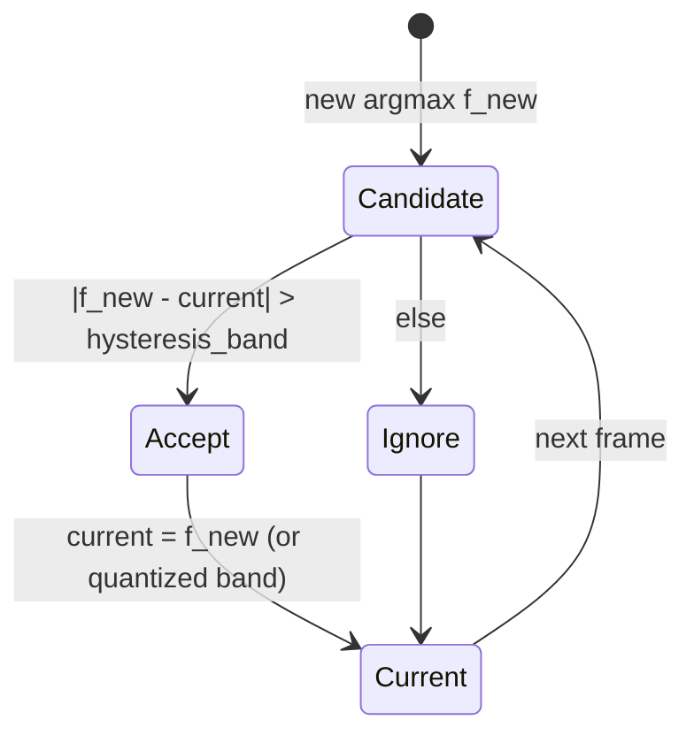

# Real-Time Dominant Frequency Band Tracking and Mapping for Spectral Control

## Abstract

Many creative, visualization, and adaptive audio applications require a compact, stable descriptor of “where the energy is right now” in the spectrum—specifically the single most active frequency or frequency band at each analysis frame. This scalar (or small integer band index) can drive color, spatial oscillator frequency, filter cutoff, or particle attributes while remaining cheap enough to compute on embedded targets at control rates (50–100 Hz). The operation is conceptually an argmax over a power spectrum (or mel / octave grouping), followed by conversion of bin index to Hertz, optional quantization into a small number of perceptual or display bands, and temporal smoothing / hysteresis to suppress frame-to-frame jitter that would produce audible or visual flicker. Because the host spectrum (STFT power, SDFT bins, or mel energies) is already resident for other feature work, the incremental state is O(1) (previous dominant value + a couple of leaky scalars) and incremental traffic is a single pass over the bins already being visited for flux, centroid, or mel accumulation—often zero extra DRAM. This note derives the direct argmax, smoothed / median-filtered, and subband-energy-max variants; supplies fixed-point bin-to-frequency arithmetic and band quantization tables; analyzes state, traffic, and latency at typical audio rates and 60 Hz feature emission; and gives embedded recipes (CLZ for fast log-freq, table-driven mapping, hysteresis state machine). The focus is **minimum added bytes moved and deterministic low-state behavior** so that the descriptor can be emitted alongside amplitude, flux, and subband energies without disturbing the memory-hierarchy discipline of the rest of the pipeline.

> **Provenance note.** Spectral peak / dominant-frequency usage appears throughout MIR and creative coding literature (Tzanetakis spectral features, Peeters feature compendium, Goto beat-tracking dominant-frequency histograms, Scheirer music/speech work). Implementation details for real-time trackers are drawn from pitch-tracking peak-picking (YIN literature) and practical spectrum analyzers (CMSIS, JUCE, open-source VJ tools). All quantitative claims labeled **[derived]** are computed from standard STFT bin spacing and the recurrence costs of the smoothers. Primary sources were re-verified via search at time of writing.

Cross-references: [`../transforms/short-time-fourier-transform.md`](../transforms/short-time-fourier-transform.md) (on-the-fly power spectrum; hop sizing for control rate; never materialize full spectrogram), [`../transforms/discrete-fourier-transform.md`](../transforms/discrete-fourier-transform.md) and [`../transforms/sliding-dft-and-recursive-spectrum-updates.md`](../transforms/sliding-dft-and-recursive-spectrum-updates.md) (Goertzel / SDFT for sparse band monitoring instead of full FFT when only dominant is needed), [`../features/mel-frequency-cepstral-coefficients.md`](../features/mel-frequency-cepstral-coefficients.md) (mel energies as a perceptually grouped domain in which to find the dominant band), [`../features/perceptual-sparse-and-ultra-low-compute-features.md`](../features/perceptual-sparse-and-ultra-low-compute-features.md) (centroid as related “average” brightness; flux, HFC, crest as companions; max used in crest factor), [`../detection/real-time-pitch-estimation.md`](../detection/real-time-pitch-estimation.md) (peak-picking and parabolic interpolation techniques reusable for sub-bin dominant refinement), [`../general/numerical-considerations-fixed-point-floating-point-audio.md`](../general/numerical-considerations-fixed-point-floating-point-audio.md) (bin index → frequency scaling in fixed point, quantization of the final band index).

---

## 1. Definition and Use Cases

Dominant frequency band at frame l:

k* = arg max_k  P[l, k]     for k in bins corresponding to a useful range (e.g. 2 kHz–8 kHz for the color example)

f* = k* · (fs / N)

band = quantize(f* )   → integer or normalized [0,1] for color / oscillator index

The value is emitted at the control rate (e.g. 60 fps) together with amplitude and other shape descriptors. It is the “mode” of the spectrum (as opposed to the energy-weighted mean given by spectral centroid).

Applications that need exactly this scalar:
- Color or hue mapping in spectrogram-driven visuals (the 2 kHz blue → 8 kHz cyan gradient).
- Selecting which member of a bank of oscillators or resonators is most excited.
- Adaptive EQ or “emphasize the loudest band” effects.
- Simple timbre classifiers or key-invariant features.

---

## 2. Direct Argmax on the Host Spectrum (Zero-Copy)

When a power or magnitude spectrum (or mel energies) has already been computed for the current frame:

```pseudocode
max_val = -1
max_k = 0
for k in k_min .. k_max:          # only the 2–8 kHz slice if desired
    if P[k] > max_val:
        max_val = P[k]
        max_k = k
f = max_k * fs / N
```

If the loop is the same pass already being performed for flux (compare to prev) or centroid (accumulate k*P[k] and sumP), the dominant extraction adds **zero extra loads** of the spectrum data.

**State for raw argmax:** none (pure reduction).

**Jitter problem:** adjacent frames can flip between two nearby bins whose energies are almost equal, producing rapid color or index changes. Hence the next sections.

---

## 3. Temporal Smoothing and Hysteresis

### 3.1 Leaky Max Tracker (single scalar state)

```
dom_env = (1 - α) * dom_env + α * P[max_k]     # or on the freq itself after conversion
if P[max_k] > dom_env * (1 + δ):               # hysteresis margin
    current_dominant = f
```

α chosen for ~100–300 ms smoothing at the feature rate.

### 3.2 Hysteresis State Machine (preferred for color stability)



Hysteresis band can be 1–3 semitones or a fixed Hz width (e.g. 200 Hz). Quantization into the display bands (the 2 kHz … 8 kHz color stops) can be performed after acceptance so the emitted value is already an integer band index.

State: previous dominant value (float or int band) + optional previous energy for relative threshold. < 16 bytes.

---

## 4. Subband-Energy Variant (More Robust, Perceptual)

Instead of raw FFT bins, first accumulate energy into a small number of bands (mel, 1/3-octave, or custom 6–12 bands covering 2–8 kHz), then take argmax over the 6–12 band energies.

Advantages:
- Matches the color-bar granularity directly (one band → one color stop).
- Less sensitive to single-bin noise or FFT scalloping.
- Can be the same reduction already done for “subband energies” that drive other osc dimensions.

Traffic still one pass; the band accumulators are tiny (12 floats) and live in the same scratch that would have been used for mel anyway.

---

## 5. Fixed-Point and Embedded Realization

- Bin index k is int; frequency = (k * fs_q) >> (logN + q) with precomputed fs_q in Q format.
- For 512-point FFT at 48 kHz, bin spacing ≈ 93.75 Hz. A 2 kHz–8 kHz range is bins ~21–85. The final band index (say 0–11 for 12 color stops) is a small table lookup or integer divide.
- All comparisons and max tracking in Q31; the spectrum P[k] may be in block-float or scaled Q31 so that the global max is representable.
- On Cortex-M4 the argmax loop over 64 bins is a few hundred cycles—cheap at 60 fps.

When only the dominant band (not the full spectrum) is required, a bank of 8–12 Goertzel or sliding-DFT resonators tuned to the band centers can replace the FFT entirely, dropping arithmetic and traffic dramatically (see sliding-DFT and DFT notes).

---

## 6. Concrete Budget Example (48 kHz, 60 fps features, N=512, H=800)

- Host STFT hop already paid (see STFT traffic tables).
- Extra for dominant: one pass over ~64 bins (or 8 mel bands) → ~64 loads of P[k] that are already in L1 from the mel or flux pass.
- State: 1–2 floats (prev dominant + energy) + hysteresis counter.
- Output: one integer band (0–11) or normalized float for color, plus optional sub-bin refinement (parabolic interp around the max bin, 3 extra loads, cheap).

Total added mutable state for the whole “amp + dominant + flux + 4 subbands” vector at 60 Hz: well under 200 bytes when everything is fused.

---

## 7. Pseudocode — Fused with Existing On-the-Fly Reductions

```pseudocode
# inside the "after FFT, while bins are hot" section of STFT or SDFT
P = compute_power(fft_out)          # or |X|^2 on the fly
amp = 0.0
dom_val = -1.0
dom_k = 0
for k in range(k_lo, k_hi):
    p = P[k]
    amp += p
    if p > dom_val:
        dom_val = p
        dom_k = k
    # also do flux, centroid, subband accumulators in same loop...
amp = sqrt(amp / n_bins)            # or whatever normalization
f = dom_k * fs / N
band = band_table[ int( (f - 2000) / 500 ) ]   # example 500 Hz stops
band = hysteresis_update(prev_band, band, dom_val)
emit(amp_scaled, band, flux, centroid, subbands)
```

---

## 8. References (Primary, Verified)

1. Tzanetakis, G. & Cook, P. “Musical genre classification of audio signals.” IEEE Trans. Speech Audio Process. 10(5), 2002. (Spectral features including rolloff, centroid, flux; practical peak-derived descriptors.)
2. Peeters, G. “A large set of audio features for sound description...” IRCAM 2004. (Comprehensive catalog; spectral shape and “spectral peak” related features.)
3. Goto, M. “Real-time beat tracking for drumless audio signals.” SPECOM 1999. (Dominant frequency detection via histogram peaks on spectrum strips; real-time considerations.)
4. Scheirer, E. & Slaney, M. “Construction and evaluation of a robust multifeature speech/music discriminator.” ICASSP 1997. (Energy + spectral shape features.)
5. de Cheveigné, A. & Kawahara, H. “YIN...” JASA 2002. (Parabolic peak interpolation and thresholding techniques directly reusable for sub-bin dominant refinement.)

*End of note. Self-contained; usable for any control-rate client that needs a stable “most active band” scalar (visualization color, resonator selection, simple timbre cue). Full expansion can add measured jitter statistics with/without hysteresis, more sophisticated multi-peak tracking, and explicit fusion examples with the perceptual-sparse and STFT notes producing a complete 60 Hz “viz feature” vector.*

Last updated: 2026 research sweep.
