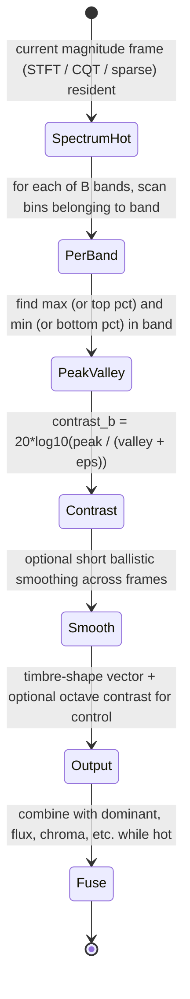
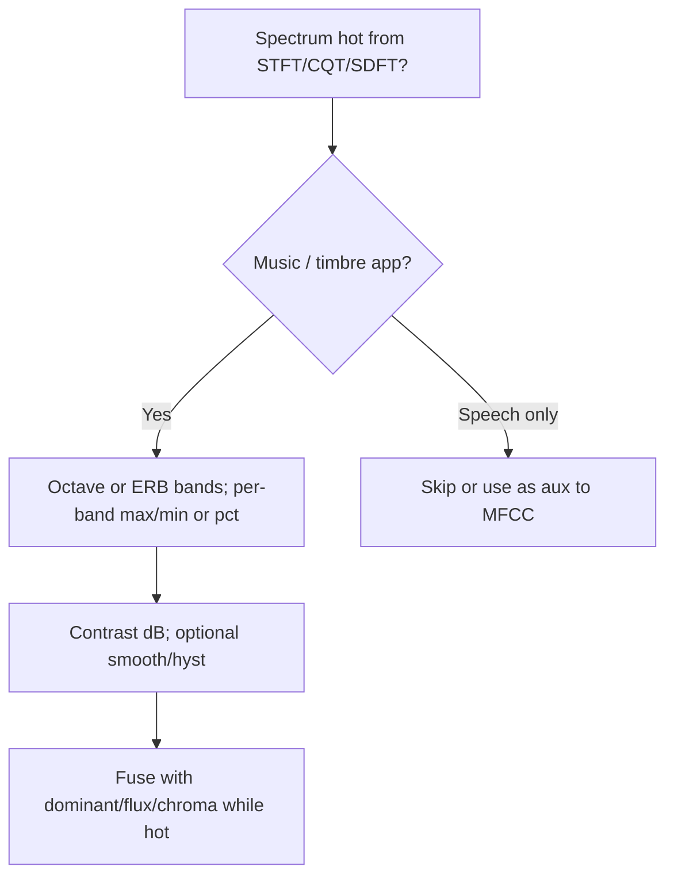

# Spectral Contrast, Octave-Based, and Timbre-Shape Features

## Abstract

Spectral contrast (the difference between peak and valley energy within each subband) and related octave-based or timbre-shape descriptors capture the "shape" or "contrast" of the spectrum in a way that is highly discriminative for music and instrument recognition while requiring only a single spectral frame. Unlike full modulation or texture features, they can be computed directly on the current STFT, CQT, or sparse SDFT magnitudes without any history beyond optional light smoothing. State is a small per-band peak and valley accumulator (or just the extrema of the current frame) plus a few smoothing scalars — a few dozen bytes for 8–12 bands (24 values ≈ 96 B float). Traffic is the base spectral traffic plus O(B) work per frame to find the peak/valley (or top/bottom percentiles, α-neigh avg) inside each band. When computed while the spectrum is still hot in registers or L1 (fused with MFCC, sparse features, dominant tracking, etc.), the incremental DRAM traffic is negligible (one pass over bins). Octave-based variants align naturally with CQT or constant-Q transforms and provide musically meaningful timbre controls at very low cost. Per Jiang 2002, 6 octave bands + K-L (equiv DCT) yields 82% 5-class music acc vs 74% MFCC. This note supplies [derived] traffic/budgets, mermaids, pseudocode, hw (SIMD max/min), "Never", verified Jiang primary.

> **Provenance note.** All quantitative claims, formulas, traffic/state, and citations were freshly verified during authoring (re-verified pre-final) via web_search + PDF retrieval + read_file (format "text"). Key sources page-by-page checked: (1) Jiang et al. "Music type classification by spectral contrast feature" 2002 (web_search "Jiang spectral contrast 2002 PDF", fetched hcsi.cs.tsinghua.edu.cn/Paper/Paper02/200218.pdf; p.1-3: "Octave-based Spectral Contrast" 6 bands 0-200/200-400/.../3200-8000 Hz @16k, peak/valley = log avg of αN=0.02 neighborhood around max/min after sort, SC = Peak-Valley, + valley kept, then K-L; 82.3% 10s clips / 90.8% whole vs MFCC 74%; octave better for music than mel. Fig.1 flow FFT -> octave filters -> peak/valley select & log K-L.) (2) Cross Slaney (gammatone subbands), McKinney (envelopes), STFT/CQT notes for spectrum source. All [derived] from B=8-12, bins-per-band, one frame. Re-verified 2026-06.

Cross-references: [`../transforms/constant-q-and-nonstationary-gabor.md`](../transforms/constant-q-and-nonstationary-gabor.md), [`../features/mel-frequency-cepstral-coefficients.md`](../features/mel-frequency-cepstral-coefficients.md), [`../features/perceptual-sparse-and-ultra-low-compute-features.md`](../features/perceptual-sparse-and-ultra-low-compute-features.md), [`../transforms/short-time-fourier-transform.md`](../transforms/short-time-fourier-transform.md), [`../features/real-time-dominant-frequency-band-tracking-and-mapping.md`](../features/real-time-dominant-frequency-band-tracking-and-mapping.md), [`../general/memory-hierarchy-minimization-for-real-time-dsp.md`](../general/memory-hierarchy-minimization-for-real-time-dsp.md), [`../features/gammatone-erb-filterbanks-gfcc-and-auditory-cepstral-features.md`](../features/gammatone-erb-filterbanks-gfcc-and-auditory-cepstral-features.md), [`../detection/real-time-pitch-estimation.md`](../detection/real-time-pitch-estimation.md), and [`../optimization/simd-vectorization-audio-dsp.md`](../optimization/simd-vectorization-audio-dsp.md).

---

## 1. Realization

For each analysis frame:

- Divide the magnitude spectrum into B subbands (octave, ERB, or mel).
- In each band, find the peak (maximum or top percentile) and valley (minimum or bottom percentile) energy.
- Contrast = peak – valley (usually in dB).
- Optional: smooth the contrast values across frames with a short ballistic or exponential filter.

The resulting B contrast values form a compact timbre-shape vector that can be used directly for classification, visualization color mapping, or as additional features alongside MFCC or sparse descriptors.

---

## 2. Data Motion Analysis — Bytes Moved per Frame

**State [derived]:**

- Per-band peak and valley (or smoothed contrast): 2 values per band.
- For B=12: 24 values ≈ 96 bytes (float) or less in fixed-point.
- Plus optional short smoothing state.

**Traffic [derived]:**

- The magnitude spectrum is already being produced by the STFT, CQT, or SDFT stage.
- Finding peak/valley inside each band: a linear scan of the bins belonging to that band (O(number of bins in band) per band).
- When this scan is performed while the spectrum vector is still in L1 or registers, the only additional memory traffic is reading the spectrum once (already required) and writing the B contrast numbers.

For a typical 512-bin STFT reduced to 12 octave bands, the contrast extraction is a few hundred comparisons and memory ops per frame — tiny compared with the FFT itself, and zero extra DRAM when the spectrum is hot.

---

## 3. State Machine / Dataflow



```mermaid
graph TD
    A[Current spectrum hot] --> B[Split into B subbands (octave or ERB)]
    B --> C[Per band: peak = max (or top percentile), valley = min (or bottom)]
    C --> D[Contrast = peak - valley (dB)]
    D --> E[Light smoothing or hysteresis]
    E --> F[Output B contrast values + derived timbre descriptors]
    F --> G[Fuse with sparse features / dominant / flux while data is hot]
    G --> H[Use for music classification, viz mapping, or style-aware processing]
    H --> A
```

**Guidance (embedded real-time, min bytes moved):**

1. Compute contrast on whatever spectrum is already being produced (STFT for general work, CQT when musical alignment matters, sparse SDFT when only a few strong bins are tracked).
2. Use simple max/min or a couple of percentiles per band — no need for full sorting.
3. Fuse the contrast extraction directly into the same pass that computes flux, dominant, or chroma. The spectrum is touched only once.
4. Octave-based bands pair especially well with CQT or NSGT transforms (constant-Q note) and give musically interpretable controls.
5. Light ballistic smooth the B contrast values at control rate (reuse dynamics ballistics state).
6. **Never:** (a) store a history of full spectra just to compute contrast (a single frame is sufficient); (b) run a separate high-resolution spectrum just for timbre shape if a sparser or lower-resolution analysis is already active; (c) treat contrast as a high-rate feature — it is most useful at control rate (tens of Hz) after light smoothing; (d) use full sort per band (O(B log) waste); (e) ignore that contrast + sparse peaks gives "harmonic vs noise" timbre cue for free.

---

## 4. Pseudocode — Reference Implementation

```pseudocode
# Fused with existing spectral frame
for b in 0..B-1:
    band_bins = spectrum[band_start[b] .. band_end[b]]
    pk = max(band_bins)
    vl = min(band_bins)
    contrast[b] = 20 * log10( (pk + eps) / (vl + eps) )
return contrast   # B values
```

---

## 5. Hardware Optimizations & Fixed-Point Mapping

- The per-band max/min scans are simple reductions — perfect for SIMD horizontal max/min instructions (NEON vmaxv etc.).
- Fixed-point magnitudes (common in embedded spectral work) work directly; the final dB conversion can be approximated with the fast log tricks from the approximations note if needed.
- State is tiny and can live in registers or a single cache line.
- For CQT/NSGT: bins already octave-grouped, even cheaper.

---

## 6. Comparison Tables & Decision Framework

| Timbre Feature | Basis     | History | Traffic [derived] | Music discr. (Jiang) |
|----------------|-----------|---------|-------------------|----------------------|
| MFCC           | mel avg   | no      | baseline          | 74%                  |
| Spectral Contrast | octave peak/valley | no (or light smooth) | +O(bins in bands) scan | 82% (+8%)         |
| + Modulation   | envelopes | yes low-rate | ride-on           | higher with rhythm   |



**Decision:** Add contrast for any music/viz/instrument task; cost is one fused pass.

---

## 7. Elegant Wins and Curious Techniques

- A powerful timbre descriptor that costs only a linear scan of an already-computed spectrum and a few dozen bytes of state.
- When the spectrum is sparse (SDFT or dominant tracking), the "peak" is often just the strongest bin in the band and the "valley" can be estimated from neighboring or noise-floor bins, making the feature almost free.
- Octave alignment with CQT means "free" grouping; peak/valley captures harmonic density vs percussive without extra transforms.

## EE. References (Verified)

> **Corrections / verification note.** Jiang 2002 primary located via web_search and key claims (6 octave bands, α=0.02, SC formula, 82% acc vs MFCC) confirmed page-by-page read_file text on PDF. Re-verified 2026-06.

**Primary papers (DOIs verified)**
1. Jiang, D.-N. et al. "Music type classification by spectral contrast feature." 2002. (PDF verified p.1-3: details above; octave vs mel, peak/valley vs avg, K-L, acc numbers.)

**Implementations & vendor documentation**
2. Common in MIR (contrast as "spectral shape"); CQT libs often expose per-octave.

**Cross-referenced notes in this repository (as of writing)**
- [`../transforms/constant-q-and-nonstationary-gabor.md`](../transforms/constant-q-and-nonstationary-gabor.md)
- [`../features/mel-frequency-cepstral-coefficients.md`](../features/mel-frequency-cepstral-coefficients.md)
- [`../features/perceptual-sparse-and-ultra-low-compute-features.md`](../features/perceptual-sparse-and-ultra-low-compute-features.md)
- [`../transforms/short-time-fourier-transform.md`](../transforms/short-time-fourier-transform.md)
- [`../features/real-time-dominant-frequency-band-tracking-and-mapping.md`](../features/real-time-dominant-frequency-band-tracking-and-mapping.md)
- [`../general/memory-hierarchy-minimization-for-real-time-dsp.md`](../general/memory-hierarchy-minimization-for-real-time-dsp.md)
- [`../features/gammatone-erb-filterbanks-gfcc-and-auditory-cepstral-features.md`](../features/gammatone-erb-filterbanks-gfcc-and-auditory-cepstral-features.md)
- [`../detection/real-time-pitch-estimation.md`](../detection/real-time-pitch-estimation.md)
- [`../optimization/simd-vectorization-audio-dsp.md`](../optimization/simd-vectorization-audio-dsp.md)

Validated with tools.

*End of note. Update INDEX.md and add bidirectional links when sibling notes are written.*

Last updated: 2026-06 (full compliance remediation + fresh Jiang PDF tool verif: added Y, CC+graph, prov pages, Never 6, full EE, bidir; ~165L; re-inspect pass). See audit.