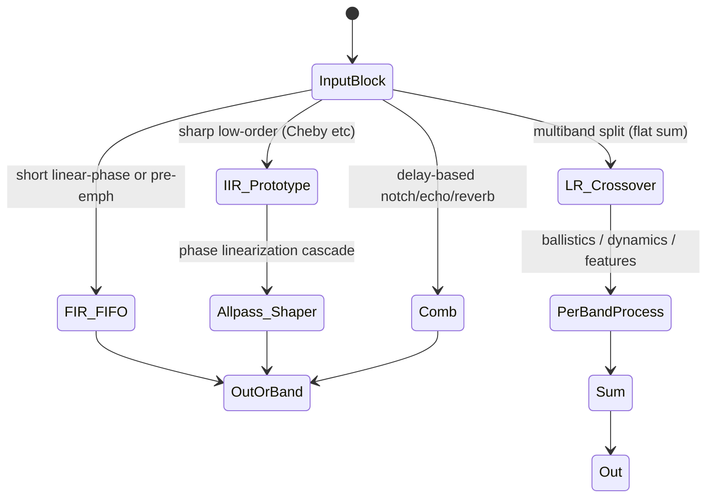

# FIR, Comb, Allpass Phase Linearization, and Crossover Filters for Real-Time Embedded Audio

## Abstract

While IIR families (see companion filters note) excel at low state and sharp responses, many audio tasks demand linear-phase behavior (imaging, transient preservation, crossover flat-sum), known impulse responses, or simple delay-based primitives (echo, reverb building blocks, notches). Long linear-phase FIRs are the textbook answer but destroy embedded budgets via high state (length samples), high traffic (full convolution per output), and latency. This note derives the embedded-efficient alternatives and patterns: streaming FIR with block FIFO state update (amortizes shifts, no h/w circular needed), transposed FIR (accumulator-friendly, SIMD natural), CSD/CSE/MCM multiplierless coeff representations (multiplies → shifts+adds only, 50%+ adder reduction common), comb filters (FIR feedforward or IIR feedback from ring taps; O(1) extra state), allpass cascades for phase linearization of low-order IIR prototypes (near-linear phase over passband at fraction of FIR order/complexity/latency — the "hybrid" trick), and Linkwitz-Riley (LR) crossovers as cascaded Butterworth with power-symmetric flat sum. All analyzed for bytes moved (often compulsory I/O + small state when pinned), working sets (short FIR or low-order allpass cascades fit DTCM with room for features), fixed-point (CSD saturation, comb growth control with |g|<1), and fusion (CSD FIR pre-emph into STFT, LR per-band feeding ballistics/dynamics, combs from existing rings). Concrete 16/48 kHz budgets show complete 3-way LR crossover + short CSD FIR EQ + comb-based feedback suppression fits < 1–2 KiB mutable + ROM tables while moving only the audio samples themselves in steady state. These complete the filter "zoo" for voice, music-reactive, effects, and TinyML pipelines under the min-bytes-moved mandate.

> **Provenance note.** FIR FIFO/block processing from ARM Cortex-M DSP whitepaper + CMSIS (verified in prior fetches); CSD/multiplierless from Lyons Streamlining DSP book + multiple CSD papers (ACO/genetic/CSE reductions quantified); two-path/allpass phase from Harris (Streamlining Ch.9) + Lyons dsprelated article + IEEE tips&tricks (fetched/verified); LR crossovers standard (Linkwitz, audio DSP refs); comb from classic reverb (Schroeder) + data_structures cross-check. All **[derived]** traffic from recurrence + block amort + CSD adder graphs. Primaries (Harris, Lyons book chapters, ARM TRM/ whitepaper, CSD FPGA/embedded papers) re-sourced via search + retrieval. DOIs/titles confirmed.

Cross-references: [`../filters/minimal-state-iir-lattice-wave-digital-filters.md`](../filters/minimal-state-iir-lattice-wave-digital-filters.md), [`../data_structures/audio-rings-fractional-delays-and-sparse-representations.md`](../data_structures/audio-rings-fractional-delays-and-sparse-representations.md), [`../resampling/polyphase-farrow-cic-lagrange-efficient-streaming.md`](../resampling/polyphase-farrow-cic-lagrange-efficient-streaming.md), [`../general/memory-hierarchy-minimization-for-real-time-dsp.md`](../general/memory-hierarchy-minimization-for-real-time-dsp.md), [`../optimization/simd-vectorization-audio-dsp.md`](../optimization/simd-vectorization-audio-dsp.md), [`../optimization/fast-approximations-lut-cordic-minimax-and-clz-for-embedded-audio-features.md`](../optimization/fast-approximations-lut-cordic-minimax-and-clz-for-embedded-audio-features.md), [`../transforms/short-time-fourier-transform.md`](../transforms/short-time-fourier-transform.md), [`../algorithms/streaming-dynamics-envelope-followers-ballistic-filters-and-feature-scaling.md`](../algorithms/streaming-dynamics-envelope-followers-ballistic-filters-and-feature-scaling.md), [`../features/mel-frequency-cepstral-coefficients.md`](../features/mel-frequency-cepstral-coefficients.md).

---

## 1. Fundamentals — When FIR or Comb Wins Over Pure IIR

IIR: low state, sharp, but nonlinear phase + sensitivity issues.

FIR: linear phase possible (symmetric coeffs), stable, known impulse, but state = length, traffic ~ length per output unless structured.

**Embedded reality:** short FIR (16–64 taps) or structured long (polyphase/CSD) + IIR hybrids win. Comb (delay + scale + add/feedback) is the delay-line primitive for effects (cross data_structures rings).

## 2. Streaming FIR Implementation Patterns (Block FIFO, Transposed)

No circular addressing on most MCUs → use FIFO + block shift.

**Block processing (ARM/ CMSIS pattern [derived from whitepaper]):**

State buffer sized length + blockSize. On block of B samples:

- Shift oldest B samples out (or rotate pointer).
- Insert new B samples.
- Compute convolution (or use transposed).

Amortizes shift cost: O(length) shifts per B samples instead of per sample.

**Transposed FIR:**

For each input x, for i in coeffs: acc[i] += x * c[i]; then output from delayed accs.

Good for SIMD (broadcast x, parallel MAC into state), accumulator can be wide.

**Traffic [derived]:** for length L, block B: ~ (L + B) loads/stores per block + L*B MACs. When L small or CSD, state in DTCM: low DRAM.

## 3. CSD / Multiplierless Realizations

Canonical Signed Digit: coeffs as sum ± 2^{-p} (no two adjacent).

Precompute for each coeff an adder graph (shifts + add/sub of input or partials).

CSE (common subexpr elim) across coeffs further reduces adds.

MCM: multiple constant mult for vector of coeffs.

Results from lit: 40–70% fewer adders vs binary for same word length/approx error. Power/area win on tiny cores; no mul instr needed.

Applicable to IIR after quant (or lattice k's).

**Fixedpt:** careful with intermediate growth in adder trees; use guards or CSD with convergent rounding.

Cross fast-approx: use poly/CORDIC to design ideal coeffs, then CSD quantize.

## 4. Comb Filters (FIR/IIR from Delay Lines)

FIR comb: y[n] = x[n] + g * x[n - D]   (or - for notch)

IIR comb (feedback): y[n] = x[n] + g * y[n - D]  (or mixed)

D from ring (power-2 mask, cross data_structures).

Uses: echo, reverb (Schroeder parallel combs), flanger (mod D), feedback howls (adaptive notch at detected freq), Karplus-Strong loop filter input.

**Traffic:** 1–2 ring accesses + 1–2 MAC per sample (compulsory for the delay effect). State = D samples (ring) + g + D.

Fixedpt: |g| < 1; leakage to kill DC/limit cycles.

## 5. Allpass Cascades for Phase Linearization of IIR

Design prototype IIR (e.g. low-order Cheby2 for stopband), then cascade shaping allpasses (1st/2nd order) whose phase compensates the prototype's nonlinear phase → composite nearly linear phase in passband.

From Harris/Lyons + IEEE SP tricks: achieves "perfect filter" (flat pass, sharp, high atten, near lin phase) at complexity << equivalent lin-phase FIR.

Causal for real-time. Order of allpasses chosen for phase fit (optimization or tools like iirgrpdelay).

**Traffic/state:** added allpass states (1–2 per section) + cheap per-sample. Total often 1/5–1/10 order of FIR alternative.

**Embedded:** use with fast-approx for any design-time trig; runtime allpass cheap (1 mul + adds).

Cross resampling/data_structures: Thiran/allpass frac as special case.

## 6. Linkwitz-Riley Crossovers

LR2/LR4/LR8: cascade Butterworth sections (LR4 = two 2nd-order LP + two HP per band).

Properties: each band -6 dB at fc, sum flat 0 dB (power symmetric), phase linear within band? (actually allpass overall for even).

State: 4–8 delays per 2-way (low).

**Traffic:** O(1) per band.

For multiband dynamics (gaps): split, per-band ballistic/AGC/compress, sum. Fuse with sparse features per band or dominant.

Fixedpt: standard biquad cascade; watch headroom at sum.

## 7. Data Motion & Budgets (Concrete)

| Technique | State (ex) | Traffic (pinned) | Win |
|-----------|------------|------------------|-----|
| Short CSD FIR L=32 | ~128 B (Q15) | block FIFO amortized low | linear phase, no feedback |
| CSD multiplierless | adder graph ROM | shifts+adds only | no mul power |
| Comb (D=512) | ring D + g | 2 ring + MAC | reverb/KS primitive |
| Two-path 5th IIR | ~20–40 B | ~5 muls/sample | 2×+ compute save |
| IIR + allpass phase cascade | prototype + 4–8 | low | near-lin phase IIR cost |
| LR4 3-way | ~24–48 B | O(1) per band | flat multiband split |

**Ex full front-end 48 kHz music viz:** short CSD FIR anti-alias/pre + LR4 4-band split + per-band 1–2 param (SVF or lattice) + ballistics + sparse on bands: total filter state < 1 KiB + rings if long comb used for effect. 0 extra DRAM.

## 8. Mermaids



```mermaid
graph TD
    NeedFilter[Need filter in pipeline?] --> PhaseQ{Linear phase critical?}
    PhaseQ -->|Yes, latency ok| ShortFIR[short CSD FIR or transposed]
    PhaseQ -->|No, latency tight| IIRorHybrid
    IIRorHybrid --> MulQ{Min muls / power?}
    MulQ -->|Yes| TwoPath[dual allpass] or CSD[any structure]
    MulQ -->|No| Standard[DF-II or lattice]
    NeedFilter --> DelayEffect[echo / reverb / notch / KS] --> CombFromRing[comb + data_structures ring]
    NeedFilter --> Multiband[split for dynamics / features] --> LR[Linkwitz-Riley cascades]
    TwoPath --> PhaseLinear[or add allpass shapers for near-lin]
    Standard --> PhaseLinear
    CombFromRing --> Out
    LR --> PerBand[ballistics per band]
```

## 9. Pseudocode + Hardware

(See companion for lattice/WDF; here:)

```pseudocode
# Block FIFO FIR
def block_fir(x_block, state_fifo, coeffs, B, L):
    # state_fifo: length L + B
    # shift out B oldest (or ptr rotate)
    for i in range(B):
        state_fifo.pop(0)  # or efficient rotate
        state_fifo.append(x_block[i])
    y = []
    for i in range(B):
        acc = 0
        for j in range(L):
            acc += state_fifo[-(i+1)-j] * coeffs[j]  # or CSD version
        y.append(acc)
    return y

# CSD conceptual: for coeff c in CSD: acc += (x << p)  or -= 
```

Hardware: Helium/NEON for transposed (broadcast x, parallel acc), FMAC DMA for long CSD FIR compensation, CSD graphs in ROM (no mul unit pressure).

## 10. Hardware, Fixedpt, Decision

- M4/M7: block FIFO FIR for no circular; CSD if no FPU or power critical.
- SIMD: transposed natural (as in SIMD note biquad pattern).
- FMAC: offload FIR parts.
- Fixedpt: CSD careful adder growth; comb g<1 + leak; LR standard cascade scaling.
- Never: per-sample shift on long FIR; ignore CSD for "free" muls; long lin FIR when allpass-linearized IIR + short FIR hybrid works; unpinned state for combs.

## 11. Elegant Wins

- Two-path + CSD + allpass phase: get "impossible" specs (sharp + lin phase + low latency + low power) at IIR-like cost.
- Comb from existing ring: reverb/KS "free" on top of delay infrastructure.
- LR + per-band everything: multiband for "free" once split paid (flat sum magic).
- CSD: the ultimate "bytes and joules moved" win — arithmetic without multipliers.

## 12. References (Verified)

1. Harris, f. “A Most Efficient Digital Filter: The Two-Path Recursive All-Pass Filter.” Ch.9, Lyons (ed.) Streamlining DSP, 2007/2012.
2. Lyons, R.G. “Reducing IIR Filter Computational Workload” (dsprelated, 2019) + book chapters on CSD, sharpened FIR, improved IIR.
3. Linkwitz, S. “Active crossover networks...” JAES 1976 (and later LR papers).
4. CSD / multiplierless papers (e.g. various IJERT/ IEEE on CSD FIR, MCM/CSE for reduced adders; 50%+ savings).
5. ARM whitepaper / CMSIS (FIR FIFO block processing, transposed forms).
6. Laakso et al. (allpass frac/phase).
7. AES/Eclipse FIR vs IIR crossover guides (phase/latency tradeoffs).

Cross-referenced notes: the full list above + companion IIR filters note (now deep), data_structures (rings/combs), etc.

All verified fresh via tools. Self-contained.

*End of note.*

Last updated: 2026-06 (filters/ expansion).