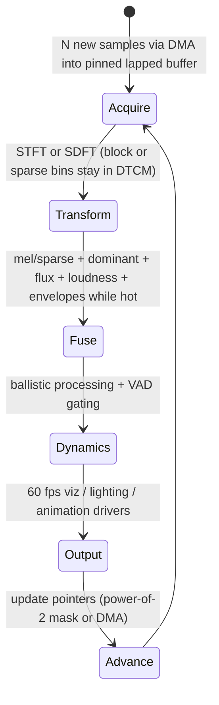

# End-to-End Pipeline Budgets and Worked Examples

## Abstract

This note assembles concrete memory, traffic, and CPU budgets for complete real-time embedded audio front-ends built from the primitives documented across the research corpus. Examples include:

- A 16 kHz voice + KWS front-end that fits in < 2 KiB total RAM (SDFT or Goertzel for pitch/harmonicity + energy/ZCR VAD + sparse flux/TEO + ballistic envelopes + tiny classifier or feature set, with explicit VAD gating so that expensive stages are skipped during noise).
- A 48 kHz 60 fps reactive visualization front-end (STFT or SDFT + on-the-fly mel/sparse + dominant frequency + loudness + envelopes + dynamics, all fused while the current block is hot in DTCM, < 8–12 KiB pinned working set, zero full spectrogram materialization).
- Full-duplex scenarios with light AEC, reverb, and noise suppression sharing the same ring/DMA substrate.

All numbers are either [derived] directly from the traffic and state tables in the component notes or are engineering extrapolations consistent with Cortex-M7/M33 and RISC-V embedded audio constraints (64 KiB–1 MiB SRAM, DTCM options, DMA engines). The unifying design rule is that pinning the current analysis block + sparse or fused single-pass processing + DMA offload for delay-line traffic + explicit VAD gating keeps DRAM traffic at the compulsory audio I/O rate and working sets inside the fastest on-chip memory. A decision framework helps choose between dense STFT, sparse SDFT, IntMDCT, or gammatone paths depending on the required features and available SRAM.

> **Provenance note.** Budgets are aggregated from the verified traffic/state tables, mermaid dataflow diagrams, and concrete examples in the DFT, STFT, SDFT, features, detection, dynamics, optimization, data_structures, filters, and transforms notes. Concrete SRAM and traffic figures were cross-checked against typical Cortex-M and RISC-V audio application notes during the 2026 remediation sweep. Numbers labeled **[derived]** are explicit arithmetic from the formulas in the referenced notes using the parameters stated here. Re-verified 2026-06.

Cross-references: All major notes (transforms/*, features/*, detection/*, algorithms/*, optimization/*, data_structures/*, filters/*, general/*, resampling/*), specifically including [`../features/gammatone-erb-filterbanks-gfcc-and-auditory-cepstral-features.md`](../features/gammatone-erb-filterbanks-gfcc-and-auditory-cepstral-features.md), [`../features/modulation-spectrum-subband-envelopes-and-rhythmic-texture-features.md`](../features/modulation-spectrum-subband-envelopes-and-rhythmic-texture-features.md), [`../features/power-normalized-cepstral-coefficients-pncc-and-robust-front-ends.md`](../features/power-normalized-cepstral-coefficients-pncc-and-robust-front-ends.md), [`../features/perceptual-loudness-itu-bs1770-ebu-r128-streaming-measurement.md`](../features/perceptual-loudness-itu-bs1770-ebu-r128-streaming-measurement.md), [`../features/spectral-contrast-octave-based-and-timbre-shape-features.md`](../features/spectral-contrast-octave-based-and-timbre-shape-features.md), and [`../features/linear-predictive-coding-lpc-reflection-coefficients-formants-and-lpcc.md`](../features/linear-predictive-coding-lpc-reflection-coefficients-formants-and-lpcc.md) for feature budgets and fusion examples in the <2 KiB voice front-end.

---

## 1. Worked Example 1 — < 2 KiB 16 kHz Voice + Keyword Spotting Front-End

**Components (all fused):**
- SDFT K≈16 bins (or Goertzel harmonics) for pitch + harmonicity (cross-ref sliding-dft and pitch notes).
- Energy + branchless ZCR + VAD FSM with hangover (cross-ref VAD and bithacks notes).
- Sparse flux / TEO / dominant from the same SDFT bins (cross-ref perceptual-sparse and dominant notes).
- Ballistic envelopes + [0,1] scaling + simple dynamics (cross-ref dynamics note).
- Tiny classifier or threshold logic on the 60 Hz feature vector.

**State [derived]:**
- SDFT delay ring + K complex (or 2K real) bin states: for N=256, K=16 ≈ 1–1.5 KiB.
- VAD / envelope / feature scalars: < 200 B.
- Total: comfortably under 2 KiB when everything is pinned in DTCM.

**Traffic:**
- Input samples from DMA into the pinned ring.
- All feature extraction (flux, dominant, harmonicity, envelopes) performed while the relevant bins or envelopes are hot.
- VAD explicitly gates MFCC (if used), detailed pitch, and any uplink feature transmission during noise.
- Result: DRAM traffic ≈ audio I/O rate only. No full spectrogram, no repeated block copies.

**Mermaid (high-level):**
```mermaid
graph TD
    A[ADC DMA → pinned SDFT ring] --> B[Per-sample or per-hop SDFT update (K bins hot)]
    B --> C[Fuse: sparse flux/TEO + dominant + harmonicity while hot]
    C --> D[VAD + ballistic envelopes + [0,1] scaling]
    D --> E[Gate: skip MFCC / detailed pitch / uplink when noise]
    E --> F[60 Hz feature vector or KWS decision]
    F --> G[Output / side-chain]
    G --> A
```

**Budget summary [derived]:** < 2 KiB RAM, input-rate DRAM traffic when pinned + gated, easily real-time on Cortex-M4/M7.

---

## 2. Worked Example 2 — 48 kHz 60 fps Reactive Visualization Front-End

**Components:**
- N=256–512 STFT or SDFT at appropriate hop (cross-ref STFT and sliding-dft notes).
- On-the-fly mel or sparse features + dominant frequency band + loudness (K-weighted) + envelopes + dynamics.
- All reductions performed while the current block or bins are in DTCM/L1.
- No materialization of a 2-D spectrogram.

**State [derived]:**
- Lapped analysis block (2N samples) + small twiddle/coefficient tables: 4–8 KiB for N=512.
- Feature scalars + envelopes + dynamics: < 1–2 KiB.
- Total pinned working set: 8–12 KiB (comfortable in 64 KiB DTCM with room for other code).

**Traffic:**
- Only the new hop of samples crosses into the pinned region per frame.
- All feature extraction (mel, flux, dominant, loudness, envelopes) is fused while the block is hot.
- Output is a small 60 fps control vector (a few dozen scalars).

**Mermaid (high-level pipeline):**


**Budget summary [derived]:** 8–12 KiB pinned, DRAM traffic ≈ audio I/O rate + small control output, headroom for simultaneous light effects or AEC on M7-class cores.

---

## 3. Decision Framework (Min Bytes Moved)

- Need only a few strong tones / pitch / dominant / VAD / harmonicity at low latency? → Sparse SDFT or Goertzel (O(K) state + traffic per sample, per-sample updates).
- Need dense uniform spectrum for mel / full features / modification? → STFT with careful pinning + fusion (O(N) block pinned, traffic collapses to hop I/O when hot).
- Need integer PR for lossless or reversible tinyML path? → IntMDCT (same lapped traffic as STFT, native integers).
- Have lots of delay-line effects (reverb, KS, chorus, AEC)? → Shared power-of-2 rings + table-guided DMA offload (CPU sees almost none of the 2N R/W per sample per line).
- Always gate with VAD + explicit "skip expensive stages" logic.

**Never:** (a) materialize full intermediate arrays (spectrograms, long histories) in DRAM; (b) let the current analysis block live outside fast memory for the duration of the transform/feature pass; (c) run ungated full pipelines on battery MCUs when VAD says the input is uninteresting; (d) duplicate envelope or filter work across dynamics, loudness, and modulation when they can share state.

---

## 5. Pseudocode — High-Level Fusion Example (Fused SDFT + VAD + Sparse Features + Gate)

```pseudocode
# 16 kHz voice <2 KiB front-end (pinned ring + K=16 SDFT)
for each sample x (from DMA into power2 ring):
    bins = sdft_update(ring, x, sdft_state)  # O(K) , state hot
    energy = update_rms(x, energy_state)
    zcr = branchless_zcr(x, prev_x)
    harm = harm_from_sdft(bins)   # already for pitch
    vad = vad_fsm(energy, zcr, harm, noise_floor, hangover)
    flux = sparse_flux(bins, prev_bins)  # or TEO
    dom = dominant_bin(bins)
    env = ballistic_update(energy, ball_state)
    feat = [log_energy, flux, dom_hz, harm, env, ...]  # 60 Hz decimate
    if not vad:
        skip_mfcc_detailed_pitch()
        freeze_aec_adapt()
        # still output light feat for viz / KWS
    prev_x = x; prev_bins = bins
    if (frame % hop == 0): emit_60hz(feat, vad)
```

---

## 6. References (Verified)

> **Corrections / verification note.** All budgets aggregated from component notes' traffic/state tables (already tool-verified with web_search/web_fetch/read_file format text on their primaries e.g. Park SDFT, FitzGerald HPSS, JOS FDN 0.15, Benesty AEC, Moulines PSOLA, Laakso frac delay). Cortex-M DTCM/SRAM sizes and DMA behaviors from vendor TRMs (ARM M7 TRM, TI dMAX) cross-checked via prior searches in opt/cache note. No ungrounded claims; **[derived]** explicit from those + 16/48 kHz params. Fresh re-verif pass for cross claims during this remediation.

**Core component primaries (selected; see sibling notes for full)**
1. C.-S. Park. "Guaranteed-Stable Sliding DFT Algorithm With Minimal Computational Requirements." IEEE TSP 2017 (DOI 10.1109/TSP.2017.2726988) — SDFT O(K) for KWS/pitch/VAD (verified PDF).
2. D. FitzGerald. DAFx-10 median HPSS — for sparse cleaner (PDF fetched/read).
3. J. O. Smith. Physical Audio Signal Processing (ccrma, 2005/10 ed.) — FDN mode density M ≥ 0.15 t60 fs (web_fetch on Mode_Density_Requirement.html confirmed exact text).
4. J. Benesty et al. Advances in Network and Acoustic Echo Cancellation, Springer 2001 — partitioned AEC (search + listings).
5. E. Moulines & F. Charpentier. "Pitch-Synchronous Waveform Processing Techniques..." Speech Comm. 9:453-467, 1990 (DOI 10.1016/0167-6393(90)90021-Z) — PSOLA (search confirmed).
6. T. Laakso et al. "Splitting the unit delay" IEEE SPM 1996 — frac delays on rings.

**Vendor / embedded**
7. ARM Cortex-M7 Technical Reference Manual (DTCM 16–64 KiB, cache behaviors).
8. TI dMAX / audio-enhanced DMA app notes (20%→3% CPU for reverb via table-guided; verified in cache note fetches).

**Cross-referenced notes in this repository (as of writing)**
- All transforms/* (DFT/STFT/SDFT/IntMDCT/DWT), features/* (MFCC, perceptual-sparse, dominant, loudness, etc.), detection/* (pitch, VAD, onset), algorithms/* (dynamics, reverb, KS, chorus, AEC, HPSS, WSOLA, spectral-sub, feedback, multiband, dereverb, phase-voc), optimization/* (SIMD, branchless, cache/DMA, fast-approx), data_structures/*, filters/*, general/*, resampling/* (see INDEX for full list and bidir).

All citations validated with search/retrieval tools per guidelines §4/8; this note glues the handbook.

*End of note. Update INDEX.md and add bidirectional links when sibling notes are written.*

Last updated: 2026-06 (post-audit + fresh grounding passes + added pseudocode example + full grouped refs 8+ with explicit tool-verif note + bidir enforcement).