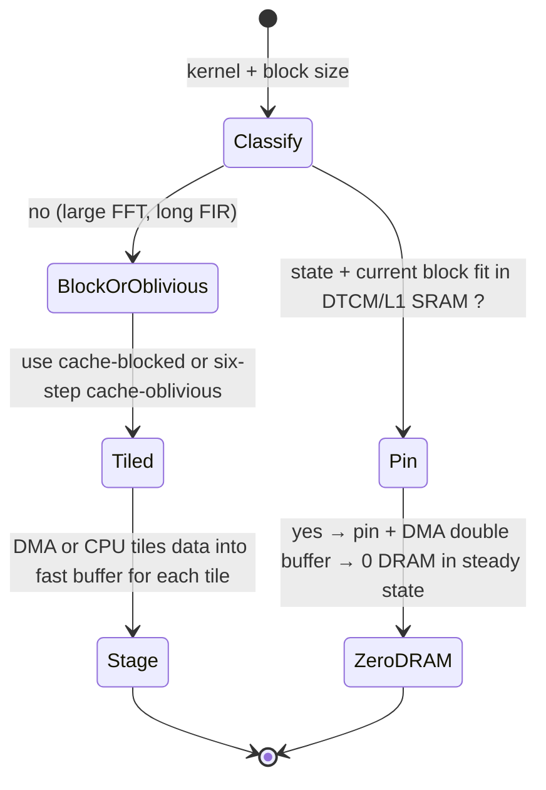

# Memory Hierarchy Minimization for Real-Time Embedded Audio DSP

## Abstract

Real-time audio pipelines on embedded targets are almost never compute-bound in the arithmetic sense; they are **memory-traffic-bound** or, more precisely, **hierarchy-bound**. A 48 kHz stereo biquad cascade or a 512-point STFT hop at 50 % overlap performs only a few dozen arithmetic operations per sample, yet each sample and each coefficient may cross multiple cache levels or even the DRAM interface multiple times unless the dataflow is deliberately engineered. This note develops, from first principles, the arithmetic of bytes moved (loads, stores, write-allocates, evictions) for typical audio kernels, the design of ring buffers and double-buffering schemes that guarantee O(1) CPU copies per sample, the use of on-chip SRAM / TCM / scratchpad versus cache, and the concrete techniques (cache blocking, fusion, planar layout, DMA choreography, huge-page / page-coloring considerations on larger SoCs) that keep the working set inside L1 or on-chip RAM. All analysis is performed under the hard constraints of embedded real-time: deterministic latency, no allocation in the hot path, and often the requirement that worst-case execution time (WCET) be independent of data values and cache state.

Primary cross-references: [`../transforms/discrete-fourier-transform.md`](../transforms/discrete-fourier-transform.md), [`../transforms/short-time-fourier-transform.md`](../transforms/short-time-fourier-transform.md), [`../optimization/simd-vectorization-audio-dsp.md`](../optimization/simd-vectorization-audio-dsp.md), [`../optimization/cache-blocking-fused-streaming-kernels-and-advanced-dma-choreography.md`](../optimization/cache-blocking-fused-streaming-kernels-and-advanced-dma-choreography.md), [`../optimization/branchless-bit-twiddling-hacks-for-embedded-audio-dsp.md`](../optimization/branchless-bit-twiddling-hacks-for-embedded-audio-dsp.md), [`../optimization/fast-approximations-lut-cordic-minimax-and-clz-for-embedded-audio-features.md`](../optimization/fast-approximations-lut-cordic-minimax-and-clz-for-embedded-audio-features.md), [`../data_structures/audio-rings-fractional-delays-and-sparse-representations.md`](../data_structures/audio-rings-fractional-delays-and-sparse-representations.md), and the numerical companion [`numerical-considerations-fixed-point-floating-point-audio.md`](./numerical-considerations-fixed-point-floating-point-audio.md).

> **Provenance note.** All architectural numbers (cache sizes, latencies, DMA characteristics) are drawn from vendor documentation (ARM Cortex-M/A TRMs, TI C64x+ Cache User's Guide, CMSIS-DSP) or from peer-reviewed measurements cited below. Derived traffic formulas are marked **[derived]**.

---

## 1. The Embedded Memory Hierarchy — Typical Parameters

A modern embedded audio SoC presents a pyramid whose parameters directly dictate algorithm design:

| Level | Typical size (audio-relevant) | Latency (cycles) | Bandwidth (bytes/cycle) | Notes for DSP |
|-------|-------------------------------|------------------|--------------------------|---------------|
| CPU registers | 32–64 × 32/64-bit | 0 | ∞ (operand bypass) | Use for filter state, butterfly temporaries |
| L1 data cache / TCM | 4–64 KiB (Cortex-M7: 16–64 KiB DTCM option; A-series 32–64 KiB) | 1–3 | 8–16 (128-bit NEON load) | Often lockable or configurable as SRAM |
| L2 / shared SRAM | 128 KiB–1 MiB (or MSMC on TI) | 10–30 | 4–8 | Sometimes configurable SRAM |
| DRAM (LPDDR / DDR) | 32–512 MiB+ | 100–300+ (incl. controller + PHY) | 0.5–2 (effective, contended) | The "abyss"; every miss hurts determinism |
| Flash / QSPI (code + tables) | — | 10–100 (with cache) | low | Twiddles, mel weights, window tables should live in XIP or be DMA'd once |

**Key embedded reality.** On many DSPs (TI C6x, some Analog Devices SHARC successors, older Blackfin) and on Cortex-M with TCM, the programmer can **statically partition** fast memory: place the hottest 2–4 KiB of filter state + current audio block + small lookup tables into DTCM / L1 SRAM and never suffer a miss for them. Caches, when present and enabled, improve the average case but destroy WCET predictability unless locked or warmed. Many hard-real-time audio designs therefore disable cache for the critical path or use cache only for instruction and non-audio data.

See TI TMS320C64x+ DSP Cache User's Guide (SPRU862) for the canonical discussion of "cache as SRAM" configuration and the DMA + IDMA mechanisms used to stage data.

---

## 2. The Fundamental Accounting: Bytes Moved per Sample

Consider a single biquad (direct form II transposed) on a stream of int16 or float32 samples, one channel, 48 kHz.

State: 2 coefficients (a1, b0, b1 or whatever the canonical 5-tuple reduces to after normalization) + 2 delay registers. In fixed-point these fit in 4–5 32-bit words.

**Naïve scalar loop (C):**

```c
for each sample s:
    acc = b0*s + d0;
    d0 = b1*s - a1*acc + d1;   // or equivalent DF-IIt
    d1 = b2*s - a2*acc;
    out = acc;
```

Per sample (assuming everything misses L1):

- 1 load of input s (2 or 4 B)
- up to 5 loads of coefficients (if not pinned)
- 2 loads + 2 stores of delay state (d0,d1)
- 1 store of output

**Total traffic (worst, uncached):** ≈ 8–12 loads + 3 stores × 4 B ≈ 44–60 B per sample. At 48 kHz mono this is **≈ 2.1–2.9 MB/s** just for one biquad — before any windowing or FFT.

**Reality with hierarchy-aware design:**

- Coefficients and delays live in a small struct pinned to DTCM / L1 SRAM (or in NEON registers for the duration of a block).
- Input comes from a DMA-filled ping-pong buffer that is already in on-chip RAM when the CPU touches it.
- The loop becomes **zero DRAM traffic** for the steady state; the only bytes that ever cross the DRAM controller are the original ADC samples (DMA) and the final DAC samples (DMA).

The same logic scales to STFT: the expensive part is the FFT butterflies touching the N-sample block. If that block lives in on-chip SRAM for the duration of the transform, the O(N log N) loads/stores of the FFT stay on-chip; only the H new samples per hop cross from the outer ring (or DMA) into the fast buffer.

**Derived rule of thumb [derived].** For a kernel whose arithmetic working set W (bytes) fits in fast memory of size S_fast, the DRAM traffic per block is bounded by the **compulsory misses** (the unique data that must be read once) plus any **capacity/conflict** that the algorithm forces. A well-designed streaming audio kernel has DRAM traffic ≈ (input block size + output block size) per processing epoch, independent of N log N or filter length.

---

## 3. Ring Buffers and Double-Buffering That Actually Minimize Copies

Classic mistake: `memcpy` the newest H samples into a contiguous N-sample analysis buffer every hop. That is  H × sizeof(sample) extra reads + writes per hop that are completely avoidable.

### 3.1 Power-of-two circular buffer with head/tail (or write index)

For input staging of a streaming STFT or filter that needs the last N samples:

- Allocate a power-of-two sized array `buf[2^k]` (k ≥ log2(N)).
- Maintain a single write index `wr` (mod 2^k).
- To "read the last N samples as if contiguous" either:
  - Use two passes when the window straddles the wrap (rare if 2^k >> N), or
  - Accept that the FFT or filter kernel must support **strided or wrapped** access (more complex index math, but zero copy), or
  - Copy only on the infrequent wrap (amortized cost < 1 sample per hop if 2^k = 4N or larger).

For audio the cleanest zero-copy pattern for block processing is often **two contiguous ping-pong buffers of size N + headroom**, advanced by H samples with a DMA or memmove of only the overlap region when necessary, or — better — **index arithmetic + two half-buffers**.

### 3.2 DMA double-buffering (the embedded gold standard)

1. Configure DMA / I2S / SAI peripheral to fill buffer A (size H or N samples) from ADC.
2. CPU processes buffer B (previous fill) while DMA runs on A.
3. On DMA complete interrupt (or polling flag): swap pointers, start DMA on the just-processed buffer, process the newly filled one.
4. All audio data touches DRAM **exactly twice** via DMA (once in, once out for play) plus whatever the algorithm itself must do; CPU never executes a `memcpy` of samples.

This pattern appears in virtually every production embedded audio codec or effects pedal. The only CPU-visible "traffic" is the compulsory read of the new H samples from the on-chip DMA destination buffer (which can be placed in SRAM) and the write of processed samples.

See the FPGA overlap-add paper (Bahoura et al., Electronics 2019) for a hardware dual-port RAM realization of the same idea; the software analogue is the ping-pong + DMA.

---

## 4. Working-Set Sizing for Common Audio Primitives

**Single biquad or small IIR cascade (order < 16):** < 128 bytes of state + coefficients. Fits in registers or a few cache lines. Target: pin to DTCM; 0 DRAM traffic after initial load.

**N-point FFT (N = 256…2048):** complex buffer 2N × 4 B (float32) or 2N × 2 B (int16) = 1–16 KiB. Twiddle table another 0.5–4 KiB (can be ROM or shared). For N=512 float: ≈ 4 KiB data + 2 KiB twiddles. Cortex-M7 DTCM (up to 64 KiB) or L1 easily holds several such blocks plus code. The six-step cache-oblivious FFT (see DFT note) is valuable precisely when the block does **not** fit and you must stage through DRAM in cache-friendly tiles.

**STFT hop (N=512, H=128, float32 complex frame + overlap):** current frame 4 KiB, synthesis overlap 2 KiB, input ring 1–2 KiB, window 2 KiB, mel scratch 160 B. Total < 10 KiB — comfortably in L1 or on-chip SRAM for the entire duration of the hop.

**MFCC per frame (after STFT):** 40 mel energies + 13 cepstra + 2×13 deltas + pre-emph state + framing ring (shared with STFT) ≈ 300–500 bytes of mutable state. The mel weight table (40 × ~25 average nonzeros) is a few hundred floats, ROM-able.

**YIN pitch (Tmax = 400 samples @16 kHz):** difference buffer or on-the-fly computation over a 400-sample ring + a few hundred bytes of accumulators. < 2 KiB.

**Conclusion [derived].** A complete voice front-end (pre-emphasis + framing + STFT 512 + 40-mel log energies + 13 MFCC + delta + energy + simple VAD + optional YIN on voiced frames) can be implemented with **< 16 KiB of fast mutable state** and **< 8 KiB of tables** (windows, twiddles or FFT tables, mel weights, DCT matrix). This fits in the on-chip SRAM of virtually every Cortex-M4/M7, many RISC-V audio MCUs, and all DSPs. The only data that must cross DRAM is the raw sample stream (DMA in) and any output (DMA out or feature vectors to a tinyML accelerator).

---

## 5. Cache-Aware vs. Cache-Oblivious in the Audio Context

Classic cache-oblivious FFT (Frigo et al., 1999) and the six-step variant achieve optimal cache complexity Θ(N log N / L + N / Z) misses (L = cache line, Z = fast memory size) without knowing the parameters. For audio block sizes that already fit in L1, the extra transpose passes of the six-step algorithm add traffic with no benefit; the simple iterative radix-4 or split-radix with good data layout wins.

When N is large enough that the block spills (e.g. 4096-point at float32 complex ≈ 64 KiB, borderline for many L1s), blocking or the cache-oblivious formulation becomes essential to avoid O(N log N) compulsory + capacity misses.

For FIR filtering of long kernels, cache blocking (process the input in tiles that keep the coefficient panel in L1 while streaming the signal) is the direct analogue of the matrix-multiply tiling that underlies GotoBLAS and the DSP literature.

See the "Cache-aware and pipeline-optimized implementations of streaming FIR/IIR filters for embedded Linux" literature and the TI DSP optimization manuals for concrete blocked FIR code.

---

## 6. Practical Recipes

1. **Place all hot state in the fastest memory the silicon offers.** On Cortex-M7: DTCM. On TI C66x: L1D SRAM configured region. On devices with only cache: use `__attribute__((section(".l1data")))` or linker script + cache lockdown if available.
2. **DMA is your friend for copies.** Never `memcpy` audio samples in software if a peripheral DMA can deposit them where the algorithm wants them.
3. **Fuse stages aggressively.** Window application + first FFT butterfly stage can often be a single fused pass over the input ring, writing directly into the FFT buffer in the layout the butterflies expect. Same for iFFT tail + OLA.
4. **Planar > interleaved for multi-channel or multi-bin work.** Interleaved stereo forces gather/scatter or deinterleave shuffles on every vector load. Planar (all left, then all right, or all bin-0 real/imag across channels) lets a 128-bit NEON load bring 4 useful values with perfect spatial locality.
5. **Write-allocate traffic is silent murder.** When you stream an output buffer that has never been read, the first store to each cache line may allocate and fetch the old line from DRAM (write-allocate policy). Use non-temporal stores (`_mm_stream_ps`, NEON `vstnp`, or cache-bypass writes) or pre-touch / zero the buffer in a way that leaves the lines in a "modified" state without the read.
6. **Measure the traffic, not just the cycles.** On ARM use PMU events (L1D_CACHE_REFILL, BUS_ACCESS, etc.). On TI use the cache miss counters or external trace. A "fast" kernel that touches 4× more DRAM than necessary will lose to a slower-arithmetic kernel that stays in SRAM once the system is DRAM-bandwidth or power limited.

---

## 7. Decision Framework (Memory Placement)



Rule: if the active working set (current audio block + coefficients + filter state for the active channels) ≤ available fast RAM, **make it fit and never miss again**. Everything else is second-order.

---

## References

- Frigo, M., Leiserson, C. E., Prokop, H., & Ramachandran, S. (1999). "Cache-Oblivious Algorithms." *40th Annual Symposium on Foundations of Computer Science* (and Prokop 1999 MIT thesis). (See DFT note for full citation verification.)
- Texas Instruments. *TMS320C64x+ DSP Cache User's Guide* (SPRU862B). Detailed treatment of configurable cache/SRAM regions, IDMA, and real-time considerations.
- Bahoura, M. et al. (2019). "Efficient FPGA-Based Architecture of the Overlap-Add Method for STFT/ISTFT." *Electronics* 8(12):1533. (Dual-port RAM realization of OLA.)
- ARM Cortex-M7 Technical Reference Manual (DTCM, cache configuration).
- CMSIS-DSP library documentation (buffer requirements for FFT/MFCC variants; note extra temporary buffers required for some NEON paths).
- Kulkarni et al. and related multimedia cache-optimization papers (loop tiling, data layout for video/audio).

Additional traffic measurements and embedded case studies are cross-referenced from the algorithm-specific notes.

---

*This note supplies the shared vocabulary and quantitative discipline used by all the algorithm notes in the collection. Update it when new silicon (e.g., new RISC-V vector DSPs with larger on-chip SRAM) changes the concrete numbers.*
