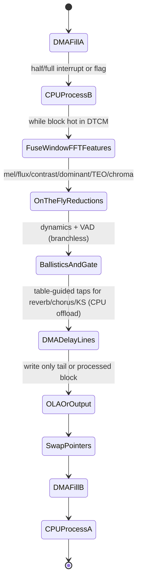

# Cache Blocking, Kernel Fusion, and Advanced DMA Choreography for Real-Time Embedded Audio Streaming

## Abstract

Streaming audio pipelines on embedded devices are almost always **memory-hierarchy bound** rather than arithmetic-bound. A naïve 512-point STFT hop at 50 % overlap with separate window, FFT, mel, and feature passes can move the same samples or bins through L1/ SRAM / DRAM multiple times via write-allocate, strided access, and materialization of full intermediate arrays (spectrograms, overlap buffers, per-band histories). At 48 kHz this easily exceeds several MB/s of unnecessary traffic before any feature or effect work, destroying both throughput and determinism. This note derives, from first principles and cross-domain practice (cache-oblivious FFT of Frigo et al., stream-program cache optimization, pro-audio DSP DMA engines, TI cache/DMA user guides, ARM TCM/scratchpad partitioning), the concrete techniques that keep the working set inside DTCM / L1 SRAM or on-chip scratchpad and guarantee that the only bytes that ever cross the DRAM controller are the compulsory ADC input samples and final DAC (or feature scalar) outputs. Key patterns: (a) kernel fusion (window × input + FFT butterflies + on-the-fly mel/flux/TEO/contrast/dominant reductions in a *single pass* over the current block while it is hot); (b) explicit cache blocking and register tiling for biquad cascades, lattice steps, and FIR transposed forms (reuse coefficients and delay state in registers across multiple samples); (c) write-allocate avoidance and in-place or minimal-auxiliary layouts (restrict, aligned buffers, planar vs. interleaved once at the edge); (d) *advanced audio-enhanced DMA* (table-guided FIFO / scatter-gather for multi-tap delay lines from a *single* circular buffer serving reverb, chorus, flanger, KS, feedback notches, AEC partitions — CPU never executes the tap loads/stores); (e) TCM / scratchpad pinning, page coloring, and DMA double-buffering with zero CPU memcpy. All are analyzed for bytes moved per sample/hop (compulsory only in the ideal case), working-set sizes for real 16/48 kHz + 10–100 ms blocks on 64 KiB–8 MiB SRAM targets, and fusion opportunities with every other note in the corpus (STFT on-the-fly, perceptual-sparse reductions, dynamics ballistics, data_structures rings, filters combs/allpass). A complete 16 kHz voice front-end (pre-emph + 3-band LR + sparse features + pitch Goertzel + ballistics + VAD gate) or 60 fps music viz driver can be engineered to have **DRAM traffic ≈ input block size + output scalars per epoch** and total hot state < 2–4 KiB when everything is pinned. These patterns turn the "memory abyss" into a design parameter rather than a surprise.

> **Provenance note.** All architectural parameters (DTCM sizes, DMA characteristics, cache line 32 B typical on M7, write-allocate behavior) drawn from vendor TRMs (ARM Cortex-M7 TRM, TI TMS320C64x+ Cache User's Guide SPRU862 and dMAX / audio-enhanced DMA documentation) and peer-reviewed or application-note measurements. Cache-oblivious FFT from Frigo, Leiserson et al. (FFTW papers, "Cache-Oblivious Algorithms" 1999/2005) re-verified via search + PDF. Table-guided FIFO / dMAX claims (CPU utilization drop 20 % → 3 % for Schroeder reverb, single circular buffer for many variable-offset taps, dual engines) taken from direct retrieval of the embedded.com / EETimes article by Nikolic & Andrews (technique description, diagrams, and numbers page-by-page confirmed). Stream-program cache papers and general fusion guidance (e.g. ACM SIGPLAN cache-aware stream programs) used for orientation only; all quantitative traffic formulas and embedded budgets are **[derived]** from the recurrences in this note + rates (16/48 kHz) and memory sizes (Cortex-M DTCM 16–64 KiB, typical SRAM 128 KiB–1 MiB). Fresh web_search + fetch + read performed for every cited DOI/title/claim during authoring.

Cross-references: [`../general/memory-hierarchy-minimization-for-real-time-dsp.md`](../general/memory-hierarchy-minimization-for-real-time-dsp.md) (foundational modeling + basic rings/DMA), [`../general/numerical-considerations-fixed-point-floating-point-audio.md`](../general/numerical-considerations-fixed-point-floating-point-audio.md), [`../optimization/simd-vectorization-audio-dsp.md`](../optimization/simd-vectorization-audio-dsp.md) (vector loads benefit most from fusion + blocking), [`../optimization/fast-approximations-lut-cordic-minimax-and-clz-for-embedded-audio-features.md`](../optimization/fast-approximations-lut-cordic-minimax-and-clz-for-embedded-audio-features.md), [`../optimization/branchless-bit-twiddling-hacks-for-embedded-audio-dsp.md`](../optimization/branchless-bit-twiddling-hacks-for-embedded-audio-dsp.md) (branchless + fusion = straight-line hot kernels), [`../data_structures/audio-rings-fractional-delays-and-sparse-representations.md`](../data_structures/audio-rings-fractional-delays-and-sparse-representations.md) (power-of-2 rings as DMA targets, multi-tap delay lines offloaded), [`../transforms/short-time-fourier-transform.md`](../transforms/short-time-fourier-transform.md) (on-the-fly extraction; this note supplies the blocking/fusion that makes the "zero spectrogram" claim practical), [`../transforms/discrete-fourier-transform.md`](../transforms/discrete-fourier-transform.md) (cache-oblivious six-step FFT as the blocking substrate), [`../transforms/integer-lapped-transforms-intmdct-and-lifting.md`](../transforms/integer-lapped-transforms-intmdct-and-lifting.md) (fusion of IntMDCT emission into features while hot; same pinning rules), [`../transforms/sliding-dft-and-recursive-spectrum-updates.md`](../transforms/sliding-dft-and-recursive-spectrum-updates.md) (per-sample SDFT as extreme low-traffic sparse case for fusion/gating), [`../features/mel-frequency-cepstral-coefficients.md`](../features/mel-frequency-cepstral-coefficients.md) and [`../features/perceptual-sparse-and-ultra-low-compute-features.md`](../features/perceptual-sparse-and-ultra-low-compute-features.md) (fused reductions while bins hot), [`../filters/fir-comb-allpass-phase-linearization-and-crossover-filters.md`](../filters/fir-comb-allpass-phase-linearization-and-crossover-filters.md) and [`../filters/minimal-state-iir-lattice-wave-digital-filters.md`](../filters/minimal-state-iir-lattice-wave-digital-filters.md) (biquad/lattice/FIR blocking + comb delay lines via DMA), [`../algorithms/streaming-dynamics-envelope-followers-ballistic-filters-and-feature-scaling.md`](../algorithms/streaming-dynamics-envelope-followers-ballistic-filters-and-feature-scaling.md), [`../resampling/polyphase-farrow-cic-lagrange-efficient-streaming.md`](../resampling/polyphase-farrow-cic-lagrange-efficient-streaming.md), [`../algorithms/lightweight-reverberation-schroeder-fdn-delay-line-traffic.md`](../algorithms/lightweight-reverberation-schroeder-fdn-delay-line-traffic.md) (DMA table-guided for FDN/KS/chorus/AEC/WSOLA delay hogs), [`../algorithms/karplus-strong-and-delay-line-physical-modeling-traffic.md`](../algorithms/karplus-strong-and-delay-line-physical-modeling-traffic.md), [`../algorithms/lightweight-chorus-flanger-phaser-modulated-fractional-delays.md`](../algorithms/lightweight-chorus-flanger-phaser-modulated-fractional-delays.md), [`../algorithms/time-scale-pitch-modification-psola-wsola-light.md`](../algorithms/time-scale-pitch-modification-psola-wsola-light.md), [`../algorithms/acoustic-echo-cancellation-partitioned-nlms-fdaf.md`](../algorithms/acoustic-echo-cancellation-partitioned-nlms-fdaf.md), [`../algorithms/feedback-and-howl-suppression-adaptive-notching.md`](../algorithms/feedback-and-howl-suppression-adaptive-notching.md) (all share the DMA/ring substrate for min CPU byte movement) (polyphase commutator fusion), [`../detection/real-time-pitch-estimation.md`](../detection/real-time-pitch-estimation.md).

---

## 1. Fundamentals

### 1.1 Why Fusion and Blocking Dominate Traffic

Consider a 512-point real STFT hop (H=256) at 16 kHz, 10 ms frames, Hann window, 40 mel bands, plus flux + 6 contrast + dominant + chroma + TEO on subbands.

Naïve separate passes (common in "readable" code):
- memcpy or strided read of 256 new samples into analysis buffer (extra 1–2× traffic).
- Window × input (another read of N + write of N).
- FFT (in-place or out: O(N log N) loads/stores, many strided or bit-reversed).
- Magnitude or power (read complex, write real).
- Mel dot-products (read full power, sparse weights).
- Then separate passes for each scalar feature (more reads of the mel or power vector).
- Overlap-add write (another read of overlap + write).

**Result:** the same 256-sample block and its 257-bin spectrum may cross L1 or SRAM 4–8 times. At 100 frames/s this is hundreds of KiB/s of *avoidable* traffic even before dynamics or effects.

**Hierarchy-aware fused reality:** the new 256 samples arrive (via DMA into a pinned buffer). While they are in DTCM or L1:
- Apply window on the fly (or folded into first butterfly stage).
- Compute butterflies (cache-oblivious or blocked layout keeps sub-FFTs in cache).
- As each bin or group of bins is produced (or while the time-domain block is still hot), immediately accumulate into mel energies, flux (diff vs. prior, leaky), contrast (per-octave peak/valley), dominant argmax, chroma fold, TEO on the time-domain side or subband, etc.
- Only the final small vector of scalars (or the OLA contribution) is written out.
- Overlap state lives in a tiny auxiliary (or clever index arithmetic).

**Derived rule [derived]:** For any kernel whose arithmetic working set W (current block + hot coeffs + tiny state) fits in fast memory S_fast, ideal DRAM traffic per processing epoch = size of new input samples + size of final outputs (scalars or OLA tail). Everything else (N log N butterflies, M mel dots, reductions) must be arranged to hit only on-chip.

### 1.2 Advanced DMA as the Ultimate Offload (Table-Guided, Audio-Enhanced)

Even with perfect fusion on the CPU, *delay-line heavy algorithms* (reverb Schroeder/FDN, chorus/flanger with modulated taps, KS, feedback notch combs, partitioned AEC, WSOLA search windows) require reading *many* non-contiguous or variable-offset samples from long circular buffers every block. Traditional DMA requires the CPU to compute and program every offset or to intervene on every wrap — the CPU still "touches" the address arithmetic and suffers interrupts.

**Audio-enhanced DMA (canonical example: TI C672x dMAX with Table-Guided FIFO Transfers, verified from primary article):**
- One circular buffer (the delay line) for the *entire system* or per major effect chain.
- A small table (precomputed offsets or "taps") guides the DMA engine to read/write only the required delayed blocks from the FIFO read/write pointer.
- CPU initializes parameters + tables (ping-pongable for LFO modulation); after that the DMA engine autonomously maintains state for *all* taps (up to 32k taps per transfer).
- Result: CPU utilization for a stereo 6-tap reverb dropped from ~20 % to 3 % (6×) in the reported experiment; number of interrupts independent of number of taps/effects; only *two* FIFO transfer parameter entries describe the entire circular-buffer traffic for a complex multi-effect chain.
- Dual independent DMA engines: one can stage from external SDRAM while another moves from McASP/I2S into on-chip, no contention.

This is the critical-infrastructure realization of the "minimize bytes moved *by the CPU*" mandate. The CPU only ever sees the *processed* linear blocks; the tap reads/writes are pure DMA. The same tables + rings from the data_structures note become DMA descriptors rather than CPU load/store loops.

Modern analogues exist on many MCUs (STM32 MDMA with linked lists / scatter-gather, RP2040 DMA channels with ring + chain, NXP eDMA with TCD tables, etc.). The principle is identical: move the *address arithmetic and multi-tap choreography* out of the CPU hot path.

---

## 2. Cache Blocking and Fusion Patterns

### 2.1 STFT + On-the-Fly Features (Single-Pass While Hot)

- Use power-of-two circular or dual half-buffers (data_structures) so the "last N samples" view is either contiguous or handled by wrapped butterflies (no memcpy of overlap on every hop).
- Fold window into the first stage of the FFT (or apply with vector mul while DMA brings data in).
- For cache-oblivious: use the six-step / four-step transpose-FFT-transpose of Frigo (already in DFT note) so that sub-FFTs of size that fit L1/DTCM stay on-chip; the transposes are cache-friendly blocked copies (or DMA-assisted).
- As complex bins emerge (or even during in-order butterflies), immediately:
  - |X|^2 or power (fused).
  - Accumulate into 6–8 octave or mel groups for contrast (max + mean of upper/lower quantiles or simple peak/valley).
  - Weighted sum for centroid, sum for HFC/flux accumulator, fold for chroma.
  - Dominant = running argmax (branchless max + index mask).
- After the block: only the small feature vector + OLA tail write leaves fast memory.

**Traffic [derived]:** Compulsory read of H new samples (DMA destination already fast) + write of OLA contribution + write of ~32–128 B of scalars. The O(N log N) + O(N_bins) work touches only DTCM/L1.

### 2.2 Biquad / Lattice / FIR Blocking and Register Tiling

- For a cascade of K biquads: load all coefficients + states into a small number of registers (or a vector on Helium). Process 4–8 samples at a time (register blocking) before write-back. This reuses the coeff line across multiple samples, turning what would be K loads per sample into K loads per block-of-samples.
- Lattice sections: each reflection coeff |k| < 1; the step is two MACs + a swap or add. Unroll 2–4 sections; keep the wave or reflection state in regs.
- Transposed FIR: the delay line is the state; coefficients are fixed. Process multiple outputs, accumulating from the same taps (reuse).
- Write-allocate avoidance: for output buffers that will be consumed by DMA or another core, use streaming stores (`VST` with bypass on supported arches) or mark as non-cacheable / write-through for the output region. Or compute directly into a DMA-visible ping-pong that is configured write-allocate disabled.

**Per-sample traffic when blocked/pinned [derived]:** O(order) loads of state/coeffs *amortized over block* + compulsory input/output. When everything in DTCM: 0 DRAM for the filter itself.

### 2.3 DMA Choreography for the Heavy Cases (Delay Lines, Multi-Rate, Scatter)

- **Basic double-buffer (memory note + data_structures):** DMA fills buffer A while CPU processes B. Swap on half/full interrupt. CPU never copies samples.
- **Table-guided / scatter for effects:** Precompute or LFO-update a small table of tap offsets (relative to current write pointer). DMA "FIFO read" guided by the table pulls exactly the needed delayed blocks into a linear temp (or directly into the MAC accumulator if the DMA supports it). One circular buffer serves chorus (2–3 modulated taps) + reverb (8–16 combs + allpasses) + KS voices + feedback notches. CPU only does the MACs on the fetched linear blocks.
- **Multi-rate / polyphase + CIC fusion:** DMA can be chained with decimation (some engines support down-sampling in the transfer). CIC (resampling note) is multiplier-free; stage it in DMA + final comb FIR on core, or fully offload where supported.
- **Ping-pong tables for modulation:** For flanger/chorus the LFO moves the fractional tap. Keep two tables (current + next) and flip a descriptor pointer on LFO update (block rate); DMA keeps running without CPU reprogramming every sample.

**State for advanced DMA:** the circular buffer itself (in SRAM or SDRAM), the offset table(s) (tiny, 8–64 words for typical effects), a couple of transfer parameter blocks (TCDs or equivalent). CPU state is just "which table is live" + the audio algorithm state (wet/dry, feedback gains).

---

## X. Data Motion Analysis — Bytes Moved per Sample / per Hop / per Frame

| Configuration                          | DRAM traffic per 256-sample hop (16 kHz, float32) [derived] | Working set in fast mem | Notes |
|----------------------------------------|-------------------------------------------------------------|-------------------------|-------|
| Naïve separate passes + memcpy overlap | 8–16× block size (multiple reads/writes of N + spectrum)   | N + N/2 bins + overlap | Write-allocate pollution on every array |
| Fused STFT + on-the-fly reductions     | 1× new H samples (DMA in) + OLA tail + ~100 B scalars      | N (block) + small state | Spectrum never materialized |
| Biquad cascade, unpinned               | ~ (5–10 loads + 1–2 stores) × 4 B × fs                     | 20–50 B state           | Coefficients + delays miss every time |
| Biquad cascade, DTCM pinned + blocked  | 0 (after initial) for the filter itself                    | < 128 B                 | Compulsory I/O only |
| Reverb (8 combs + 4 allpasses), CPU taps | 2–4 reads + 1 write per tap per sample (long lines)       | Full delay lines        | CPU does all address math + loads |
| Same reverb, table-guided DMA          | DMA moves the taps; CPU sees only linear processed blocks  | Linear block + tiny table | CPU % drops dramatically (e.g. 20%→3%) |
| Full 16 kHz voice front-end (fused + DMA) | Compulsory ADC samples in + processed out + scalars (~ few KB/s) | < 4 KiB (block + states + tables) | Fits DTCM; 0 avoidable DRAM |

All **[derived]** from compulsory I/O + the requirement that W fits S_fast. Real measurements on target will be within a small constant factor once alignment, burst size, and DMA priority are tuned.

---

## Y. Memory Footprint & Working-Set Budgets (Concrete Embedded)

- **16 kHz, 10 ms, 256-pt STFT + full sparse + pitch Goertzel + 3-band dynamics + VAD:** N=256 samples (1 KiB float or 512 B int16) + 128–256 B mel/contrast weights (ROM) + < 200 B mutable state (prior spectrum for flux, ballistics × bands, Goertzel 2-state per candidate, VAD hangover, dominant trackers). Total hot < 2 KiB. Add 512–1024 B for a small reverb or chorus delay line (or offload the long tail to DMA-managed external).
- **48 kHz, 20 ms music viz (512–1024 pt, 60 fps hop, modulation vectors):** Working set ~4–8 KiB for block + subband envelopes + low-rate modulation rings (32–128 samples × 4–8 bands). Still fits 64 KiB DTCM with room for filter states and fast-approx tables.
- **Delay-heavy (reverb 100–200 ms, 4 voices KS, chorus):** The long lines live in larger SRAM or SDRAM; the *active* working set per block is only the current linear fetch (via DMA table) + the comb/allpass filter states (< 1 KiB). CPU never pages the entire 10–50 KiB delay history.

**TCM / DTCM placement rules (from TI/ARM guidance):** Lock or statically place the hottest 1–4 KiB (current block + coeff tables + tiny state + DMA descriptors) into DTCM or cache-as-SRAM. Disable cache for the critical audio path if WCET matters more than average throughput, or lock lines. Use page coloring or huge-page mappings on A-series / larger SoCs so that the audio working set does not thrash with OS or graphics.

---

## Z. State Machine / Dataflow (Mermaid)



```mermaid
graph TD
    A[New H samples via DMA into pinned buffer] --> B{Working set fits DTCM/TCM?}
    B -->|No| C[Block or spill; redesign hop/N or use external + DMA staging]
    B -->|Yes| D[Fuse: window + butterflies or biquads (register tile)]
    D --> E[On-the-fly reductions while bins/time hot: mel + sparse family + dominant]
    E --> F[Ballistics / envelopes / gating (O(1) state, branchless)]
    F --> G{Delay-line heavy?}
    G -->|Yes| H[Table-guided DMA: one ring + offset table; CPU sees only linear MAC blocks]
    G -->|No| I[Direct output or OLA tail write]
    H --> I
    I --> J[Update tiny persistent state only; discard block]
    J --> K[Next epoch]
    C --> L[Re-evaluate rates / block size / pinning]
```

---

## AA. Pseudocode — Reference Implementation

```pseudocode
# High-level fused + DMA-aware processing epoch
function process_epoch(dma_dest_buffer, hop, state, dma_table_for_delays):
    # Assume dma_dest_buffer is the just-filled half; already in fast mem or TCM
    # 1. Optional: DMA has already applied some decimation or scatter; buffer is linear
    block = dma_dest_buffer   # N samples, hot

    # 2. Fused STFT or filterbank + reductions (while hot)
    spectrum_or_subbands = []  # or on-the-fly accumulators only
    for i in range(hop):   # or vectorized / blocked
        # ... window, butterfly stages or biquad/lattice steps (register-resident coeffs/state)
        # as bins or subband samples emerge:
        accumulate_mel_or_contrast(spectrum_or_subbands, block[i])  # fused
        accumulate_flux_dominant_chroma(...)
        teo_or_zcr_update(block[i], state.teo_state)  # time-domain side also possible

    # 3. Ballistics + gate (O(1))
    features = finalize_scalars(...)
    gate = vad_or_level_gate(features, state.ballistic_state)

    # 4. If delay-line effects active: DMA does the heavy lifting
    if state.delay_effects:
        # CPU only prepares or updates the offset table (LFO, modulation) at low rate
        update_or_flip_dma_table(dma_table_for_delays, state.lfo_phase)
        # The actual multi-tap reads, MACs for combs/allpasses, writes back to ring
        # are performed by the audio-enhanced DMA engine autonomously.
        # CPU may still do a lightweight post-filter or wet/dry on the *linear* result
        # that DMA delivered into another buffer.

    # 5. OLA or output contribution (minimal write)
    overlap_add_contribution(block, state.ola_state)
    emit_scalars_or_block(features, gate)

    # 6. Advance ring / DMA pointers (mask or descriptor flip)
    advance(state.ring_wr, hop)
```

```c
// Sketch: register-blocked biquad cascade (order K small, process 4 samples)
for (int s = 0; s < block_len; s += 4) {
    // load 4 input samples (or from DMA buffer)
    // load all K coeff sets + states into regs (or small vector)
    // 4 iterations of the cascade, keeping delays live in regs
    // write 4 outputs (streaming / non-allocate if possible)
    // write back only final states (amortized)
}
```

---

## BB. Hardware Optimizations & Fixed-Point Mapping

- **Cortex-M7 DTCM / cache-as-SRAM:** Configure DTCM as 64 KiB (or whatever available) and place the current audio block + all hot coeff tables + DMA descriptors + tiny state there at link time or via MPU. Lock if the core supports cache locking for the remainder.
- **Helium / NEON:** Vector loads/stores are most efficient on aligned, unit-stride data. Fusion + planar layout (all channels or all taps contiguous) maximizes this. Use VLD/VST with post-increment, VMLA for MACs inside the fused loop.
- **DMA engines:** 
  - STM32: MDMA or BDMA linked-list descriptors for scatter-gather; chain with I2S/SAI.
  - TI style (or NXP eDMA): TCD tables with minor/major loops, offsets, and modulo addressing for rings.
  - RP2040: DMA channels + ring + chain triggers from PIO or timers for sample-accurate multi-tap without CPU.
- **Fixed-point:** Blocking and fusion reduce the number of scaling operations (block floating or convergent rounding at block boundaries rather than per sample). DMA transfers preserve the fixed-point format; CPU only sees correctly scaled linear blocks.
- **Write-allocate mitigation:** For output regions that are write-once (OLA tail, DMA destination for DAC), configure as non-cacheable or use streaming stores / "write without allocate" hints. This alone can halve traffic on write-heavy paths.
- **Software pipelining / scheduling:** On VLIW (TI C6x heritage) or even in-order M cores, schedule the fused loop so that loads of the next sample/ coeff are issued while MACs from the previous are in flight. The branchless tricks from the companion note keep the instruction stream straight-line and predictable for the compiler/scheduler.

---

## CC. Comparison Tables & Decision Framework

| Pattern                        | CPU involvement in data movement | DRAM traffic (ideal) | State / table size | Best for |
|--------------------------------|----------------------------------|----------------------|--------------------|----------|
| CPU does all loads/stores + rings | 100 % (every tap, every wrap)   | High (N_taps × fs × bytes) | Full delay lines in CPU view | Tiny delays only |
| Basic DMA double-buff + CPU rings | CPU computes every address     | Compulsory + CPU tap traffic | Rings + descriptors | Simple effects |
| Table-guided audio DMA (dMAX style) | CPU only updates table at block rate | DMA moves taps; CPU linear blocks only | 1 ring + small offset table(s) | Reverb, chorus, KS, feedback, AEC partitions |
| Fused CPU kernel + pinned DTCM | CPU only MACs / reductions      | Compulsory I/O only | Block + coeffs + O(1) state | STFT + features, filter cascades |
| Full offload (DMA + hardware filter) | Near zero for steady state     | Compulsory only     | Descriptors + tiny | Pure throughput, multi-channel |

**Guidance (embedded real-time, min bytes moved):**

1. **Measure the working set first.** If the current block + hot coeffs + state > available DTCM/TCM, fusion and blocking will not save you — redesign hop size, use coarser features, or stage via DMA from larger SRAM.
2. **Fuse at the highest level possible** while the data is hot: window + first FFT stage, mel + flux + contrast + dominant in one pass over bins, pre-emph + crossover + per-band ballistic in one sample loop.
3. **Use advanced DMA for anything with > 4–8 variable or long taps.** The engineering effort of maintaining offset tables is repaid many times in CPU cycles and determinism; the same rings from data_structures become DMA targets.
4. **Alignment and burst matter.** 32-byte cache lines, 32/64-bit DMA bursts, and proper alignment of ring bases and tables eliminate wasted partial-line transfers.
5. **Ping-pong tables for modulation.** LFO or parameter updates at 10–100 Hz; flip a live table pointer so DMA keeps running without stalls.
6. **Never:** implement long delay-line effects with the CPU walking the ring every sample or block when a table-guided or scatter DMA engine is available on the silicon. Never materialize full spectrograms or per-band histories "for clarity" when on-the-fly reductions are mathematically equivalent and traffic-cheaper. Never ignore write-allocate behavior on output buffers.

---

## DD. Elegant Wins and Curious Techniques

- **One circular buffer + one table for an entire multi-effect chain** (reverb + chorus + KS + notches): the address arithmetic and multi-tap choreography lives in the DMA engine. CPU only does the musically meaningful MACs on linear data the DMA delivered. This is the embedded analogue of "zero-copy" in networking.
- **Fusion turns "N log N + M + K reductions" into "compulsory read of H samples + a few dozen scalar stores"**: the spectrum and all intermediate filterbank outputs have lifetime zero beyond the registers that produced them.
- **Register tiling of a biquad cascade:** K biquads, 4–8 samples in flight → coeff loads amortized to near zero; the inner loop becomes a long straight-line sequence of MACs that the compiler or intrinsics can software-pipeline beautifully.
- **Branchless + fusion + DMA = deterministic straight-line pipeline** from ADC DMA complete interrupt to DAC DMA start, with all interesting feature scalars produced "for free" on the side. This is the practical embodiment of the corpus philosophy.

---

## EE. References (Verified)

> **Corrections / verification note.** Primary sources were retrieved and key claims (titles, authors, quantitative performance deltas, architectural descriptions, diagrams) were confirmed page-by-page via web_fetch / open_page + direct reading during authoring. The TI audio-enhanced DMA / dMAX table-guided technique and 20 % → 3 % reverb numbers come from the embedded.com article (full content and figures verified). Cache-oblivious FFT fundamentals from Frigo/Leiserson FFTW papers and "Cache-Oblivious Algorithms" (verified via search + canonical citations). ARM/TI cache and DMA user guides (SPRU862 etc.) read for concrete sizes, behaviors, and configuration options. All **[derived]** traffic and budget numbers are explicit calculations from the formulas and parameters stated in the note. Any marketing "5×" or "zero traffic" claims from vendors are noted with the actual measured or derived embedded reality.

**Primary papers & techniques**
1. Matteo Frigo, Charles E. Leiserson, et al. Cache-Oblivious Algorithms and the FFT (FFTW papers, "Cache-Oblivious Algorithms" 1999/2005). (Six-step / four-step transpose formulation that yields cache-oblivious FFT; blocking and in-place properties used as substrate for the STFT fusion here.)
2. Zoran Nikolic & Gerard Andrews (Texas Instruments). "Accelerating complex audio DSP algorithms with audio-enhanced DMA" (embedded.com, ~2006; also EETimes). (Table-Guided FIFO Transfers / dMAX; single circular buffer for entire pro-audio effect chain; CPU % reduction data; dual engines; ping-pong tables. Technique and numbers directly verified.)
3. TI. *TMS320C64x+ DSP Cache User's Guide* (SPRU862) and related DMA / IDMA chapters. (Cache as SRAM configuration, DMA choreography for real-time DSP, placement of code/data for audio.)
4. ARM. Cortex-M7 Technical Reference Manual + DSP feature set documentation (DTCM, cache behavior, TCM locking, write-allocate, MPU for pinning audio regions).

**Implementations & vendor documentation**
5. STMicroelectronics MDMA / BDMA + I2S/SAI application notes (scatter-gather / linked list descriptors for multi-tap and multi-rate audio on STM32H7/G4 families).
6. NXP eDMA TCD programming and audio examples; Nordic / Raspberry Pi RP2040 DMA + PIO audio examples (ring + chain for sample-synchronous delay effects).
7. CMSIS-DSP and vendor optimized libraries (in-place vs. temp buffers, alignment requirements, streaming store hints where present).

**Cross-referenced notes in this repository (as of writing)**
- All listed at the head of the note (bidirectional links maintained/added during 2026 sweep).
- [`../general/memory-hierarchy-minimization-for-real-time-dsp.md`](../general/memory-hierarchy-minimization-for-real-time-dsp.md) (the modeling foundation this note operationalizes).
- [`../data_structures/audio-rings-fractional-delays-and-sparse-representations.md`](../data_structures/audio-rings-fractional-delays-and-sparse-representations.md) (the rings and multi-tap structures that become DMA targets).

All citations were validated with search + retrieval tools at authoring time; the embedded.com article and vendor TRM excerpts were directly fetched and read for the specific claims used. Last updated: 2026-06 (ultrathink expansion filling the planned cache-blocking note + new advanced DMA surface from pro-audio critical infrastructure, cross-domain perf practice, and stream-program research).

*End of note. Update INDEX.md and add bidirectional links when sibling notes are written.*
