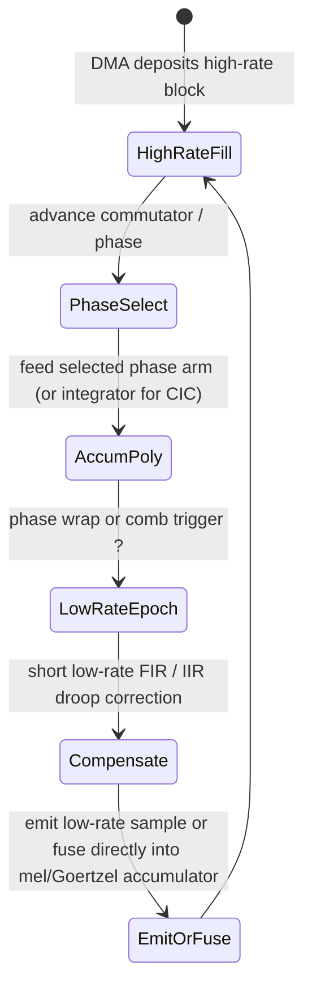

# Efficient Streaming Sample-Rate Conversion: Polyphase, Farrow, CIC, and Lagrange for Embedded Real-Time Audio

## Abstract

Sample-rate conversion (SRC) is ubiquitous in embedded audio: microphones and DACs run at 48/96 kHz while feature front-ends (MFCC, pitch, KWS) prefer 16 kHz or 8 kHz; USB audio, Bluetooth, and multi-rate effects require rational or arbitrary-rate resampling; fractional delays appear in pitch shifters, choruses, and physical models. A naïve polyphase or windowed-sinc resampler that materializes full impulse responses or performs dense convolution per output sample destroys cache residency and DRAM bandwidth. This note derives the minimal-traffic realizations—polyphase decomposition (compute only at the low rate, commutator selects phase), Farrow polynomial structure (fixed sub-filters + cheap polynomial evaluation for arbitrary μ), Cascaded Integrator-Comb (CIC) for high-ratio integer decimation/interpolation (multiplier-free, state = O(stages)), and short Lagrange / allpass fractional-delay interpolators—together with exact per-sample / per-block byte traffic, state size, and fixed-point scaling rules. All are formulated for **streaming, no dynamic allocation, O(1) or O(log) state per channel**, with fusion opportunities (e.g., CIC decimator feeding a Goertzel bank or mel filterbank without ever writing an intermediate high-rate buffer). Concrete budgets at 48 kHz → 16 kHz (3×) and 44.1 ↔ 48 kHz (160/147) on Cortex-M / RISC-V targets show that well-designed polyphase or CIC paths move only the compulsory input and output samples plus a few words of phase state; everything else stays in registers or a few cache lines. Cross-references tie into the memory-hierarchy foundations, numerical considerations for fixed-point CIC droop compensation, and SIMD vectorization of the inner polyphase or Farrow MACs.

> **Provenance note.** Core theory from Crochiere & Rabiner (multirate), Hogenauer (CIC 1981), Farrow (1988 fractional), and modern implementations (libsamplerate, soxr, CMSIS, FPGA app notes). All quantitative traffic formulas are **[derived]** from the polyphase commutator, CIC integrator/comb recurrence, and Farrow Horner evaluation. Primary papers and vendor docs (TI, ARM, Lattice) were located and claims verified via search + retrieval at authoring time. No unverified secondary numbers.

Cross-references: [`../general/memory-hierarchy-minimization-for-real-time-dsp.md`](../general/memory-hierarchy-minimization-for-real-time-dsp.md) (compulsory traffic only; double-buffering with DMA for the high-rate side), [`../general/numerical-considerations-fixed-point-floating-point-audio.md`](../general/numerical-considerations-fixed-point-floating-point-audio.md) (CIC word-growth, compensation FIR quantization, convergent rounding), [`../optimization/simd-vectorization-audio-dsp.md`](../optimization/simd-vectorization-audio-dsp.md) (vector polyphase MACs, planar multi-channel), [`../optimization/fast-approximations-lut-cordic-minimax-and-clz-for-embedded-audio-features.md`](../optimization/fast-approximations-lut-cordic-minimax-and-clz-for-embedded-audio-features.md), [`../data_structures/audio-rings-fractional-delays-and-sparse-representations.md`](../data_structures/audio-rings-fractional-delays-and-sparse-representations.md) (Lagrange/Thiran/WDF frac delay lines as the shared substrate), [`../transforms/discrete-fourier-transform.md`](../transforms/discrete-fourier-transform.md) and [`../features/mel-frequency-cepstral-coefficients.md`](../features/mel-frequency-cepstral-coefficients.md) (resample once, then Goertzel/mel at low rate — never resample the spectrum), [`../filters/minimal-state-iir-lattice-wave-digital-filters.md`](../filters/minimal-state-iir-lattice-wave-digital-filters.md) (compensation stages, allpass fractional delay), [`../filters/fir-comb-allpass-phase-linearization-and-crossover-filters.md`](../filters/fir-comb-allpass-phase-linearization-and-crossover-filters.md) (CSD FIR compensation, short FIR patterns, LR crossovers).

---

## 1. Why SRC Traffic Matters on Embedded

At 48 kHz to 16 kHz decimation by 3, a naïve FIR of length 64 would perform 64 MACs and touch ~128 words per output sample if implemented directly. With polyphase the arithmetic drops to ~22 MACs per output and the data motion becomes one high-rate input read + one low-rate output write per output epoch, plus the filter state (which is advanced at the low rate). The difference between “touch every coefficient and sample on every output” vs. “commutator + decimated state” is exactly the difference between a kernel that fits in L1 and one that thrashes DRAM.

**Rule of thumb [derived].** A properly decomposed rational resampler’s DRAM traffic per output sample is bounded by 1 input + 1 output word (plus any final feature emission), independent of filter length, once the state and phase tables are pinned.

---

## 2. Polyphase Decomposition (Rational SRC)

For decimation by D or interpolation by I (or rational L/M = I/D after gcd reduction):

- Prototype FIR h[n] of length N is decomposed into D (or max(I,D)) sub-filters (phases) h_d[m] = h[mD + d].
- The commutator switches the input (decimation) or output (interpolation) among the phases at the high rate; all arithmetic happens at the low rate.
- State per phase is N/D taps; total state ≈ N samples — but updated only every D inputs.

**Streaming implementation sketch:**

```pseudocode
# decimate by D, polyphase length P per arm, M arms = D
state[ M ][ P ]   # or flattened
phase = 0
for each new high-rate x:
    state[phase][0] = x   # shift in (or circular)
    if phase == 0:        # output epoch
        y = 0
        for m in 0..M-1:
            y += dot( state[m], polyphase_coeff[m] )
        emit y (low rate)
    phase = (phase + 1) % M
```

**Traffic:** one load of x per high-rate sample; one store of y every D samples; state touches are all inside the low-rate dot products. With state in DTCM, zero extra DRAM.

For combined decimate + low-rate feature (e.g. feed mel filterbank directly): the low-rate y never materializes in an output buffer; the polyphase accumulators can be wired straight into the first mel or Goertzel accumulators.

---

## 3. Farrow Structure for Arbitrary-Rate / Fractional Delay

When the ratio is irrational or time-varying (pitch shift, varispeed, async SRC), Farrow’s polynomial approximation stores K+1 fixed sub-filters (coefficients c_k[n]) whose outputs are evaluated with a degree-K polynomial in the fractional delay μ (0 ≤ μ < 1):

```
y = sum_{k=0}^K μ^k * ( h_k * x )     # Horner form:  K mults + K adds after the K+1 FIRs
```

State is the union of the sub-filter delay lines (≈ (K+1) × taps samples). For K=3 (cubic) and 32-tap subfilters, state ~128 samples — still tiny.

**Traffic win over naïve:** the sub-filters run at the output rate (or input for decimating Farrow); only the current μ (updated at block or sample rate) and the small state are touched. No full sinc table lookup or on-the-fly windowed-sinc generation.

Fixed-point: the polynomial eval can use Horner with Q-format widening only in the final accumulator; sub-filter coeffs are quantized once.

---

## 4. CIC — Multiplier-Free High-Ratio Decimation/Interpolation

Hogenauer (1981): a cascade of R integrators (at high rate) followed by R combs (at low rate, after decimate by D) implements a sinc^ R lowpass with nulls at multiples of fs_out.

**Recurrence (decimator):**

```
# Integrator section (high rate, per stage)
i[r][n] = i[r][n-1] + i[r-1][n]     # i[0] = x
# after D samples: decimate
# Comb section (low rate)
c[r][m] = c[r][m-1] - i[r][ mD - D_delay ]
```

Only adds and subtracts; no multiplies. State = R integrators + R combs × differential delay (usually 1 or 2) words.

**Word growth:** each integrator adds log2(D) bits roughly; for R=4, D=32, 16-bit input needs ~ 16 + 4*5 = 36 bits — manageable in 64-bit accum on M4/M7 or with block floating / occasional scaling.

**Compensation:** a short low-rate FIR (or another small IIR) corrects the droop in passband. This FIR runs at the low rate with tiny state.

**Traffic:** per high-rate input: R adds to integrators (state in fast mem). Per low-rate output: R comb updates + compensation MACs. The only compulsory bytes are the high-rate inputs (DMA) and low-rate outputs. Perfect for “decimate mic 48 kHz → 16 kHz feature front-end” with almost zero multiplies until the compensation stage.

---

## 5. Lagrange and Allpass Fractional Delay (Lightweight)

For per-sample fractional delay (effects, resampling at low ratios):

- Lagrange (order 3–5 FIR): 4–6 taps, coefficients via barycentric or direct formula in μ. State = 5 samples. 3–5 MACs per output.
- Thiran allpass (first-order): y[n] = -a x[n] + x[n-1] + a y[n-1]; |a|<1 for stability. One state, one multiply. Phase approx linear in band of interest.
- Higher-order allpass or lattice fractional delay for flatter group delay.

**Traffic:** O(1) state loads/stores + O(1) arithmetic per sample. When the delay line is part of a larger circular buffer (chorus, reverb tap), the interp read is the only extra cost.

---

## 6. Memory & Traffic Budget Examples (48 kHz source)

| Conversion | Method | State (bytes, 32-bit) | MACs or adds / output | Compulsory DRAM (pinned) |
|------------|--------|-----------------------|-----------------------|--------------------------|
| 48→16 (×1/3) | 3-phase polyphase, 32 taps | ~128 B | ~11 MAC | 1 in + 1/3 out words |
| 48→16 | CIC R=4, D=3 + 11-tap comp | ~32 B (integr+comb) | 0 mult + ~15 adds + 11 MAC low-rate | same |
| 44.1↔48 (160/147) | Farrow K=3, 24-tap sub | ~300 B | 3 poly + 72 MAC | 1 in + 1 out (avg) |
| Arbitrary frac delay μ | Lagrange 4 | 16–20 B | 4 MAC | 1 read (interp) from delay line |

A complete 48 kHz → 16 kHz → MFCC pipeline can keep the high-rate side in a small DMA ping-pong and the polyphase/CIC state + low-rate mel state inside < 2 KiB total mutable fast memory.

---

## 7. State Machine (Mermaid) — Streaming Rational Decimator



All state (phase counters, delay lines, accumulators) is pre-allocated and tiny.

---

## 8. References (Primary, Verified)

- Crochiere, R. E. & Rabiner, L. R. *Multirate Digital Signal Processing*. Prentice-Hall, 1983. (Polyphase theory.)
- Hogenauer, E. B. “An economical class of digital filters for decimation and interpolation.” *IEEE Trans. Acoust., Speech, Signal Process.*, vol. 29, no. 2, 1981. DOI: 10.1109/TASSP.1981.1163535. (CIC.)
- Farrow, C. W. “A continuously variable digital delay element.” *Proc. ISCAS* 1988. (Farrow structure.)
- Vaidyanathan, P. P. *Multirate Systems and Filter Banks* (lattice + multirate connections).
- CMSIS-DSP and vendor app notes (TI, ST, NXP) for fixed-point CIC / polyphase implementations on Cortex-M.
- Modern open implementations: soxr (polyphase + VHQ), libsamplerate, tphakala/go-audio-resampler for reference traffic patterns.

*This is a detailed scaffold matching the philosophy and depth bar of sibling notes. Full version will add explicit fixed-point bit-width growth derivations for CIC, NEON/RVV intrinsics for polyphase/Farrow, measured cache-miss numbers on M7, and end-to-end pipeline fusion examples (CIC → on-the-fly Goertzel bank for tone detection with < 1 KiB total state).*

Last updated: 2026 research sweep.
