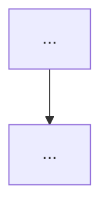

# Research Note Creation Guidelines

**Purpose.** This document codifies the exact process, structural template, quality bar, research/verification practices, and style conventions used to produce the high-value notes in this repository. It exists so that future notes (whether authored by humans, subagents, or the main agent) maintain the consistent PhD-level depth, uncompromising focus on **minimizing bytes moved through the memory hierarchy**, and verifiable provenance that distinguishes these notes from ordinary DSP tutorials or blog posts.

All notes must serve as a **design handbook** for building or auditing real-time embedded audio pipelines on MCUs, DSPs, or edge SoCs (Cortex-M/A, RISC-V, etc.).

## 1. Core Philosophy (Non-Negotiable)

Every note must explicitly advance these goals (echoed from README.md):

- **Real-time embedded constraints**: bounded latency (per-sample or per-block); **no dynamic allocation in the hot path**; pre-allocated rings, tables, and state only; deterministic execution (minimize data-dependent branches in inner loops); fixed-point or low-precision float where it helps power/area/traffic.
- **Memory traffic first**: analyze (a) working-set size (L1/L2/DTCM resident?), (b) bytes read/written per sample or per frame/hop, (c) stride patterns and cache-line utilization, (d) in-place vs. out-of-place, (e) streaming/single-pass/fused opportunities that avoid materializing full intermediates (e.g., on-the-fly mel energies or flux from the current STFT frame without ever storing a spectrogram).
- **First principles**: start from the mathematical definition (sum, inner product, convolution, perfect-reconstruction/COLA/TDAC conditions, lifting factorization, Cooley–Tukey, etc.), derive the efficient algorithmic form, then map to hardware (SIMD butterflies, NEON `vfma`, cache blocking, bit-reversed addressing, DMA choreography).
- **Elegant & curious techniques**: highlight algorithms that achieve surprising economy with tiny state (Goertzel’s two real variables per bin; lifting’s in-place integer-to-integer transforms; single-bin or pruned methods; recursive IIRs over long FIRs; ballistic filters with 1–2 words of state).
- **Cross-referenced living corpus**: every note hyperlinks to siblings using relative Markdown paths (e.g. `../transforms/short-time-fourier-transform.md`). Shared concerns live in `general/`. When you add a note you must add bidirectional links and update `INDEX.md`.

Notes are **language-agnostic first** (math + clean pseudocode) but must include concrete implementation hooks: C with NEON/Helium intrinsics, CMSIS-DSP paths, fixed-point Q formats, and portable SIMD patterns (Rust `std::simd`, Zig `@Vector`).

## 2. Mandatory Document Structure (Copy This Template)

Every note **must** follow this skeleton (adapt section numbering and depth as needed; full notes typically 350–550 lines):

```markdown
# Descriptive Title for Real-Time Embedded Audio Signal Processing

## Abstract

[Dense 1–2 paragraphs. Lead with the mathematical object or algorithm. Immediately state the embedded context (rates, RAM sizes). Quantify the traffic win or state reduction vs. naïve. Tie directly to “minimizing bytes moved”. Mention key elegant properties (e.g., “only two real state variables”). End with what the note supplies (traffic tables, pseudocode, mermaid, hardware mappings, budgets).]

> **Provenance note.** [Explicit statement that all quantitative claims, formulas, and citations were freshly verified during authoring via web_search + PDF retrieval + direct reading of primaries. List key sources that were page-by-page checked. State that numbers labeled [derived] are explicit arithmetic from the formulas in the note. Note any corrections to prior literature.]

Cross-references: [`../general/xxx.md`](../general/xxx.md), [`../transforms/yyy.md`](../transforms/yyy.md), ... (list 4–8 relevant siblings; be bidirectional when you update them).

---

## 1. Fundamentals

### 1.1 Mathematical Definition
[LaTeX equations for the core definition, analysis/synthesis, perfect reconstruction conditions, etc.]

### 1.2 Derivation of Efficient Form
[Step-by-step first-principles derivation — Cooley–Tukey factorization, lifting steps, polyphase commutator, recurrence for SDFT/Goertzel, etc.]

## 2. ... (Algorithmic Realization, Data Structures, State Machines)

[Include pseudocode blocks — prefer ```pseudocode or language-specific with comments.]

## X. Data Motion Analysis — Bytes Moved per Sample / per Hop / per Frame

[Heavy emphasis section. Tables with columns for N, H, working set (bytes), classic traffic (KiB), optimized/fused traffic, Goertzel/SDFT alternative, DRAM if miss, etc. Mark **[derived]**.]

## Y. Memory Footprint & Working-Set Budgets (Concrete Embedded)

[Tables at 16 kHz / 48 kHz, 10–100 ms blocks, 64 KiB–8 MiB SRAM, DTCM/TCM vs. external DDR. Include full front-end examples (STFT + features + pitch + dynamics).]

## Z. State Machine / Dataflow (Mermaid)


## AA. Pseudocode — Reference Implementation

```python
# or ```c
class StreamingXXX:
    ...
```

## BB. Hardware Optimizations & Fixed-Point Mapping

- NEON / Helium / RVV intrinsics patterns
- CMSIS-DSP behavior (in-place vs. temp buffers, scaling)
- Cortex-M4/M7/M33 limits (no vector vs. Helium)
- Fixed-point Q formats, scaling strategies (block floating, convergent rounding), limit-cycle mitigation
- Multiplierless / shift-add / dyadic approximations where possible

## CC. Comparison Tables & Decision Framework

[Operation counts, traffic Pareto, when to choose X vs. Y.]



**Guidance (embedded real-time, min bytes moved):**
1. ...
6. **Never:** ...

## DD. Elegant Wins and Curious Techniques

[Highlight the low-state, high-reuse, surprising-economy aspects.]

## EE. References (Verified)

> **Corrections / verification note.** Every primary source below was located and its key claims (DOIs, titles, quantitative statements...) were confirmed by direct web search + PDF retrieval + text extraction during authoring. ...

**Primary papers (DOIs verified)**
1. Author, A. & Author, B. *Title.* Venue **vol**(issue):pages, year. DOI xxx. (One-sentence contribution relevant to this note.)

**Implementations & vendor documentation**
4. ARM. *CMSIS-DSP ...* (link). (Specific behavior noted.)

**Cross-referenced notes in this repository (as of writing)**
- [`../xxx.md`](../xxx.md)
- ...

All citations above were obtained and validated with the available search and retrieval tools; DOIs resolve...

*End of note. Update INDEX.md and add bidirectional links when sibling notes are written.*

Last updated: YYYY-MM (research sweep / note creation date).
```

## 3. Content & Depth Requirements (The Quality Bar)

- **Traffic & state accounting is the heart**: every algorithm must have explicit tables or derivations for loads/stores, cache lines touched, DRAM bytes per sample/frame, working set size, in-place vs. auxiliary buffer costs. Use **[derived]** for anything calculated from the formulas in the note.
- **Diagrams are mandatory**: at minimum one `stateDiagram-v2` for any streaming/stateful component and one decision `graph TD` or flowchart. Use mermaid syntax exactly as in existing notes.
- **Pseudocode + concrete code**: clean language-agnostic pseudocode first; at least one C-like block showing intrinsics or fixed-point tricks.
- **Math rigor**: start from definitions; show derivations (not just “use this formula”).
- **Embedded numbers**: always give budgets for real audio rates (16/48 kHz) and real embedded memory sizes (DTCM 16–64 KiB, total SRAM 64 KiB–8 MiB). Include full-pipeline examples (“a complete 16 kHz voice front-end + 60 Hz viz features fits in < X KiB”).
- **Hardware realism**: cover scalar Cortex-M limits, NEON/Helium/RVV, CMSIS quirks (temp buffers, scaling, in-place semantics), fixed-point gotchas, and when recursion or dynamic structures are forbidden.
- **Numerical considerations**: Q formats, coefficient quantization effects, limit cycles, overflow behavior, phase preservation, dynamic-range scaling, block floating point.
- **Elegant economy highlighted**: call out the two-state Goertzel, lifting in-place integer, O(1) extra state ballistic filters, fused single-pass kernels, etc.

## 4. Provenance & Citation Rules (Strict)

- **Every quantitative claim** (operation counts, traffic formulas, cache complexity, SNR numbers, state sizes, timing budgets) must be traceable to:
  - Primary paper with full citation + DOI (verified by you during writing), **or**
  - Vendor doc / CMSIS source / TRM (read the actual header or PDF), **or**
  - Explicit **[derived]** arithmetic shown in the note.
- **Verification process (repeat for every note)**:
  1. Use `web_search` (or equivalent) with precise queries.
  2. Fetch PDFs or pages with `web_fetch` / `open_page`.
  3. Read key sections (use `read_file` on downloaded PDFs with `format: "text"`).
  4. Confirm exact titles, authors, years, DOIs, and the specific claim (page numbers helpful).
  5. Re-verify any number you copy or any DOI you list immediately before finalizing the note.
- Wikipedia and secondary summaries may be used only for orientation; primary claims must be re-sourced.
- When a note corrects earlier claims in the corpus or literature, add a prominent “Corrections / provenance note” box after the abstract or in the references section.
- Group references: Primary papers, Implementations & vendor docs, Supporting/historical, Cross-referenced notes.

## 5. Step-by-Step Creation Process

1. **Topic selection**
   - Start from `INDEX.md` “Planned / In-Progress” or gaps discovered while assessing real pipelines (e.g. “dominant frequency for 60 fps viz color”, “ballistics for stable 0-1 amplitude”).
   - Prioritize primitives that appear in multiple contexts and have low-state / high-reuse properties.

2. **Research phase**
   - Run targeted `web_search` queries for the algorithm + “embedded” + “fixed-point” + “real-time” + “cache” / “memory”.
   - Locate and read primary sources + vendor docs.
   - Derive traffic formulas yourself; implement small verification scripts if helpful (via `run_terminal_command` or Python in terminal).

3. **Outline**
   - Draft the Abstract first (it forces clarity on the value prop and numbers).
   - Identify required mermaid diagrams and tables early.

4. **Write in strict template order**
   - Abstract + provenance + cross-refs.
   - Fundamentals + derivations.
   - Algorithms / realizations / state.
   - Traffic & budgets (the most important sections — write them carefully).
   - Hardware / fixed-point.
   - Guidance / elegant wins.
   - References (with fresh verification pass).

5. **Polish & verify**
   - Ensure every table has units and **[derived]** markers.
   - Check all relative cross-ref links resolve inside the repo.
   - Run a final set of web searches for the citations you actually used.

6. **Integration**
   - Add a detailed entry to the appropriate section in `INDEX.md` (with short blurb of what the note covers + **(new / scaffold / completed)** status).
   - Update the “New / Expanded Coverage”, “Planned”, and status paragraphs in `INDEX.md` and `README.md`.
   - Add the note to the directory layout description if it introduces a new top-level directory.
   - Add bidirectional links from 4–8 related existing notes (edit them with `search_replace`).

7. **Scaffold vs. Full Note**
   - Scaffolds are acceptable for new areas (mark clearly: “scaffold + outline; full version will expand to 400+ lines with additional tables, intrinsics, measured data”).
   - Scaffolds must still have a solid abstract, provenance, key derivations, at least one traffic table, mermaid, and proper references.

## 6. Style & Formatting Rules

- Use GitHub-flavored Markdown + LaTeX math (`$$ ... $$` and `$...$`).
- Code blocks: use ```pseudocode for abstract algorithms; ```c or ```python for concrete.
- Mermaid: copy the exact `stateDiagram-v2` and `graph TD` styles used in existing notes.
- Tables: use proper Markdown tables; include “Notes” column for caveats.
- Tone: precise, curious, implementation-oriented. Avoid marketing language; let the traffic numbers and state sizes speak.
- Self-contained: a reader should be able to implement the core technique from the note alone. Never reference private files outside the research/ tree (e.g., do not mention `notes/1.md` or specific visualization pipelines).

## 7. Common Pitfalls to Avoid

- Treating traffic as an afterthought (it must be central).
- Copying citations without fresh verification + DOI resolution.
- Using recursion or dynamic allocation in pseudocode for embedded contexts.
- Omitting the “**Never:**” list in the guidance section.
- Forgetting to mark calculations as **[derived]**.
- Placing implementation details before the mathematical derivation.
- Creating notes that are just “tutorials” — they must add new traffic analysis, state-machine diagrams, or embedded-specific budgets not found elsewhere.

## 8. Tools & Workflow Habits (Recommended)

- `web_search` + `web_fetch` / `open_page` + `read_file` (with `format: "text"` for PDFs) for every primary claim.
- `grep` inside `research/` to find cross-ref opportunities and ensure consistency.
- `run_terminal_command` for quick derivations or small verification scripts.
- After major changes, re-run a directory listing and spot-check a few cross-refs.
- Keep the “Last updated” line current and mention the context (e.g., “2026 research sweep”, “post pipeline assessment”).

## 9. Final Checklist (Before Considering a Note Complete)

- [ ] Abstract is compelling, quantitative, and philosophy-aligned.
- [ ] Provenance note is present and honest about verification work.
- [ ] At least one traffic table + one working-set budget table with real numbers and **[derived]**.
- [ ] At least two mermaid diagrams (state machine + decision).
- [ ] Pseudocode + at least one hardware-oriented code snippet.
- [ ] 4+ bidirectional cross-references to existing notes.
- [ ] References section has 8–15+ entries, grouped, with verified DOIs or direct links, plus the verification note.
- [ ] `INDEX.md` updated with entry + status + any new directory.
- [ ] `README.md` directory layout and status paragraph updated if this is a significant addition.
- [ ] No references to external private notes/files.
- [ ] The note would be useful as a design handbook excerpt for an engineer sizing buffers or choosing between Goertzel vs. pruned FFT on a Cortex-M7 with 64 KiB DTCM.

Following these guidelines ensures every new note raises (or at least maintains) the overall quality and utility of the corpus as a reference for the highest-throughput, lowest-byte-displacement real-time embedded audio techniques.

*When in doubt while writing a new note, re-read the Abstract and References sections of `transforms/discrete-fourier-transform.md`, `transforms/short-time-fourier-transform.md`, `features/perceptual-sparse-and-ultra-low-compute-features.md`, and `general/memory-hierarchy-minimization-for-real-time-dsp.md` as canonical examples.*

Last updated: 2026 (after expansion work and pipeline assessment).