# Short-Time Fourier Transform (STFT) and Streaming Spectrogram / Time-Frequency Pipelines

## Abstract

The Short-Time Fourier Transform (STFT) is the workhorse time–frequency representation for real-time audio DSP. It decomposes a signal into overlapping windowed DFT frames, enabling per-hop spectral analysis, modification, and resynthesis via overlap-add (OLA) or overlap-save (OLS). For embedded real-time systems (Cortex-M/A, RISC-V, DSPs, FPGAs) the dominant cost is rarely arithmetic but **memory traffic**: naive materialization of full spectrograms, repeated memcpy of overlap regions, write-allocate pollution on output buffers, and strided or non-fused passes over the same samples destroy cache residency and DRAM bandwidth. This note derives the STFT from first principles (analysis equation, COLA perfect-reconstruction condition), quantifies window families (Hann, Blackman, Kaiser, flat-top) with sidelobe/mainlobe trade-offs, analyzes hop-size (H or R) Pareto surfaces (latency = N + (frames-1)·H vs. CPU frames/s = fs/H · cost(FFT) vs. time/frequency resolution), and supplies a complete **streaming minimal-state recipe** whose per-hop DRAM traffic is O(H) rather than O(N) and whose total mutable working set is typically < 4–10 KiB even for N = 1024 float32. Key patterns include power-of-two circular buffers with index arithmetic (no full-frame memcpy), ping-pong / DMA double-buffering for zero-CPU-copy input staging, fused window+FFT and iFFT+OLA kernels, and strictly on-the-fly feature extraction (mel energies, flux, etc.) that consumes the current complex frame in registers/scratch and discards it—never allocating a T × K spectrogram. Concrete budgets are given at 16 kHz voice and 48 kHz music rates; fixed-point (Q15 complex) and CMSIS-DSP / KISS-FFT back-ends are discussed; hardware mappings (NEON vmul/vfma for window, dual-port RAM analogues in FPGA, DMA choreography) appear throughout. Cross-references supply the DFT kernel, mel pipeline, pitch estimators, SIMD, cache-blocking, and general memory-hierarchy foundations.

> **Provenance note.** All primary citations (Harris 1978, Portnoff 1980, Bahoura et al. 2019, J. O. Smith CCRMA notes, ARM/ TI vendor docs, CMSIS-DSP usage patterns) were verified by web search against IEEE Xplore, MDPI, ACM, arXiv, project repositories, and vendor TRMs during authoring. Quantitative claims labeled **[derived]** are computed from the stated formulas in this note; numbers from hardware measurements or papers are attributed explicitly. The prior absence of this note in the corpus is noted in INDEX.md; this is the bootstrap implementation matching the quality bar of `archive/high-throughput-url-processing.md` and the philosophy of `research/README.md` and `research/general/memory-hierarchy-minimization-for-real-time-dsp.md`.

Cross-references: [`../transforms/discrete-fourier-transform.md`](../transforms/discrete-fourier-transform.md) (FFT kernel traffic, butterflies, Goertzel, six-step cache-oblivious), [`../features/mel-frequency-cepstral-coefficients.md`](../features/mel-frequency-cepstral-coefficients.md) (mel filterbank application on the current STFT frame), [`../detection/real-time-pitch-estimation.md`](../detection/real-time-pitch-estimation.md) (instantaneous frequency from STFT phase differences, HPS on current frame), [`../optimization/simd-vectorization-audio-dsp.md`](../optimization/simd-vectorization-audio-dsp.md) (NEON window × signal, complex mul, fused kernels), [`../optimization/fast-approximations-lut-cordic-minimax-and-clz-for-embedded-audio-features.md`](../optimization/fast-approximations-lut-cordic-minimax-and-clz-for-embedded-audio-features.md), [`../optimization/branchless-bit-twiddling-hacks-for-embedded-audio-dsp.md`](../optimization/branchless-bit-twiddling-hacks-for-embedded-audio-dsp.md) (branchless reductions + decisions while bins hot), [`../optimization/cache-blocking-fused-streaming-kernels-and-advanced-dma-choreography.md`](../optimization/cache-blocking-fused-streaming-kernels-and-advanced-dma-choreography.md) (fusion single-pass + blocking + table-guided DMA offload that makes on-the-fly claims practical), [`../data_structures/audio-rings-fractional-delays-and-sparse-representations.md`](../data_structures/audio-rings-fractional-delays-and-sparse-representations.md) (power-of-2 rings, zero-copy, frac for phase vocoder/WSOLA), [`../general/memory-hierarchy-minimization-for-real-time-dsp.md`](../general/memory-hierarchy-minimization-for-real-time-dsp.md) (ring-buffer invariants, DMA double-buffering, DTCM/TCM placement, bytes-moved accounting), [`../transforms/discrete-wavelet-transform.md`](../transforms/discrete-wavelet-transform.md) (multi-resolution vs. STFT uniform; lifting vs. OLA traffic comparison), [`../filters/minimal-state-iir-lattice-wave-digital-filters.md`](../filters/minimal-state-iir-lattice-wave-digital-filters.md), [`../filters/fir-comb-allpass-phase-linearization-and-crossover-filters.md`](../filters/fir-comb-allpass-phase-linearization-and-crossover-filters.md) (pre-emph allpass/FIR, comb effects in phase vocoder).

---

## 1. Fundamentals

### 1.1 Definition and Analysis Equation

The discrete STFT of a signal x[n] at frame index l and frequency bin m is the windowed DFT:

$$
X(m, l) = \sum_{n=0}^{N-1} x(n + lH) \, w(n) \, \exp\left(-j 2\pi m n / N\right), \quad m = 0 \dots N-1
$$

where:
- N = FFT length (analysis window support, usually power of 2),
- H = hop size (advance in samples between frames; also called R in some texts),
- w(n) = analysis window of length ≤ N (zero-padded if shorter),
- the sum is over one frame; in practice the DFT is computed via an N-point FFT (see DFT note for Cooley–Tukey, bit-reversal, in-order variants, and traffic inside the kernel).

Equivalently, each frame is a windowed segment starting at time lH, modulated to baseband by the complex exponentials. The STFT can be viewed as a uniformly-spaced filter bank whose prototype filter is the window w(n) and whose channels are modulated copies (cross-reference DWT note for the contrast with critically-sampled or multi-rate wavelet filter banks).

For real-valued audio the spectrum is Hermitian; only bins 0 … N/2 are independent (N_BINS = N/2 + 1 for even N). Real-FFT back-ends (CMSIS-DSP arm_rfft_fast_f32, KISS FFT real variants, pffft) halve both arithmetic and storage versus complex FFT.

### 1.2 Synthesis via Overlap-Add (OLA) and Overlap-Save (OLS)

Given (possibly modified) frames Y(m, l), the inverse STFT (ISTFT) via OLA is:

$$
y(n) = \sum_l y_l(n - lH) , \qquad y_l(n) = \frac{1}{N} \sum_{m=0}^{N-1} Y(m, l) \, \exp\left(+j 2\pi m n / N\right) \cdot v(n)
$$

where v(n) is a synthesis window. When no modification occurs and the COLA condition (below) holds with appropriate scaling, y(n) = x(n) (perfect reconstruction, up to a constant gain).

**Overlap-Save (OLS)** is the dual used primarily for fast convolution: the input is overlapped by N-H samples, the FFT-multiplied-iFFT block produces a result whose first H samples are discarded (wrap-around pollution) and the remaining H are kept. OLS appears in partitioned convolution engines (see DFT note for fast-conv details) but the canonical STFT analysis/synthesis pipeline for spectral effects is OLA.

### 1.3 The COLA (Constant Overlap-Add) Perfect-Reconstruction Condition

For unmodified spectra the sum of the (analysis × synthesis) windows shifted by multiples of H must be constant:

$$
\sum_{l=-\infty}^{\infty} w(n - lH) \cdot v(n - lH) = c \quad \forall n
$$

(weak COLA). The common “strong COLA” or “partition of unity” form (sufficient for many modifications) is

$$
\sum_{l} w(n - lH) = c \quad \forall n
$$

(with v = w or a dual). When c = 1 the reconstruction gain is unity with simple summation. Rectangular window satisfies COLA only at H = N (no overlap). The Hann (raised-cosine) family and all generalized Hamming windows satisfy COLA at H = N/2 (50 % overlap) when endpoints are handled consistently (periodic or “flat” extension). See J. O. Smith (CCRMA) for weak vs. strong COLA, aliasing-cancellation interpretation, and the Poisson-summation dual in the frequency domain. 

The “magic” of 50 % Hann: w(n) = 0.5 − 0.5 cos(2π n / N) (periodic convention) sums exactly to 1.0 at 50 % hop with identical analysis/synthesis windows and plain addition; no extra scaling or dual window is required for perfect reconstruction of unmodified spectra. This is the most common embedded choice because it is cheap to generate (table or on-the-fly) and the dual is itself.

---

## 2. Window Design Math

Window choice trades main-lobe width (frequency resolution / smearing) against side-lobe height (leakage / dynamic range). All are real, symmetric, and usually normalized so max(w) = 1 or ∑w² appropriate for energy.

**Common families (N-point, 0 ≤ n < N):**

- Rectangular (boxcar): w(n) = 1. Sidelobe ≈ −13 dB, fastest roll-off but terrible leakage.
- Hann (Hanning): w(n) = 0.5 (1 − cos(2π n / N)). −31 dB first sidelobe; COLA at 50 %, 66.7 %, 75 % etc.
- Hamming: w(n) = 0.54 − 0.46 cos(2π n / N). −43 dB; not exactly COLA at 50 % but close; often used anyway.
- Blackman: three-term cosine, ≈ −58 dB.
- Blackman–Harris (4-term): ≈ −92 dB; wider main lobe.
- Flat-top: designed for amplitude accuracy (scalloping loss < 0.1 dB); very wide main lobe.
- Kaiser (β parameter): I_0(β √(1 − ((2n/N)−1)²)) / I_0(β). Tunable sidelobe height vs. main-lobe width; β ≈ 5–9 typical for audio. Excellent for COLA construction at arbitrary hops (see papers on “COLA-constrained window design”).

**Harris 1978** remains the canonical catalog and comparison (equivalent-noise bandwidth, processing loss, scallop loss, 6 dB / 3 dB bandwidths, highest sidelobe, sidelobe fall-off rate). DOI 10.1109/PROC.1978.10837. 

For perfect-reconstruction ISTFT the synthesis window is often chosen as the dual of the analysis window (or sqrt(w) for power complementarity when modifications are expected). In practice many embedded pipelines simply reuse the same Hann for both and accept the COLA gain correction (computed once at init as 1 / average of summed squared windows over one hop region).

---

## 3. Hop Size Trade-offs

Hop H controls three axes:

- **Algorithmic latency** ≈ N + (look-ahead frames − 1)·H samples (plus any DMA/processing block size). At 48 kHz, N = 512, H = 128 → frame time 10.67 ms; one-frame algorithmic delay ≈ 10.67 ms (plus output buffering).
- **CPU cost per second** = (fs / H) × (cost of one window+FFT + (optional mod) + iFFT + OLA). Halving H doubles the frame rate.
- **Time resolution vs. frequency resolution**: smaller H → better transient tracking / less smearing in time; larger N → finer bin spacing Δf = fs/N but wider effective main lobe if window widens.

Typical audio choices (verified in production code, JOS, embedded examples):

| Overlap | H = N/k | Common windows | COLA? | Latency impact (N=512, 48 kHz) | CPU multiplier vs 0 % | Notes |
|---------|---------|----------------|-------|--------------------------------|-----------------------|-------|
| 0 %     | N       | rect             | only at H=N | 10.67 ms frame               | 1×                    | Poor for mod; blocking artifacts |
| 50 %    | N/2     | Hann, sqrt(Hann) | yes (Hann) | 5.33 ms hop; ~10–11 ms total | 2×                    | “Magic” default; cheap perfect recon |
| 75 %    | N/4     | Hann, Blackman   | yes   | 2.67 ms hop                  | 4×                    | Smoother for pitch shift / vocoder |
| 87.5 %  | N/8     | Kaiser / Blackman-Harris | constructible | 1.33 ms hop               | 8×                    | High CPU; for high-quality TSM |

[derived from COLA math and standard DSP practice; see also daisy-fast-stft measurements below.]

At 16 kHz voice (N = 256, H = 64): hop = 4 ms; typical algorithmic delay ~ 16–20 ms (comfortable for VAD/pitch front-ends).

---

## 4. Streaming Implementation from First Principles

### 4.1 Required Persistent State (minimal)

- Input circular buffer of length ≥ N (power-of-two convenient for masking): stores the most recent N samples (or N + headroom).
- Write index (modulo buffer size).
- Optional read index for output synthesis buffer.
- Synthesis overlap buffer of length N (or at least N − H + BLOCK_SIZE): accumulates the iFFT tails.
- Window table (N floats or ROM).
- FFT state (CMSIS twiddles or KISS plan — can be static/ROM).
- Frame counter or phase-state accumulator if phase-vocoder modifications are active (see §8).
- COLA gain scalar (computed at init).

Total mutable audio state for N = 512 float32: circ (2 KiB) + overlap (2 KiB) + window (2 KiB) + FFT scratch (4 KiB) + indices + gain ≈ 10–12 KiB before mel scratch. Fits in Cortex-M7 DTCM or typical L1. See general memory note for placement.

### 4.2 Dual-Buffer / Ping-Pong Pattern (DMA Gold Standard)

1. DMA / I2S peripheral fills buffer A (size H or BLOCK_SIZE samples) directly into on-chip SRAM.
2. CPU processes buffer B (previous) while DMA runs.
3. On completion interrupt: swap, process newly filled, restart DMA into the just-processed slot.
4. **Zero CPU memcpy** of samples. Only the compulsory read of the H new samples (already in fast RAM) and the write of H output samples cross the CPU–memory boundary inside the algorithm.

This is the software analogue of the dual-port RAM used in the Bahoura FPGA OLA architecture (Electronics 2019). 

### 4.3 Index-Arithmetic “Virtual Frame” (zero-copy gather)

Instead of `memcpy` N samples into a contiguous analysis buffer every hop:

```c
// power-of-two circ_buf[1<<k], k >= log2(N)
size_t wr; // updated by H each hop (or by BLOCK_SIZE in callback)
for (int n = 0; n < N; n++) {
    size_t idx = (wr + n - N) & (BUF_MASK);   // or (wr - N + n) & mask
    fft_in[n] = circ_buf[idx] * window[n];    // fused gather + window
}
```

Only H new samples were ever written into the ring by the producer (DMA or prior stage). The “copy” is virtual; we pay N loads + N muls (fusable) but no extra N stores of audio data. When the window straddles the wrap point rarely (large power-of-two), a small split copy can be used; amortized cost << H.

Planar (de-interleaved) layout for multi-channel or multi-bin work improves vector load locality (see SIMD note).

---

## 5. Data Motion Analysis — Bytes Moved per Hop

**Naïve full-copy baseline per hop (N = 512, float32, one channel):**

- Read H new samples into ring (or already there via DMA).
- Copy N samples from ring → analysis buf: N loads + N stores (8 B each → 8 KiB traffic).
- Window: N loads (signal) + N loads (win) + N stores (or fused).
- FFT: see DFT note — naïve O(N log N) loads/stores; cache-resident version O(N) if block fits.
- (optional) magnitude/phase or mod: another 2N loads/stores.
- iFFT: symmetric.
- OLA: read N from overlap + add N from iFFT + store N (or fused tail) → ~6N loads/stores for overlap zone.
- Emit H samples.

**Total naive:** easily 30–60 KiB moved per hop (many times the compulsory H × 4 B ≈ 2 KiB for 512/4).

**Streaming minimal recipe (fused, index-arith, DMA, on-chip placement):**

- Compulsory: H input samples read (DMA deposited or  H loads).
- Window application fused into first FFT pass or explicit: N loads (ring via index) + N window loads (ROM or L1) + writes to FFT in-buf (N stores).
- FFT (cache-resident): ≈ 5N log₂N loads/stores in naïve butterfly order, but stays in L1 (4–8 KiB working set).
- Feature extraction or light mod on current frame only (registers/scratch): O(N) traffic inside L1.
- iFFT + OLA fused: produce N time-domain samples, add to overlap region (N loads of prior overlap + N adds + N stores), then emit the oldest H samples (N loads from overlap tail, but only H net new output).
- Clear or rotate the emitted portion of overlap (or just overwrite on next).

**Net DRAM / outer traffic per hop (well-designed):** ≈ 2H samples read (input) + H samples written (output) + any feature vector emission. Window table and twiddles are ROM or pinned once. If the entire N-sample working set (circ head + FFT buf + overlap + window slice) lives in DTCM/L1, the O(N log N) FFT traffic never leaves fast memory.

**Fusing wins (elegant):**
- Window × signal + first butterfly stage can be a single pass that writes directly into the bit-reversed or in-order layout expected by the FFT kernel.
- iFFT tail + window (if dual) + OLA add can be fused so the only stores are the final H output samples plus the overlap region update.

See cache-blocking note and general memory note for when N > L1 (six-step or explicit tiling).

**Concrete bytes/hop table (float32, N-point complex frame = 8N bytes, derived):**

| N   | H   | Compulsory in/out (2H×4 B) | Window (N loads + stores est.) | FFT/iFFT internal (approx, L1) | OLA overlap zone (est. 4N B) | Total est. moved if L1-resident (outer only) | Notes |
|-----|-----|----------------------------|--------------------------------|--------------------------------|------------------------------|---------------------------------------------|-------|
| 256 | 128 | 2 KiB                      | 2 KiB                          | ~4 KiB                         | 4 KiB                        | ~2–4 KiB (H only)                           | voice |
| 512 | 128 | 1 KiB                      | 4 KiB                          | 8 KiB                          | 8 KiB                        | ~1–2 KiB                                    | music default |
| 512 | 256 | 2 KiB                      | 4 KiB                          | 8 KiB                          | 8 KiB                        | ~2–4 KiB                                    | lighter CPU |
| 1024| 256 | 2 KiB                      | 8 KiB                          | 16 KiB                         | 16 KiB                       | ~2–4 KiB                                    | high res |
| 1024| 128 | 1 KiB                      | 8 KiB                          | 16 KiB                         | 16 KiB                       | ~1–2 KiB                                    | high CPU |

(Internal L1 traffic is paid in energy even if no DRAM; keep working set < 32–64 KiB L1.)

---

## 6. Zero/Minimal-Copy Patterns

- **Two ping-pong input buffers sized H + headroom**: DMA fills one while CPU consumes the other; on swap, the “headroom” overlap region may be a small memmove or left in place with pointer swap + index adjustment.
- **Planar audio**: non-interleaved channels or bins. A 128-bit NEON load pulls four contiguous useful values instead of strided gathers.
- **Virtual frames via modular arithmetic** (as in §4.3 and the daisy-fast-stft circ_buf example): the ring is the only persistent copy of recent history.
- **In-place STFT where possible**: some real-FFT implementations allow in-place; overlap region still needs auxiliary storage for OLA.
- **Feature-only pipelines**: never allocate output overlap at all if only mel / flux / pitch features are required (see §7).

---

## 7. On-the-Fly Features — Never Materialize the Spectrogram

A 10-second clip at 48 kHz, H = 256, N = 1024 yields ≈ 1875 frames. Storing the full complex spectrogram (513 bins × 2 × 4 B ≈ 4 KiB/frame) costs ≈ 7.5 MiB. Even magnitude-only (513 × 4 B) is still > 3.5 MiB.

**Instead, for each frame immediately after the forward FFT (while the complex values are still in registers or a tiny N/2 scratch):**

```c
// current complex frame in fft_out[0..N-1] interleaved or planar
for each desired feature:
    compute |X[k]|^2 or Re/Im as needed
    accumulate into mel[40], flux (vs prev mags), centroid, etc.
    (all in a few hundred bytes of accumulators)
discard the frame (no write-back to a 2-D array)
```

**Savings example (40 mel bands, float32):**

- Per-frame storage for features-only: 40 × 4 B = 160 B (or 13 MFCCs after DCT-II ≈ 52 B).
- vs. full complex frame: 513 × 8 B ≈ 4 KiB → **25× reduction per frame**.
- Over a long recording or streaming session the saving is unbounded; the pipeline stays O(1) memory in time.

Mel filterbank itself is a sparse table (≈ 20–30 nonzeros per band on average for 40 bands on 513 bins); it lives in ROM/flash. Application is a handful of MACs per bin, easily vectorized (see features/MFCC note and SIMD note). Log, DCT, deltas are likewise per-frame and tiny-state.

This pattern is standard in tinyML keyword spotting and always-on voice front-ends: the STFT frame is a transient register file, not a stored image.

---

## 8. Phase Handling for Real-Time

Phase is the expensive part of STFT:

- Storing or transporting full complex frames (or even unwrapped phase) multiplies traffic and state.
- Phase unwrapping across frames per bin is a recursive state machine with branchy decisions; it is rarely done in hard real-time embedded loops.
- **For features-only pipelines**: discard phase entirely after computing magnitudes (or |X|²). Instantaneous frequency for pitch (see pitch note) can be obtained from the **phase difference across one hop** without full unwrap:

  Δφ_k ≈ arg( X(k,l) * conj(X(k,l−1)) )

  inst_freq_k = (Δφ_k / (2 π H)) · fs   (principal value + optional cumulative)

  This costs only the previous-frame magnitude/phase (or complex) storage of one frame — O(N) not O(TN).

- **For ISTFT / resynthesis (phase vocoder, pitch shift, TSM)**: phase must be preserved or consistently modified. State includes the previous frame’s phase (or the full complex) for the “committed” region; look-ahead frames (as in streaming Griffin-Lim) add a small fixed sliding window of frames (e.g., w_size = 4 in the 2022 mobile paper). Algorithmic delay is then a few hops.

- **Reassignment / synchrosqueezing** (cross-ref advanced TF note) uses phase derivatives for sharper ridges but adds traffic and is usually reserved for offline or higher-end cores.

Rule of thumb: if the downstream consumer only needs magnitude-derived features, **throw the phase away immediately** after the current-frame computation. The savings in state and copies are first-order.

---

## 9. Latency and Buffering Budgets

**Algorithmic (STFT-induced) latency** is dominated by the analysis window plus any synthesis look-ahead or output buffering. Processing latency is additional (FFT cycles + feature cost) and must be < hop time for real-time.

Examples at common rates (derived):

| fs    | N   | H   | Hop time | Approx. one-frame alg. delay | Typical use          | Notes |
|-------|-----|-----|----------|------------------------------|----------------------|-------|
| 16 kHz| 256 | 64  | 4 ms     | ~16–20 ms                    | voice VAD/pitch      | comfortable for comms |
| 16 kHz| 512 | 128 | 8 ms     | ~32 ms                       | higher-res features  | |
| 48 kHz| 512 | 128 | 2.67 ms  | ~10.7 ms                     | music effects        | low-latency pedal range |
| 48 kHz| 1024| 256 | 5.33 ms  | ~21 ms                       | high-res analysis    | |
| 48 kHz| 2048| 512 | 10.67 ms | ~43 ms                       | high-quality TSM     | noticeable for live |

Block size (audio callback granularity) must divide H for clean alignment (common: 32/64 samples). DMA double-buffering hides the transfer behind processing.

See the 2022 “Real time spectrogram inversion on mobile phone” arXiv for streaming GL with 12.5 ms hop (200 samples @16 kHz) and 1-hop lookahead yielding 12.5 ms alg. delay component. 

---

## 10. Memory Footprint — Concrete Embedded Budgets

**Float32 (typical dev / higher-end MCU):**

- Complex frame / FFT buf: 2N × 4 B = 8N bytes
- Window table: N × 4 B (can be const/ROM)
- Overlap / synth buf: N × 4 B
- Input ring: N or 2H × 4 B (power-of-2)
- Mel / feature scratch: 40–128 floats + prev frame for flux/delta ≈ 0.5–1 KiB
- Total mutable for N=512: < 10 KiB (matches general memory note example)

**Fixed-point / int16 (Cortex-M4/M0, power-sensitive):**

- Complex: 4 bytes per bin (Q15 real+imag or packed)
- 2N × 2 B = 4N bytes per complex buffer
- Window often Q15 or Q31 table
- Overlap accumulator may need headroom (32-bit) or scaled
- Total state often < 5–6 KiB for N=512; CMSIS-DSP supplies fixed-point FFTs with scaling to avoid overflow.

**ROM / flash tables (shared or per-note):**

- Twiddles (FFT) or precomputed real-FFT tables
- Mel filterbank weights (sparse)
- Window coefficients (or generated at init from formula)
- COLA gain, bin-frequency table (optional)

**Daisy Seed (Cortex-M7) real measurement (Farmer2K5/daisy-fast-stft, 48 kHz, CMSIS real FFT, Hann COLA):** flash footprint 77–89 % of available for the framework + typical app; CPU 10 % (N=512 H=128 complex mono) to 40–90 % (larger / MagPhase / stereo). All configs stable real-time. [web:11 via search, Performance.md]

A complete always-on front-end (pre-emph + framing ring + STFT N=256/512 + 40-mel log energies + 13 MFCC + deltas + energy + VAD + optional pitch on voiced) fits in < 16 KiB fast mutable + < 8 KiB tables — comfortably inside on-chip SRAM of virtually every relevant embedded target (general memory note).

---

## 11. Comparison to Filter Banks and Wavelets

STFT: uniform frequency resolution Δf = fs/N across the spectrum. Excellent for broadband signals, harmonic analysis, and when a single FFT backend is desired. Traffic per sample (amortized) is low when H is not tiny.

Wavelets / DWT (lifting): multi-resolution (constant-Q like at low freqs, broader at high). Perfect reconstruction with integer-to-integer paths and in-place state (2–4 samples per level typical). Lower traffic for transient detection or subband coding because decimation is built-in and no O(N log N) per frame. Cross-reference DWT note for lifting scheme (Sweldens), Mallat pyramid traffic, and direct comparison of DRAM bytes per sample vs. STFT OLA.

Filter-bank view of STFT: the analysis is exactly a bank of N complex bandpass filters (prototype w(n) modulated by the DFT carriers) followed by decimation by H. Polyphase implementations exist that can reduce traffic further (cross-ref CQT/NSGT note for variable-Q generalizations).

Choose STFT when uniform bins + FFT speed + easy magnitude features are wanted; wavelets or CQT when logarithmic spacing or lower state for multi-scale transients matters.

---

## 12. Hardware / SIMD / Embedded Back-Ends

**Vectorized window (NEON example, see SIMD note):**

```c
// 4-wide float32
for (i = 0; i < N; i += 4) {
    float32x4_t x = vld1q_f32(&ring[(wr + i - N) & mask]);
    float32x4_t w = vld1q_f32(&window[i]);
    vst1q_f32(&fft_in[i], vmulq_f32(x, w));
}
```

FMA (vfma) fuses multiply-add in later butterfly stages.

**Streaming FFT libraries for embedded:**

- CMSIS-DSP: arm_rfft_fast_f32 / arm_rfft_q15 etc. Real-optimized, fixed scaling or dynamic. Used in daisy-fast-stft and countless STM32 / Daisy projects. Requires aligned buffers; some paths need temporary storage.
- KISS FFT: tiny, portable, no deps, fixed-point support via kiss_fft_scalar. Popular for Arduino / bare-metal.
- pffft: SIMD-accelerated (SSE/NEON), good for medium N.
- Vendor: TI DSPLib, CEVA, etc.

**Cache behavior:** contiguous frames + power-of-two rings are usually excellent (sequential or small-stride access). Strided access inside FFT butterflies is the classic problem solved by bit-reversal or in-order algorithms and cache-oblivious tiling (DFT note).

**DMA double-buffering + TCM/DTCM:** place circ head, FFT in/out, overlap, and hot tables in the fastest on-chip SRAM. CPU never sees a DRAM miss for the working set after init. DMA moves the raw samples; CPU only touches fast memory.

**FPGA analogue (Bahoura et al. 2019):** circular buffer realized with dual-port RAM; overlapping/windowing, STFT/ISTFT, and OLA blocks pipelined with minimal external memory traffic. The software moral is identical: stage the overlap region in fast local memory while the “new H” arrive via DMA-like path. 

---

## 13. State Machine (Mermaid)

```mermaid
stateDiagram-v2
    [*] --> Idle: init (window, COLA gain, FFT plan, zero buffers)
    Idle --> Fill: DMA / callback delivers BLOCK_SIZE samples
    Fill --> Accum: push into circ_buf[wr]; wr = (wr + BLOCK) & mask; accum += BLOCK
    Accum --> NewFrame: accum >= HOP ?
    NewFrame --> WindowGather: index-arith gather N samples from circ + * window (fused)
    WindowGather --> ForwardFFT: fft_in → FFT → fft_out (CMSIS / KISS)
    ForwardFFT --> FeaturesOrMod: on-the-fly |X|^2 → mel / flux / centroid ... (or user ProcessFrame)
    FeaturesOrMod --> EmitFeatures: publish tiny feature vector; discard frame
    FeaturesOrMod --> ISTFT: (if resynthesis path) iFFT
    ISTFT --> OLA: add iFFT tail to overlap_buf; optional * synth window
    OLA --> EmitH: pull & clear oldest H samples from overlap_buf[rd]; rd += H & mask
    EmitH --> Accum: accum -= HOP; output the H (or BLOCK) samples via DMA / callback
    NewFrame --> Fill: (loop while more hops due)
    Fill --> [*]: (audio callback returns)
    EmitFeatures --> Fill
```



The loop is driven by sample arrival; all state is O(N) and lives in fast memory.

---

## 14. Pseudocode — streaming_stft_step

```python
# Minimal streaming STFT (features-only path). N power of 2, H divides N.
class StreamingSTFT:
    def __init__(self, N, H, fs, n_mels=40):
        self.N, self.H, self.fs = N, H, fs
        self.circ = [0.0] * N          # or power-of-2 larger
        self.overlap = [0.0] * N       # only if OLA path
        self.wr = 0
        self.rd = 0
        self.window = make_hann(N)     # or other COLA window
        self.cola_gain = compute_cola_gain(self.window, H)
        self.prev_mag = [0.0] * (N//2 + 1)  # for flux etc.
        self.mel_weights = build_mel_table(fs, N, n_mels)  # ROM
        self.fft = make_real_fft(N)    # CMSIS / KISS state

    def push_block(self, block):       # block of size B (B divides H)
        for s in block:
            self.circ[self.wr] = s
            self.wr = (self.wr + 1) & (self.N - 1)
        self.accum += len(block)
        outs = []
        feats = []
        while self.accum >= self.H:
            # 1. gather + window (index arith, fused)
            frame = [0.0] * self.N
            for n in range(self.N):
                idx = (self.wr + n - self.N) & (self.N - 1)
                frame[n] = self.circ[idx] * self.window[n]
            # 2. forward
            X = self.fft.forward(frame)   # complex or packed real
            # 3. on-the-fly features (current frame only)
            mag = [abs(c) for c in X[:self.N//2+1]]
            mel_e = apply_mel(mag, self.mel_weights)  # 40 floats
            flux = sum(abs(m - p) for m,p in zip(mag, self.prev_mag))
            self.prev_mag = mag
            feats.append((mel_e, flux))   # tiny; discard X
            # 4. (optional) ISTFT + OLA path for audio out
            #    Y = process(X); y = ifft(Y) * synth_win; add to overlap
            #    emit H samples from overlap, clear emitted zone
            self.accum -= self.H
        return feats   # or output audio blocks
```

Real C implementations (daisy-fast-stft style) fuse the gather+window, use bitmasks, and keep the overlap read/clear in the same callback that pushes input.

---

## 15. Summary Tables

**Overlap factors and COLA status (common audio windows)**

| Window | 50 % (H=N/2) | 75 % (H=N/4) | 87.5 % | Notes |
|--------|--------------|--------------|--------|-------|
| Hann   | COLA (magic) | COLA         | COLA   | default choice |
| Hamming| near-COLA    | yes          | yes    | slightly higher sidelobes than Blackman |
| Blackman | no        | COLA-ish     | better | good leakage |
| Kaiser | tunable      | tunable      | tunable| construct COLA via optimization |

**Working set vs. typical L1 (32–64 KiB)**

All practical N ≤ 2048 float32 STFT state (< 20 KiB) + small feature scratch fit comfortably; FFT butterflies stay on-chip. Only when N ≈ 4096+ or multi-channel high-overlap does one need explicit blocking or six-step (see DFT + cache-blocking notes).

**Latency / resolution / CPU Pareto (48 kHz mono, approximate)**

- N=256 H=128: low CPU (4× frame rate of N=H), coarse freq (187.5 Hz bins), low latency.
- N=512 H=128: sweet spot for many effects.
- N=1024 H=256: 2× better freq res, ½ CPU of H=128 same N.
- N=2048 H=512: high res, high CPU, higher latency.

Choose the smallest N and largest H that meet quality/latency; measure on target.

---

## 16. Elegant Wins and Curious Techniques

1. **50 % Hann self-duality**: analysis = synthesis, plain add gives perfect reconstruction; window generation is a single cosine.
2. **Single-pass data touch**: with index-arithmetic ring + DMA, each input sample is read from DRAM (or ADC) exactly once; all subsequent window/FFT/feature work is on fast copies that never leave on-chip SRAM.
3. **Filter-bank interpretation + FFT**: the STFT gives you N uniform filters “for free” via one FFT instead of N separate FIRs.
4. **Phase diff for instantaneous frequency**: one prior frame of complex state yields high-quality pitch candidates without autocorrelation or zero-crossing state machines (cross-ref pitch note).
5. **On-the-fly mel as a reduction**: the mel matrix reduces N/2 bins → 40 numbers in registers; the 2-D spectrogram tensor is never born.

---

## 17. Decision Framework

```mermaid
graph TD
    A[Need full waveform resynthesis?] -->|Yes| B[Maintain OLA overlap buf + phase or complex state]
    A -->|No, features only| C[Throw phase after current-frame mel/flux/etc.; 160 B/frame]
    B --> D[Phase vocoder / TSM / ISTFT?]
    D -->|Simple mod| E[Store 1 prior complex frame for Δφ]
    D -->|High quality| F[Small sliding window of frames (e.g. 4) + lookahead]
    C --> G[Pin ring + FFT buf + mel table to DTCM/L1]
    G --> H[DMA double-buffer input; index-arith gather; fuse window+FFT]
    H --> I[Measure: DRAM traffic ≈ 2H samples/hop only]
```

Guidance:
- Features pipelines (VAD, KWS, pitch, onset): N=256–512, H=N/2 or N/4, Hann, on-the-fly mel, < 8 KiB state.
- Spectral effects with resynthesis: add overlap buf, COLA gain, optional phase persistence; still < 12 KiB for N=512.
- When N large or multi-channel: consult cache-blocking note; consider CQT if log resolution is acceptable.
- Always verify COLA (or NOLA) for the chosen window/hop pair with scipy.signal.check_COLA or equivalent at init.

---

## 18. References

**Standards / core DSP texts (verified)**
1. Oppenheim, A. V. & Schafer, R. W. *Discrete-Time Signal Processing* (various eds.). Prentice Hall. (STFT chapter; COLA discussion.)
2. Rabiner, L. R. & Schafer, R. W. *Digital Processing of Speech Signals*. (Early STFT/phase-vocoder treatment.)

**Foundational STFT / OLA papers**
3. Portnoff, M. R. “Time-frequency representation of digital signals and systems based on short-time Fourier analysis.” *IEEE Trans. Acoust., Speech, Signal Processing*, vol. 28, no. 1, pp. 55–69, Feb. 1980. **DOI 10.1109/TASSP.1980.1163359**. (Rigorous filter-bank and OLA analysis.) 
4. Allen, J. B. & Rabiner, L. R. “A unified approach to short-time Fourier analysis and synthesis.” *Proc. IEEE*, 1977. (Classic STFT definition.)
5. Griffin, D. W. & Lim, J. S. “Signal estimation from modified short-time Fourier transform.” *IEEE Trans. ASSP*, 1984. (Griffin-Lim; basis for streaming variants.)

**Windows**
6. Harris, F. J. “On the use of windows for harmonic analysis with the discrete Fourier transform.” *Proc. IEEE*, vol. 66, no. 1, pp. 51–83, Jan. 1978. **DOI 10.1109/PROC.1978.10837**. (Definitive catalog; sidelobe, ENBW, COLA-related figures of merit.) 
7. Heinzel, G. et al. “Spectrum and spectral density estimation by the Discrete Fourier Transform (DFT), including a comprehensive list of window functions and some new flat-top windows.” (2002). (Practical COLA tables; often cited with Harris.)

**Streaming / real-time / embedded implementations & architectures**
8. Bahoura, M. & Ezzaidi, H. “Efficient FPGA-Based Architecture of the Overlap-Add Method for Short-Time Fourier Analysis/Synthesis.” *Electronics* 8(12):1533, 2019. **DOI 10.3390/electronics8121533**. (Circular buffer, dual-port RAM, real-time OLA pipeline; direct hardware analogue of software ping-pong/DMA.) 
9. Rybakov, O. et al. “Real time spectrogram inversion on mobile phone.” *Interspeech* (or arXiv:2203.00756), 2022. (Streaming Griffin-Lim with small fixed look-ahead window; memory & latency numbers on Pixel4 ARM; 4.5× less RAM than MelGAN baseline.) 
10. Farmer2K5. “daisy-fast-stft” (header-only CMSIS-DSP STFT/ISTFT for Electrosmith Daisy Seed, Cortex-M7). GitHub. (Concrete circular-buffer + index-arith + COLA gain + MagPhase vs Complex modes; measured CPU/flash at 48 kHz.) [web:1 via search + raw sources]
11. Electro-Smith Daisy / DaisySP community examples and shy_fft.h (STMLib). (Widely used embedded real-FFT + STFT patterns on Cortex-M7.)
12. ARM. *CMSIS-DSP Library* documentation (arm_rfft_fast_f32, real FFT buffer requirements, fixed-point variants). (Primary embedded FFT backend; used in virtually all STM32 / Daisy real-time spectral code.)
13. KISS FFT project (M. Borgerding). (Minimal portable FFT; fixed-point friendly; common in Arduino / bare-metal STFT ports.)
14. J. O. Smith III. *Spectral Audio Signal Processing* (CCRMA / W3K, 2011; online at ccrma.stanford.edu/~jos/sasp/). (COLA weak/strong, OLA processor diagrams, filter-bank dual, window tables; all formulas verified against the HTML edition.)

**Related / cross-referenced notes (internal, follow same verification standard)**
15. The DFT, cache-oblivious, and SIMD notes (this corpus) — for the inner FFT kernel traffic and vectorization.
16. General memory-hierarchy and optimization notes (this corpus) — for the < 10 KiB STFT budgets, DMA recipes, and DTCM placement rules cited above.
17. [`../transforms/integer-lapped-transforms-intmdct-and-lifting.md`](../transforms/integer-lapped-transforms-intmdct-and-lifting.md) (2026 restored/expanded) — lapped OLA state machine and traffic are structurally identical; IntMDCT gives integer PR at the same pinned-block cost.
18. [`../transforms/sliding-dft-and-recursive-spectrum-updates.md`](../transforms/sliding-dft-and-recursive-spectrum-updates.md) (2026 restored/expanded) — per-sample sparse alternative (O(K) vs. N log N) for dominant/pitch/VAD/harmonicity when full dense STFT is overkill; fusion examples.
19. [`../general/end-to-end-pipeline-budgets-and-worked-examples.md`](../general/end-to-end-pipeline-budgets-and-worked-examples.md) (2026 expanded scaffold) — concrete <2 KiB voice + 60 fps viz budgets built on this STFT path + gating/fusion.

*All DOIs, titles, and quantitative attributions were freshly confirmed via web search against primary sources at the time of writing. When implementing, re-verify COLA for the exact window/hop pair on the target numeric type and re-measure traffic on the actual memory hierarchy.*

---

*This note is a living design handbook. When extending (e.g., NSGT, reassignment, multi-channel planar STFT), add traffic tables, update cross-links in INDEX.md, and verify new citations.*
